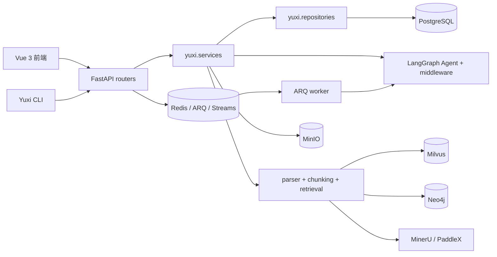

# Yuxi Java 全量重构指南

> 目标项目：KnowAgent  
> Java 根包：`com.knowagent`  
> Yuxi 扫描基线：`main@c4c6eb70de246ce279e85a7286befceb070b4f51`（2026-08-04）  
> 扫描规模：810 个受控文件，其中 682 个代码、配置和脚本文件；22 个后端路由文件；244 个 HTTP 端点  
> 重构策略：功能等价、接口与数据库不兼容；12 周完成面试主链，后续阶段补齐完整能力

## 1. 如何使用本指南

本指南不是把 Python 文件逐行翻译成 Java，而是先识别 Yuxi 的业务边界、状态事实和跨进程协议，再在 Java 中重建等价能力。阅读和实施时遵循以下顺序：

1. 先阅读第 2～5 节，确定模块边界、状态模型、存储职责和接口规范。
2. 按第 6～17 节逐个实现功能域；每节都给出原项目入口、原实现方式和 Java 重写方案。
3. 按第 18 节的 12 周路线推进，不提前实现后续阶段能力。
4. 使用附录 A 核对全部原端点，使用附录 B 核对全部 810 个文件是否已有去向。

文件处理标记：

- `REWRITE`：在 Java 或新的工程配置中重新实现。
- `RETAIN_VUE`：保留 Vue 文件，在新 API 下逐步适配。
- `EXTERNAL_SERVICE`：保留为独立服务，Java 只维护客户端和任务编排。
- `REFERENCE_ONLY`：仅作为行为、测试或文档参考，不进入生产代码。
- `DEFERRED`：属于全量目标，但安排在 12 周主链之后。

## 2. 原项目总体结构

Yuxi 的后端分成两个顶层边界：`backend/server` 是 FastAPI、鉴权依赖和响应装配层，`backend/package/yuxi` 是业务、Agent、存储和基础设施主体。生产运行包含 API 与 ARQ worker 两个进程。



原项目的重要架构约束：

- HTTP 路由保持薄层，主要用例放在 `yuxi.services`，数据访问放在 `yuxi.repositories`。
- PostgreSQL 保存用户、会话、消息、请求、Run、任务和知识库元数据，是最终事实来源。
- Redis 同时承担 ARQ 投递、Run 事件、取消信号和配置缓存，但不独占最终业务状态。
- 同一用户、Agent 和会话线程的普通请求按 FIFO 串行派发；Request 与 Run 是两个不同生命周期。
- 知识库通过 parser、chunker、embedding、vector store 接口组合，OCR 和图谱是可替换能力。
- Agent 能力通过 context、middleware、toolkit、Skills、MCP、SubAgent 和 sandbox 组合，而非写死在路由中。

## 3. Java 目标架构

技术基线固定为 Java 21、Spring Boot 3.5.9、Spring AI 1.1.8、MyBatis-Plus、Flyway、PostgreSQL 16、Redis 7、MinIO、Milvus 2.5.6、Neo4j 5.26 和 Docker Compose。

### 3.1 Maven 模块

| Maven 模块 | 职责 | 允许依赖 |
|---|---|---|
| `knowagent-common` | ID、时间、异常、分页、租户上下文、事件信封 | 无业务模块依赖 |
| `knowagent-security` | tenant、department、user、role、JWT、OIDC、API Key | `common` |
| `knowagent-model` | 模型供应商、Chat/Embedding/Rerank 网关、缓存 | `common`、`security` |
| `knowagent-knowledge` | 知识库、文件、解析、分块、向量、检索、图谱、评估 | `common`、`security`、`model` |
| `knowagent-agent-runtime` | Agent、会话、Request、Run、checkpoint、编排 | `common`、`security`、`model`、领域端口 |
| `knowagent-extension` | Tools、Skills、MCP、SubAgent 注册和授权 | `common`、`security`、`agent-runtime` 端口 |
| `knowagent-workspace` | 工作区、附件、产物、虚拟路径、沙盒 | `common`、`security` |
| `knowagent-observability` | Task、审计、反馈、评估、指标、Langfuse | `common` 和只读领域事件 |
| `knowagent-api` | Spring MVC/WebFlux Controller、Security Filter、SSE、OpenAPI | 组合全部业务模块 |
| `knowagent-worker` | Redis Streams 消费、Outbox 发布、解析与 Run 执行 | 组合全部业务模块 |

`api` 与 `worker` 是可独立启动的 Spring Boot 应用。领域模块不能依赖 Controller，也不能跨模块直接调用对方 Mapper；跨域协作通过应用服务、端口接口或领域事件完成。

### 3.2 核心端口

```java
public interface ChatModelGateway { Flux<ModelEvent> stream(ChatCommand command); }
public interface EmbeddingGateway { List<float[]> embed(List<String> texts); }
public interface RerankGateway { List<RankedChunk> rerank(String query, List<ChunkCandidate> chunks); }
public interface VectorStoreGateway { void upsert(List<VectorChunk> chunks); List<VectorHit> search(VectorQuery query); }
public interface ObjectStorageGateway { StoredObject put(PutObjectCommand command); InputStream get(GetObjectCommand command); void delete(DeleteObjectCommand command); }
public interface DocumentParser { boolean supports(ParseSource source); ParsedDocument parse(ParseSource source); }
public interface Chunker { List<ChunkDraft> split(ParsedDocument document, ChunkPolicy policy); }
public interface AgentOrchestrator { Flux<RunEvent> execute(AgentRunContext context); }
public interface ToolRegistry { List<ToolDefinition> resolve(ToolScope scope); ToolResult invoke(ToolInvocation call); }
public interface CheckpointStore { Optional<AgentCheckpoint> load(UUID runId); void save(AgentCheckpoint checkpoint); }
public interface RunEventPublisher { Mono<PublishedRunEvent> publish(RunEvent event); Flux<PublishedRunEvent> replay(UUID runId, String lastEventId); }
public interface JobDispatcher { void dispatch(JobEnvelope job); }
```

Spring AI 用于 `ChatClient`/`ChatModel`、流式响应、Advisor、ChatMemory、ToolCallback 和 Milvus VectorStore。它不负责 Yuxi 的 Run 状态机、FIFO、审批中断、恢复和事件回放，这些由 `agent-runtime` 明确定义。

## 4. 数据、租户与基础设施边界

### 4.1 PostgreSQL

核心表至少包括：`tenants`、`departments`、`users`、`roles`、`user_roles`、`api_keys`、`model_providers`、`agents`、`conversations`、`messages`、`knowledge_bases`、`knowledge_files`、`knowledge_chunks`、`agent_run_requests`、`agent_runs`、`agent_checkpoints`、`tasks`、`outbox_events`、`skills`、`mcp_servers`、`audit_logs`。

- 所有业务表必须有 `tenant_id`，租户内 slug/name 唯一约束必须包含 `tenant_id`。
- MyBatis-Plus `TenantLineInnerInterceptor` 负责普通 SQL；XML、自定义锁查询、统计 SQL 和批量操作仍显式带 `tenant_id`。
- JSONB 字段使用明确 DTO 与 TypeHandler，不在 Service 中传递无约束 `Map<String,Object>`。
- Flyway 是唯一 schema 变更入口；应用启动不得用 ORM 自动建表。

### 4.2 Redis、MinIO、Milvus 与 Neo4j

- Redis Streams 保存任务投递和短期 Run 事件；消费者组负责 worker 竞争消费、ACK、pending reclaim 和重试。
- PostgreSQL 保存 Run 最终状态和 Outbox。Outbox publisher 成功发布后再标记发送，避免“数据库已提交但消息未投递”的崩溃窗口。
- MinIO 保存原始文件、附件和产物；PostgreSQL 只保存 object key、散列、大小、MIME 和业务归属。
- Milvus 每条向量必须携带 `tenant_id`、`knowledge_base_id`、`file_id`、`chunk_id`；检索过滤器不能只依赖调用方传入字符串。
- Neo4j 只保存图实体和关系，图谱元数据、构建任务和文件归属仍在 PostgreSQL。

## 5. 状态模型与新 API

### 5.1 状态

- Request：`QUEUED -> DISPATCHED`，或进入 `CANCELLED/REJECTED/FAILED`。
- Run：`PENDING -> RUNNING -> COMPLETED`，可进入 `INTERRUPTED/FAILED/CANCELLED`。
- 文件：`UPLOADED -> PARSING -> PARSED -> INDEXING -> READY`，任一步可进入 `FAILED`。
- Task：`PENDING -> RUNNING -> SUCCEEDED`，可进入 `FAILED/CANCELLED`。

状态更新使用条件 SQL 或版本号，禁止先查询后无条件覆盖。终态不可回退；重复消费相同 job/run 必须返回已有结果或安全跳过。

### 5.2 API 规范

新接口统一放在 `/api/v1`，使用 Problem Details 风格错误体和稳定错误码。关键接口：

- `POST /api/v1/auth/token`：登录并返回 access/refresh token。
- `POST /api/v1/knowledge-bases/{id}/files`：上传文件，返回文件与任务 ID。
- `POST /api/v1/knowledge-bases/{id}/retrieval`：直接检索并返回 chunk、score 和引用。
- `POST /api/v1/agents/{id}/requests`：返回 `202 Accepted`、requestId、status、queuePosition、runId。
- `GET /api/v1/agent-requests/{id}/events`：排队与派发 SSE。
- `GET /api/v1/agent-runs/{id}/events`：模型、工具、审批和终态 SSE，支持 `Last-Event-ID`。
- `POST /api/v1/agent-runs/{id}:cancel`：幂等取消 Run。
- `POST /api/v1/agent-runs/{id}:resume`：提交审批或人工输入，从 checkpoint 恢复。

## 6. 系统、认证、租户与部门

**原项目位置**：`backend/server/routers/auth_router.py`、`auth_dept_router.py`、`user_router.py`、`system_router.py`，以及 `backend/package/yuxi/services/auth_service.py`、`oidc_service.py`、`user_identity_service.py`、`config`、`repositories/user_repository.py`。

**原项目实现**：FastAPI dependency 提取当前用户并区分普通用户、管理员和超级管理员；PostgreSQL 保存 User、Department、APIKey、CLIAuthSession、UserConfig、AgentEnv；支持首次初始化管理员、密码登录、OIDC、CLI 浏览器授权、头像和用户模拟。前端路由守卫只负责体验，最终权限仍在后端。

**Java 重写**：在 `security` 模块建立显式 Tenant 与 Department。Spring Security Filter 解析 JWT 后生成只读 `TenantPrincipal`；Controller 不接收客户端自报 tenantId。密码使用 Argon2，refresh token 只保存散列。管理员初始化使用一次性 bootstrap 状态。OIDC 与 CLI 授权安排在后续阶段，但表结构和端口从第一阶段预留。模型密钥、API Key 和外部凭据必须加密存储并支持轮换。

**异常与测试**：覆盖跨租户 ID 枚举、管理员越权、token 过期、refresh 重放、禁用用户、登录限流和自定义 SQL 漏 tenant 条件；使用 Testcontainers PostgreSQL 验证真实约束。

## 7. 模型供应商

**原项目位置**：`model_provider_router.py`、`backend/package/yuxi/models/chat.py`、`embed.py`、`rerank.py` 和 `models/providers`。

**原项目实现**：供应商配置保存在 PostgreSQL，通过 Redis 缓存向 API 与 worker 提供一致视图；支持内置和 OpenAI-compatible 供应商、模型列表刷新、连接状态检查、chat/embedding/rerank 三类模型。

**Java 重写**：`model` 模块以 `providerId:modelName` 作为稳定 spec。`ModelProviderService` 负责配置验证、加密、缓存失效和连通性探测；`SpringAiChatModelGateway`、`EmbeddingGateway`、`RerankGateway` 隔离 Spring AI 与供应商 SDK。缓存采用 cache-aside，并通过配置版本号防止 API 与 worker 使用不同配置。

**异常与测试**：区分配置错误、鉴权失败、限流、超时和供应商 5xx；使用 WireMock 验证 OpenAI-compatible 流式协议、重试边界和敏感字段不出现在日志中。

## 8. 知识库、文件与文档解析

**原项目位置**：`knowledge_router.py`、`external_kb_router.py`、`backend/package/yuxi/knowledge`、三个 knowledge repository、`storage/minio` 和 `services/task_service.py`。

**原项目调用链**：上传文件后先进入 MinIO 和 KnowledgeFile 元数据，Tasker 在 API 进程内执行解析、分块、Embedding、Milvus 入库和状态更新。`knowledge/factory.py` 创建 Milvus、Dify、Notion 或只读连接器；`knowledge/manager.py` 统一管理实例和可见性。

**Java 重写**：上传事务只保存文件元数据、Task 与 Outbox，解析由 worker 消费。`ParserRegistry` 根据 MIME 和用户策略选择 Tika/PDFBox/POI 或外部 OCR；解析结果先规范化为 `ParsedDocument`，再由 `Chunker` 输出不可变 chunk。Embedding 分批并限制 token；PostgreSQL chunk 与 Milvus 向量使用相同 UUID。失败任务记录阶段、错误码和可重试性，重试不得重复创建 chunk。

**解析边界**：普通 PDF、Word、Excel、PowerPoint、HTML、Markdown 和文本优先使用 Java；复杂版面、扫描 PDF 和视觉 OCR 调 MinerU/PaddleX HTTP 服务。URL 导入必须限制协议、DNS 解析和响应大小，防止 SSRF。

**测试**：覆盖重复上传、同名文件、空文档、超长段落、表格、乱码、压缩包穿越、OCR 超时、Embedding 部分失败、删除过程和任务重试。

## 9. 分块、向量检索与引用

**原项目位置**：`knowledge/chunking`、`chunking/ragflow_like`、`knowledge/implementations/milvus.py`、`knowledge_chunk_repository.py` 和 `agents/toolkits/kbs/tools.py`。

**原项目实现**：提供 general、book、laws、QA、semantic、separator 等分块预设；Milvus 实现写入、过滤检索和配置化 topK/threshold；知识库工具把检索结果转换为 Agent 可使用的文档和引用。

**Java 重写**：第一阶段实现 recursive、markdown-heading、token-window 三种策略，保留 `ChunkPolicy` 扩展点；semantic 与 RAGFlow-like 在后续阶段加入。检索分为 query rewrite、embedding、Milvus filter search、可选 rerank、权限过滤和 citation assembly。Spring AI VectorStore 用于通用写入和检索，集合管理、索引和复杂 filter 使用 Milvus SDK v2 封装。

**测试**：固定 embedding stub 验证排序、threshold、topK、tenant/kb/file 过滤、删除一致性和引用页码；禁止以纯 mock 测试代替真实 Milvus Compose 集成测试。

## 10. 知识图谱与评估

**原项目位置**：`graph_router.py`、`knowledge_eval_router.py`、`knowledge/graphs`、`knowledge/eval`、`storage/neo4j` 和知识图谱/评估模型。

**原项目实现**：从 chunk 抽取实体、关系和 mention，写入 PostgreSQL、Milvus 与 Neo4j；提供子图、标签、统计、思维导图、数据集生成、RAG 指标和评估 Run。

**Java 重写**：作为 12 周后的独立子阶段。`GraphExtractionJob` 读取 READY chunk，经结构化 LLM 输出实体与关系，先写 PostgreSQL 构建批次，再幂等同步 Neo4j。评估模块把 dataset、run、item 和 metric 分离，支持 recall、MRR、faithfulness 等可复现指标。图谱或评估失败不能改变普通 RAG 文件的 READY 状态。

## 11. Agent 定义、上下文与编排

**原项目位置**：`backend/package/yuxi/agents/base.py`、`context.py`、`models.py`、`buildin/chatbot`、`buildin/subagent` 和 `middlewares`。

**原项目实现**：BaseAgent 构建 LangGraph；BaseContext 持有 uid、知识库、Skills、MCP、SubAgent 和运行配置；middleware 注入附件、动态工具、模型输入、Skills、steer、摘要、审批和 token usage。上下文启动时根据当前用户重新解析可见资源，避免直接信任持久化配置。

**Java 重写**：`AgentDefinition` 只保存声明配置，`AgentRunContextFactory` 每次 Run 根据 tenant/user 重新解析资源。`AgentOrchestrator` 使用明确阶段：准备上下文、检索、调用模型、处理工具、检查审批/取消、继续模型、持久化结果。每个阶段生成 typed event 和 checkpoint。Spring AI Advisor 只承载 prompt/RAG/memory 横切逻辑，不能成为业务状态事实。

**测试**：覆盖资源被删除或失权、模型覆盖、摘要触发、工具不可用、取消安全点、审批中断、checkpoint 恢复和 token 统计。

## 12. Request、Run、Outbox 与 SSE

**原项目位置**：`agent_router.py`、`agent_request_queue_service.py`、`agent_run_service.py`、`run_submission_service.py`、`run_worker.py`、AgentRun/AgentRunRequest repositories 和 Redis manager。

**原项目实现**：同一 uid、agent_slug、thread_id 下以 Conversation 行锁串行化接入；事务中创建 Message 与 AgentRunRequest，队头可转为 AgentRun；数据库提交后才调用 ARQ。启动恢复扫描 pending Run 和 queued Request。Request SSE 展示排队状态，Run SSE 从 Redis Stream 读取执行事件；取消使用 Redis key/pubsub，最终状态回写 PostgreSQL。

**Java 重写**：保留 Request/Run 分离和线程级 FIFO，但用事务 Outbox 消除提交与投递间隙。接入事务锁定 Conversation，校验 requestId 幂等，创建 Message、Request、可能的 Run 与 Outbox。publisher 投递 `agent-run-jobs` Stream；worker 以 runId 幂等抢占 `PENDING` Run。终态事务同时更新 Run、Message delivery status，并触发下一队头。

SSE 事件统一为 `id/event/data`，Redis Stream ID 作为 SSE id。重连读取 `Last-Event-ID` 后的事件；事件已过期时从 PostgreSQL 返回 Run 快照和终态补偿。heartbeat 不写数据库。第一阶段实现 enqueue/reject/cancel，steer、approval resume 和复杂恢复在后续阶段加入。

**并发测试**：至少覆盖 20 个并发请求的 FIFO、重复 requestId、publisher 崩溃恢复、worker 重复消费、Run 终态与下一队头竞争、取消与完成竞争、SSE 断线回放和事件过期补偿。

## 13. 会话、消息、附件与产物

**原项目位置**：`chat_router.py`、`chat_service.py`、`conversation_service.py`、`input_message_service.py`、`thread_files_service.py`、`feedback_service.py` 和 conversation/message repositories。

**原项目实现**：Conversation 以 thread_id 组织历史；Message 保存输入、输出、delivery status、附件和引用；临时附件先解析，确认后进入线程；Agent 产物通过线程沙盒路径和 MinIO 暴露；支持历史、搜索、反馈和线程状态恢复。

**Java 重写**：会话与 Run 分离，消息是用户可见记录，Run 是执行记录。附件采用 `TEMPORARY/CONFIRMED/DELETED` 生命周期；确认时校验 tenant、owner、hash 和 object key。assistant 消息只在完成或中断时形成稳定版本，流式 token 不逐 token 写 PostgreSQL。反馈单独建表并保留模型、Agent 和引用快照。

## 14. Tools、Skills、MCP 与 SubAgent

**原项目位置**：`mcp_router.py`、`skill_router.py`、`tool_router.py`、`agents/toolkits`、`agents/skills`、`agents/mcp`、`middlewares/dynamic_tool.py` 和 `subagent_task.py`。

**原项目实现**：Tool registry 管理基础工具和知识库工具；Skills 通过 SKILL.md 和依赖工具控制运行时开放范围；MCP server 配置保存在数据库并在运行时加载；SubAgent 作为工具调用并拥有独立线程事件。

**Java 重写**：Spring AI `ToolCallback` 只作为模型适配层，真正执行经过 `ToolRegistry -> ToolPolicy -> ToolExecutor`。每次 Run 根据 tenant、user、Agent 和激活 Skill 计算 ToolScope，不能全局暴露所有工具。SkillManifest 使用版本化 YAML/Markdown 元数据；MCP client 维护连接池、超时、工具 schema 缓存和租户凭据。SubAgent 通过父 Run 的受控工具启动，并拥有独立 runId、预算和事件前缀。

**测试**：覆盖未激活 Skill 的依赖工具不可见、恶意 schema、MCP 超时、工具重复调用、审批模式、SubAgent 深度和预算限制。

## 15. Workspace、文件系统与沙盒

**原项目位置**：`workspace_router.py`、`filesystem_router.py`、`mention_router.py`、workspace/viewer services、`agents/backends/sandbox` 和 `docker/sandbox_provisioner`。

**原项目实现**：用户工作区、知识库文件和线程产物通过不同视图暴露；沙盒把用户可见虚拟路径映射到隔离环境，provisioner 可使用 Docker 或 Kubernetes；文件工具通过 backend 接口访问，而不是直接拼宿主机路径。

**Java 重写**：`VirtualPath` 是值对象，统一规范化并拒绝绝对路径、`..`、符号链接逃逸和跨租户 object key。第一阶段只实现 MinIO 工作区与只读预览；沙盒在后续阶段通过 `SandboxProvider` 接口接入现有 provisioner，不让 Java API 直接访问 Docker socket。下载、预览和产物保存必须重新校验权限。

## 16. Task、观测、审计与仪表盘

**原项目位置**：`system_task_router.py`、`dashboard_router.py`、`knowledge_eval_router.py`、`task_service.py`、`langfuse_service.py`、`operation_log_service.py` 和 Task/Feedback/Stats 模型。

**原项目实现**：Tasker 用于知识解析、评估和图谱等通用后台任务；任务摘要持久化在 PostgreSQL，但 coroutine 与内存队列不能跨进程恢复。Langfuse 记录模型和 Agent trace，Dashboard 聚合用户、工具、知识库、Agent 与反馈统计。

**Java 重写**：所有长任务统一进入 Redis Streams，Task 表保存事实状态、进度、阶段和错误摘要。Micrometer 记录队列延迟、模型耗时、token、检索耗时和失败率；OpenTelemetry/Langfuse 通过适配器接入。审计日志只记录操作元数据，不记录 prompt、密钥或文档正文。仪表盘使用只读聚合查询，所有 SQL 显式限制 tenant。

## 17. Vue、CLI、部署与测试迁移

**Vue**：保留 `web/src/views`、`components`、`composables` 和视觉结构，先替换 `web/src/apis`。`useAgentRequestQueue` 对接 Request SSE，`useAgentRunStream` 对接 Run SSE；Pinia 不保存模型密钥。前端路由守卫继续提供体验，但权限以 Java 后端为准。

**CLI**：`packages/yuxi-cli` 在 12 周后重写为 Java/Picocli 或保留 Python 客户端；客户端只依赖公开 `/api/v1`，不能共享服务端模型。

**部署**：Compose 至少包含 `api`、`worker`、`web`、`postgres`、`redis`、`minio`、`milvus`、`etcd`；Neo4j、MinerU、PaddleX 和 sandbox provisioner 使用 profile。健康检查区分 liveness 与 readiness，启动顺序不能替代应用重试。

**测试迁移**：原 `backend/test/unit` 转为 JUnit 5；integration 使用 Testcontainers 或 Compose；e2e 保留真实服务链路。测试优先迁移行为契约，不逐个翻译 mock 实现。

## 18. 12 周实施路线

| 周期 | 交付 | 验收 |
|---|---|---|
| 1～2 | Maven 模块、Flyway、租户、JWT、模型供应商、Compose | 登录、租户隔离、模型连通性、基础服务健康 |
| 3～5 | MinIO、解析、分块、Embedding、Milvus、检索与引用 | 上传文档后可检索，失败任务可重试且不重复索引 |
| 6～8 | Agent、会话、Request/Run、Outbox、worker、双 SSE | FIFO、流式回答、断线恢复、取消和历史保存 |
| 9～10 | ToolRegistry、基础 Skills、MCP client、审批骨架 | Agent 可按权限调用知识库和一个外部工具 |
| 11～12 | Vue 适配、任务页、测试、README、架构图、演示脚本 | Compose 一键启动，完成 10 分钟面试演示 |
| 后续 | 图谱、评估、SubAgent、完整 Skills、沙盒、OIDC、CLI、resume/steer、仪表盘 | 按附录逐项达到功能等价 |

## 19. 面试讲解重点

- 为什么没有逐行翻译 LangGraph，而是把 Run 状态机与 Spring AI 模型能力分离。
- 为什么 PostgreSQL 是事实来源，Redis Streams 只承载投递和短期事件。
- 原项目“提交后 ARQ 投递 + 启动恢复扫描”的方案，与 Java 版事务 Outbox 的差异。
- Request SSE 与 Run SSE 为什么分开，以及如何通过 Last-Event-ID 回放。
- tenant_id 如何贯穿 PostgreSQL、Redis key、MinIO object key 和 Milvus filter。
- 文档解析为何采用 Java 基础解析加外部 OCR，而不是强行把视觉模型迁移到 JVM。
- 如何控制 Skills、MCP、Tools 和 SubAgent 的运行时可见范围与成本。

## 附录 A：原 HTTP 端点对照

下表由 `backend/server/routers` 的 FastAPI 装饰器生成，共用于盘点 244 个旧端点。`Java 目标资源族` 只表示迁移归属，不等同于已经冻结的新接口路径；不能据此直接生成 Controller。

新接口不追求兼容旧请求结构。开发每个纵向切片前，应先在 OpenAPI 中冻结具体 method、path、DTO、权限、幂等键和错误码，再把对应行更新为精确路径。当前已冻结的 Agent 主链接口见第 3.2 节，未冻结部分保持资源族标记，避免用虚假精度误导实现。

| 原文件 | 原端点 | Handler | Java 目标资源族 | 模块 | 阶段 |
|---|---|---|---|---|---|
| `backend/server/routers/agent_invocation_call_router.py:62` | `POST /api/agent-invocation/agent-call/runs` | `create_agent_call_run` | `/api/v1/agents、agent-requests、agent-runs` | `agent-runtime` | 第 6～8 周 |
| `backend/server/routers/agent_invocation_call_router.py:132` | `POST /api/agent-invocation/agent-call/runs/result` | `get_agent_call_run_result` | `/api/v1/agents、agent-requests、agent-runs` | `agent-runtime` | 第 6～8 周 |
| `backend/server/routers/agent_invocation_channel_router.py:52` | `POST /api/agent-invocation/channel/messages` | `receive_channel_message` | `/api/v1/agents、agent-requests、agent-runs` | `agent-runtime` | 第 6～8 周 |
| `backend/server/routers/agent_invocation_eval_router.py:50` | `POST /api/agent-invocation/eval/runs` | `create_agent_eval_run` | `/api/v1/agents、agent-requests、agent-runs` | `agent-runtime` | 第 6～8 周 |
| `backend/server/routers/agent_router.py:116` | `GET /api/agent/backends` | `list_agent_backends` | `/api/v1/agents、agent-requests、agent-runs` | `agent-runtime` | 第 6～8 周 |
| `backend/server/routers/agent_router.py:122` | `GET /api/agent/backends/{backend_id}` | `get_agent_backend` | `/api/v1/agents、agent-requests、agent-runs` | `agent-runtime` | 第 6～8 周 |
| `backend/server/routers/agent_router.py:134` | `GET /api/agent` | `list_agents` | `/api/v1/agents、agent-requests、agent-runs` | `agent-runtime` | 第 6～8 周 |
| `backend/server/routers/agent_router.py:148` | `GET /api/agent/default` | `get_default_agent` | `/api/v1/agents、agent-requests、agent-runs` | `agent-runtime` | 第 6～8 周 |
| `backend/server/routers/agent_router.py:157` | `POST /api/agent` | `create_agent` | `/api/v1/agents、agent-requests、agent-runs` | `agent-runtime` | 第 6～8 周 |
| `backend/server/routers/agent_router.py:187` | `GET /api/agent/{agent_id}` | `get_agent` | `/api/v1/agents、agent-requests、agent-runs` | `agent-runtime` | 第 6～8 周 |
| `backend/server/routers/agent_router.py:197` | `PUT /api/agent/{agent_id}` | `update_agent` | `/api/v1/agents、agent-requests、agent-runs` | `agent-runtime` | 第 6～8 周 |
| `backend/server/routers/agent_router.py:238` | `DELETE /api/agent/{agent_id}` | `delete_agent` | `/api/v1/agents、agent-requests、agent-runs` | `agent-runtime` | 第 6～8 周 |
| `backend/server/routers/agent_router.py:255` | `POST /api/agent/{agent_id}/set_default` | `set_agent_default` | `/api/v1/agents、agent-requests、agent-runs` | `agent-runtime` | 第 6～8 周 |
| `backend/server/routers/agent_router.py:273` | `POST /api/agent/runs` | `create_agent_run` | `/api/v1/agents、agent-requests、agent-runs` | `agent-runtime` | 第 6～8 周 |
| `backend/server/routers/agent_router.py:323` | `GET /api/agent/requests/{request_id}` | `get_request` | `/api/v1/agents、agent-requests、agent-runs` | `agent-runtime` | 第 6～8 周 |
| `backend/server/routers/agent_router.py:335` | `GET /api/agent/thread/{thread_id}/requests` | `list_thread_requests` | `/api/v1/agents、agent-requests、agent-runs` | `agent-runtime` | 第 6～8 周 |
| `backend/server/routers/agent_router.py:350` | `POST /api/agent/thread/{thread_id}/requests/continue` | `continue_thread_requests` | `/api/v1/agents、agent-requests、agent-runs` | `agent-runtime` | 第 6～8 周 |
| `backend/server/routers/agent_router.py:367` | `POST /api/agent/requests/{request_id}/cancel` | `cancel_request` | `/api/v1/agents、agent-requests、agent-runs` | `agent-runtime` | 第 6～8 周 |
| `backend/server/routers/agent_router.py:378` | `POST /api/agent/requests/{request_id}/steer` | `steer_request` | `/api/v1/agents、agent-requests、agent-runs` | `agent-runtime` | 第 6～8 周 |
| `backend/server/routers/agent_router.py:396` | `GET /api/agent/requests/{request_id}/events` | `stream_request_events_route` | `/api/v1/agents、agent-requests、agent-runs` | `agent-runtime` | 第 6～8 周 |
| `backend/server/routers/agent_router.py:412` | `GET /api/agent/runs/{run_id}` | `get_agent_run` | `/api/v1/agents、agent-requests、agent-runs` | `agent-runtime` | 第 6～8 周 |
| `backend/server/routers/agent_router.py:419` | `GET /api/agent/runs/{run_id}/result` | `get_agent_run_result_route` | `/api/v1/agents、agent-requests、agent-runs` | `agent-runtime` | 第 6～8 周 |
| `backend/server/routers/agent_router.py:426` | `POST /api/agent/runs/{run_id}/cancel` | `cancel_agent_run` | `/api/v1/agents、agent-requests、agent-runs` | `agent-runtime` | 第 6～8 周 |
| `backend/server/routers/agent_router.py:433` | `GET /api/agent/runs/{run_id}/events` | `stream_run_events` | `/api/v1/agents、agent-requests、agent-runs` | `agent-runtime` | 第 6～8 周 |
| `backend/server/routers/agent_router.py:449` | `GET /api/agent/thread/{thread_id}/active_run` | `get_thread_active_run` | `/api/v1/agents、agent-requests、agent-runs` | `agent-runtime` | 第 6～8 周 |
| `backend/server/routers/auth_dept_router.py:64` | `GET /api/departments` | `get_departments` | `/api/v1/departments` | `security` | 第 1～2 周 |
| `backend/server/routers/auth_dept_router.py:71` | `GET /api/departments/{department_id}` | `get_department` | `/api/v1/departments` | `security` | 第 1～2 周 |
| `backend/server/routers/auth_dept_router.py:91` | `POST /api/departments` | `create_department` | `/api/v1/departments` | `security` | 第 1～2 周 |
| `backend/server/routers/auth_dept_router.py:167` | `PUT /api/departments/{department_id}` | `update_department` | `/api/v1/departments` | `security` | 第 1～2 周 |
| `backend/server/routers/auth_dept_router.py:208` | `DELETE /api/departments/{department_id}` | `delete_department` | `/api/v1/departments` | `security` | 第 1～2 周 |
| `backend/server/routers/auth_router.py:201` | `POST /api/auth/token` | `login_for_access_token` | `/api/v1/auth、/api/v1/users` | `security` | 第 1～2 周 |
| `backend/server/routers/auth_router.py:301` | `POST /api/auth/cli/sessions` | `create_cli_session` | `/api/v1/auth、/api/v1/users` | `security` | 第 1～2 周 |
| `backend/server/routers/auth_router.py:313` | `GET /api/auth/cli/sessions/{user_code}` | `get_cli_session` | `/api/v1/auth、/api/v1/users` | `security` | 第 1～2 周 |
| `backend/server/routers/auth_router.py:326` | `POST /api/auth/cli/sessions/{user_code}/approve` | `approve_cli_session` | `/api/v1/auth、/api/v1/users` | `security` | 第 1～2 周 |
| `backend/server/routers/auth_router.py:339` | `POST /api/auth/cli/sessions/token` | `exchange_cli_session_token` | `/api/v1/auth、/api/v1/users` | `security` | 第 1～2 周 |
| `backend/server/routers/auth_router.py:348` | `GET /api/auth/check-first-run` | `check_first_run` | `/api/v1/auth、/api/v1/users` | `security` | 第 1～2 周 |
| `backend/server/routers/auth_router.py:355` | `POST /api/auth/initialize` | `initialize_admin` | `/api/v1/auth、/api/v1/users` | `security` | 第 1～2 周 |
| `backend/server/routers/auth_router.py:436` | `GET /api/auth/me` | `read_users_me` | `/api/v1/auth、/api/v1/users` | `security` | 第 1～2 周 |
| `backend/server/routers/auth_router.py:449` | `PUT /api/auth/profile` | `update_profile` | `/api/v1/auth、/api/v1/users` | `security` | 第 1～2 周 |
| `backend/server/routers/auth_router.py:516` | `POST /api/auth/users` | `create_user` | `/api/v1/auth、/api/v1/users` | `security` | 第 1～2 周 |
| `backend/server/routers/auth_router.py:617` | `GET /api/auth/users` | `read_users` | `/api/v1/auth、/api/v1/users` | `security` | 第 1～2 周 |
| `backend/server/routers/auth_router.py:651` | `GET /api/auth/users/access-options` | `read_user_access_options` | `/api/v1/auth、/api/v1/users` | `security` | 第 1～2 周 |
| `backend/server/routers/auth_router.py:677` | `GET /api/auth/users/{user_id}` | `read_user` | `/api/v1/auth、/api/v1/users` | `security` | 第 1～2 周 |
| `backend/server/routers/auth_router.py:691` | `PUT /api/auth/users/{user_id}` | `update_user` | `/api/v1/auth、/api/v1/users` | `security` | 第 1～2 周 |
| `backend/server/routers/auth_router.py:807` | `DELETE /api/auth/users/{user_id}` | `delete_user` | `/api/v1/auth、/api/v1/users` | `security` | 第 1～2 周 |
| `backend/server/routers/auth_router.py:883` | `POST /api/auth/validate-username` | `validate_username_and_generate_uid` | `/api/v1/auth、/api/v1/users` | `security` | 第 1～2 周 |
| `backend/server/routers/auth_router.py:916` | `GET /api/auth/check-uid/{uid}` | `check_uid_availability` | `/api/v1/auth、/api/v1/users` | `security` | 第 1～2 周 |
| `backend/server/routers/auth_router.py:927` | `POST /api/auth/upload-avatar` | `upload_user_avatar` | `/api/v1/auth、/api/v1/users` | `security` | 第 1～2 周 |
| `backend/server/routers/auth_router.py:953` | `POST /api/auth/impersonate/{user_id}` | `impersonate_user` | `/api/v1/auth、/api/v1/users` | `security` | 第 1～2 周 |
| `backend/server/routers/auth_router.py:1012` | `GET /api/auth/oidc/config` | `get_oidc_config` | `/api/v1/auth、/api/v1/users` | `security` | 第 1～2 周 |
| `backend/server/routers/auth_router.py:1018` | `GET /api/auth/oidc/login-url` | `get_oidc_login_url` | `/api/v1/auth、/api/v1/users` | `security` | 第 1～2 周 |
| `backend/server/routers/auth_router.py:1024` | `GET /api/auth/oidc/callback` | `oidc_callback` | `/api/v1/auth、/api/v1/users` | `security` | 第 1～2 周 |
| `backend/server/routers/auth_router.py:1030` | `POST /api/auth/oidc/exchange-code` | `oidc_exchange_code` | `/api/v1/auth、/api/v1/users` | `security` | 第 1～2 周 |
| `backend/server/routers/chat_router.py:64` | `POST /api/chat/call` | `call` | `/api/v1/conversations、messages、attachments` | `agent-runtime / workspace` | 第 6～8 周 |
| `backend/server/routers/chat_router.py:81` | `GET /api/chat/thread/{thread_id}/history` | `get_thread_history` | `/api/v1/conversations、messages、attachments` | `agent-runtime / workspace` | 第 6～8 周 |
| `backend/server/routers/chat_router.py:98` | `GET /api/chat/thread/{thread_id}/state` | `get_thread_state` | `/api/v1/conversations、messages、attachments` | `agent-runtime / workspace` | 第 6～8 周 |
| `backend/server/routers/chat_router.py:274` | `POST /api/chat/thread` | `create_thread` | `/api/v1/conversations、messages、attachments` | `agent-runtime / workspace` | 第 6～8 周 |
| `backend/server/routers/chat_router.py:288` | `GET /api/chat/threads` | `list_threads` | `/api/v1/conversations、messages、attachments` | `agent-runtime / workspace` | 第 6～8 周 |
| `backend/server/routers/chat_router.py:302` | `GET /api/chat/threads/search` | `search_threads` | `/api/v1/conversations、messages、attachments` | `agent-runtime / workspace` | 第 6～8 周 |
| `backend/server/routers/chat_router.py:322` | `DELETE /api/chat/thread/{thread_id}` | `delete_thread` | `/api/v1/conversations、messages、attachments` | `agent-runtime / workspace` | 第 6～8 周 |
| `backend/server/routers/chat_router.py:336` | `PUT /api/chat/thread/{thread_id}` | `update_thread` | `/api/v1/conversations、messages、attachments` | `agent-runtime / workspace` | 第 6～8 周 |
| `backend/server/routers/chat_router.py:359` | `POST /api/chat/attachments/tmp` | `upload_tmp_attachment` | `/api/v1/conversations、messages、attachments` | `agent-runtime / workspace` | 第 6～8 周 |
| `backend/server/routers/chat_router.py:365` | `POST /api/chat/attachments/tmp/parse` | `parse_tmp_attachment` | `/api/v1/conversations、messages、attachments` | `agent-runtime / workspace` | 第 6～8 周 |
| `backend/server/routers/chat_router.py:380` | `POST /api/chat/thread/{thread_id}/attachments/confirm` | `confirm_tmp_thread_attachments` | `/api/v1/conversations、messages、attachments` | `agent-runtime / workspace` | 第 6～8 周 |
| `backend/server/routers/chat_router.py:396` | `POST /api/chat/thread/{thread_id}/attachments` | `upload_thread_attachment` | `/api/v1/conversations、messages、attachments` | `agent-runtime / workspace` | 第 6～8 周 |
| `backend/server/routers/chat_router.py:412` | `GET /api/chat/thread/{thread_id}/attachments` | `list_thread_attachments` | `/api/v1/conversations、messages、attachments` | `agent-runtime / workspace` | 第 6～8 周 |
| `backend/server/routers/chat_router.py:426` | `DELETE /api/chat/thread/{thread_id}/attachments/{file_id}` | `delete_thread_attachment` | `/api/v1/conversations、messages、attachments` | `agent-runtime / workspace` | 第 6～8 周 |
| `backend/server/routers/chat_router.py:442` | `GET /api/chat/thread/{thread_id}/files` | `list_thread_files` | `/api/v1/conversations、messages、attachments` | `agent-runtime / workspace` | 第 6～8 周 |
| `backend/server/routers/chat_router.py:460` | `GET /api/chat/thread/{thread_id}/files/content` | `read_thread_file_content` | `/api/v1/conversations、messages、attachments` | `agent-runtime / workspace` | 第 6～8 周 |
| `backend/server/routers/chat_router.py:480` | `GET /api/chat/thread/{thread_id}/artifacts/{path:path}` | `get_thread_artifact` | `/api/v1/conversations、messages、attachments` | `agent-runtime / workspace` | 第 6～8 周 |
| `backend/server/routers/chat_router.py:503` | `POST /api/chat/thread/{thread_id}/artifacts/save` | `save_thread_artifact_to_workspace` | `/api/v1/conversations、messages、attachments` | `agent-runtime / workspace` | 第 6～8 周 |
| `backend/server/routers/chat_router.py:537` | `POST /api/chat/message/{message_id}/feedback` | `submit_message_feedback` | `/api/v1/conversations、messages、attachments` | `agent-runtime / workspace` | 第 6～8 周 |
| `backend/server/routers/chat_router.py:555` | `GET /api/chat/message/{message_id}/feedback` | `get_message_feedback` | `/api/v1/conversations、messages、attachments` | `agent-runtime / workspace` | 第 6～8 周 |
| `backend/server/routers/chat_router.py:574` | `POST /api/chat/image/upload` | `upload_image` | `/api/v1/conversations、messages、attachments` | `agent-runtime / workspace` | 第 6～8 周 |
| `backend/server/routers/dashboard_router.py:131` | `GET /api/dashboard/conversations` | `get_all_conversations` | `/api/v1/admin/dashboard` | `observability` | 后续 |
| `backend/server/routers/dashboard_router.py:183` | `GET /api/dashboard/conversations/{thread_id}` | `get_conversation_detail` | `/api/v1/admin/dashboard` | `observability` | 后续 |
| `backend/server/routers/dashboard_router.py:252` | `GET /api/dashboard/stats/users` | `get_user_activity_stats` | `/api/v1/admin/dashboard` | `observability` | 后续 |
| `backend/server/routers/dashboard_router.py:323` | `GET /api/dashboard/stats/tools` | `get_tool_call_stats` | `/api/v1/admin/dashboard` | `observability` | 后续 |
| `backend/server/routers/dashboard_router.py:398` | `GET /api/dashboard/stats/knowledge` | `get_knowledge_stats` | `/api/v1/admin/dashboard` | `observability` | 后续 |
| `backend/server/routers/dashboard_router.py:486` | `GET /api/dashboard/stats/agents` | `get_agent_analytics` | `/api/v1/admin/dashboard` | `observability` | 后续 |
| `backend/server/routers/dashboard_router.py:590` | `GET /api/dashboard/stats` | `get_dashboard_stats` | `/api/v1/admin/dashboard` | `observability` | 后续 |
| `backend/server/routers/dashboard_router.py:662` | `GET /api/dashboard/feedbacks` | `get_all_feedbacks` | `/api/v1/admin/dashboard` | `observability` | 后续 |
| `backend/server/routers/dashboard_router.py:735` | `GET /api/dashboard/stats/calls/timeseries` | `get_call_timeseries_stats` | `/api/v1/admin/dashboard` | `observability` | 后续 |
| `backend/server/routers/external_kb_router.py:28` | `GET /api/knowledge/databases/external` | `list_external_databases` | `/api/v1/knowledge-bases` | `knowledge` | 第 3～5 周 |
| `backend/server/routers/external_kb_router.py:47` | `GET /api/knowledge/databases/external/{kb_id}/files` | `list_external_files` | `/api/v1/knowledge-bases` | `knowledge` | 第 3～5 周 |
| `backend/server/routers/external_kb_router.py:76` | `POST /api/knowledge/databases/external/{kb_id}/retrieve` | `retrieve_external` | `/api/v1/knowledge-bases` | `knowledge` | 第 3～5 周 |
| `backend/server/routers/external_kb_router.py:98` | `GET /api/knowledge/databases/external/{kb_id}/files/{file_id}/open` | `open_external_file` | `/api/v1/knowledge-bases` | `knowledge` | 第 3～5 周 |
| `backend/server/routers/external_kb_router.py:117` | `POST /api/knowledge/databases/external/{kb_id}/files/{file_id}/find` | `find_external_file` | `/api/v1/knowledge-bases` | `knowledge` | 第 3～5 周 |
| `backend/server/routers/filesystem_router.py:34` | `GET /api/viewer/filesystem/tree` | `get_viewer_tree` | `/api/v1/filesystem` | `workspace` | 后续 |
| `backend/server/routers/filesystem_router.py:49` | `GET /api/viewer/filesystem/file` | `get_viewer_file` | `/api/v1/filesystem` | `workspace` | 后续 |
| `backend/server/routers/filesystem_router.py:64` | `DELETE /api/viewer/filesystem/file` | `delete_viewer_file_route` | `/api/v1/filesystem` | `workspace` | 后续 |
| `backend/server/routers/filesystem_router.py:79` | `POST /api/viewer/filesystem/directory` | `create_viewer_directory_route` | `/api/v1/filesystem` | `workspace` | 后续 |
| `backend/server/routers/filesystem_router.py:94` | `POST /api/viewer/filesystem/upload` | `upload_viewer_files_route` | `/api/v1/filesystem` | `workspace` | 后续 |
| `backend/server/routers/filesystem_router.py:111` | `GET /api/viewer/filesystem/download` | `download_viewer` | `/api/v1/filesystem` | `workspace` | 后续 |
| `backend/server/routers/graph_router.py:25` | `GET /api/graph/list` | `get_graphs` | `/api/v1/graphs` | `knowledge` | 后续 |
| `backend/server/routers/graph_router.py:51` | `GET /api/graph/subgraph` | `get_subgraph` | `/api/v1/graphs` | `knowledge` | 后续 |
| `backend/server/routers/graph_router.py:78` | `GET /api/graph/labels` | `get_graph_labels` | `/api/v1/graphs` | `knowledge` | 后续 |
| `backend/server/routers/graph_router.py:95` | `GET /api/graph/stats` | `get_graph_stats` | `/api/v1/graphs` | `knowledge` | 后续 |
| `backend/server/routers/knowledge_eval_router.py:42` | `POST /api/evaluation/databases/{kb_id}/datasets/upload` | `upload_evaluation_dataset` | `/api/v1/evaluations` | `knowledge / observability` | 后续 |
| `backend/server/routers/knowledge_eval_router.py:72` | `GET /api/evaluation/databases/{kb_id}/datasets` | `list_evaluation_datasets` | `/api/v1/evaluations` | `knowledge / observability` | 后续 |
| `backend/server/routers/knowledge_eval_router.py:84` | `GET /api/evaluation/databases/{kb_id}/datasets/{dataset_id}` | `get_evaluation_dataset` | `/api/v1/evaluations` | `knowledge / observability` | 后续 |
| `backend/server/routers/knowledge_eval_router.py:109` | `GET /api/evaluation/datasets/{dataset_id}/download` | `download_evaluation_dataset` | `/api/v1/evaluations` | `knowledge / observability` | 后续 |
| `backend/server/routers/knowledge_eval_router.py:130` | `DELETE /api/evaluation/datasets/{dataset_id}` | `delete_evaluation_dataset` | `/api/v1/evaluations` | `knowledge / observability` | 后续 |
| `backend/server/routers/knowledge_eval_router.py:146` | `POST /api/evaluation/databases/{kb_id}/datasets/generate` | `generate_evaluation_dataset` | `/api/v1/evaluations` | `knowledge / observability` | 后续 |
| `backend/server/routers/knowledge_eval_router.py:173` | `POST /api/evaluation/databases/{kb_id}/datasets/{dataset_id}/resume` | `resume_evaluation_dataset` | `/api/v1/evaluations` | `knowledge / observability` | 后续 |
| `backend/server/routers/knowledge_eval_router.py:191` | `POST /api/evaluation/databases/{kb_id}/runs` | `run_evaluation` | `/api/v1/evaluations` | `knowledge / observability` | 后续 |
| `backend/server/routers/knowledge_eval_router.py:213` | `GET /api/evaluation/databases/{kb_id}/runs` | `list_evaluation_runs` | `/api/v1/evaluations` | `knowledge / observability` | 后续 |
| `backend/server/routers/knowledge_eval_router.py:225` | `GET /api/evaluation/databases/{kb_id}/runs/{run_id}` | `get_evaluation_run_results` | `/api/v1/evaluations` | `knowledge / observability` | 后续 |
| `backend/server/routers/knowledge_eval_router.py:255` | `DELETE /api/evaluation/databases/{kb_id}/runs/{run_id}` | `delete_evaluation_run` | `/api/v1/evaluations` | `knowledge / observability` | 后续 |
| `backend/server/routers/knowledge_router.py:207` | `GET /api/knowledge/databases` | `get_databases` | `/api/v1/knowledge-bases` | `knowledge` | 第 3～5 周 |
| `backend/server/routers/knowledge_router.py:217` | `POST /api/knowledge/databases` | `create_database` | `/api/v1/knowledge-bases` | `knowledge` | 第 3～5 周 |
| `backend/server/routers/knowledge_router.py:292` | `GET /api/knowledge/databases/accessible` | `get_accessible_databases` | `/api/v1/knowledge-bases` | `knowledge` | 第 3～5 周 |
| `backend/server/routers/knowledge_router.py:316` | `GET /api/knowledge/mindmap/databases` | `get_mindmap_databases` | `/api/v1/knowledge-bases` | `knowledge` | 第 3～5 周 |
| `backend/server/routers/knowledge_router.py:328` | `GET /api/knowledge/databases/{kb_id}/mindmap/files` | `get_database_mindmap_files` | `/api/v1/knowledge-bases` | `knowledge` | 第 3～5 周 |
| `backend/server/routers/knowledge_router.py:340` | `POST /api/knowledge/databases/{kb_id}/mindmap/generate` | `generate_mindmap` | `/api/v1/knowledge-bases` | `knowledge` | 第 3～5 周 |
| `backend/server/routers/knowledge_router.py:358` | `GET /api/knowledge/databases/{kb_id}/mindmap` | `get_database_mindmap` | `/api/v1/knowledge-bases` | `knowledge` | 第 3～5 周 |
| `backend/server/routers/knowledge_router.py:370` | `GET /api/knowledge/databases/{kb_id}/mindmap/diff` | `get_mindmap_diff_route` | `/api/v1/knowledge-bases` | `knowledge` | 第 3～5 周 |
| `backend/server/routers/knowledge_router.py:382` | `GET /api/knowledge/databases/{kb_id}` | `get_database_info` | `/api/v1/knowledge-bases` | `knowledge` | 第 3～5 周 |
| `backend/server/routers/knowledge_router.py:395` | `POST /api/knowledge/databases/{kb_id}/stats/repair` | `repair_database_stats` | `/api/v1/knowledge-bases` | `knowledge` | 第 3～5 周 |
| `backend/server/routers/knowledge_router.py:408` | `PUT /api/knowledge/databases/{kb_id}` | `update_database_info` | `/api/v1/knowledge-bases` | `knowledge` | 第 3～5 周 |
| `backend/server/routers/knowledge_router.py:458` | `DELETE /api/knowledge/databases/{kb_id}` | `delete_database` | `/api/v1/knowledge-bases` | `knowledge` | 第 3～5 周 |
| `backend/server/routers/knowledge_router.py:476` | `GET /api/knowledge/databases/{kb_id}/graph-build/status` | `get_graph_build_status` | `/api/v1/knowledge-bases` | `knowledge` | 第 3～5 周 |
| `backend/server/routers/knowledge_router.py:487` | `POST /api/knowledge/databases/{kb_id}/graph-build/config` | `configure_graph_build` | `/api/v1/knowledge-bases` | `knowledge` | 第 3～5 周 |
| `backend/server/routers/knowledge_router.py:509` | `POST /api/knowledge/databases/{kb_id}/graph-build/index` | `index_graph_build` | `/api/v1/knowledge-bases` | `knowledge` | 第 3～5 周 |
| `backend/server/routers/knowledge_router.py:558` | `GET /api/knowledge/databases/{kb_id}/graph-build/failed-chunks` | `get_graph_build_failed_chunks` | `/api/v1/knowledge-bases` | `knowledge` | 第 3～5 周 |
| `backend/server/routers/knowledge_router.py:573` | `POST /api/knowledge/databases/{kb_id}/graph-build/reset` | `reset_graph_build` | `/api/v1/knowledge-bases` | `knowledge` | 第 3～5 周 |
| `backend/server/routers/knowledge_router.py:598` | `POST /api/knowledge/databases/{kb_id}/graph-build/reconcile` | `reconcile_graph_build` | `/api/v1/knowledge-bases` | `knowledge` | 第 3～5 周 |
| `backend/server/routers/knowledge_router.py:652` | `GET /api/knowledge/databases/{kb_id}/export` | `export_database` | `/api/v1/knowledge-bases` | `knowledge` | 第 3～5 周 |
| `backend/server/routers/knowledge_router.py:685` | `GET /api/knowledge/databases/{kb_id}/documents` | `list_documents` | `/api/v1/knowledge-bases` | `knowledge` | 第 3～5 周 |
| `backend/server/routers/knowledge_router.py:712` | `GET /api/knowledge/databases/{kb_id}/documents/search` | `search_documents` | `/api/v1/knowledge-bases` | `knowledge` | 第 3～5 周 |
| `backend/server/routers/knowledge_router.py:739` | `GET /api/knowledge/databases/{kb_id}/documents/exists` | `document_file_exists` | `/api/v1/knowledge-bases` | `knowledge` | 第 3～5 周 |
| `backend/server/routers/knowledge_router.py:757` | `POST /api/knowledge/databases/{kb_id}/documents` | `add_documents` | `/api/v1/knowledge-bases` | `knowledge` | 第 3～5 周 |
| `backend/server/routers/knowledge_router.py:940` | `POST /api/knowledge/databases/{kb_id}/documents/add` | `add_uploaded_documents` | `/api/v1/knowledge-bases` | `knowledge` | 第 3～5 周 |
| `backend/server/routers/knowledge_router.py:1381` | `POST /api/knowledge/databases/{kb_id}/documents/parse` | `parse_documents` | `/api/v1/knowledge-bases` | `knowledge` | 第 3～5 周 |
| `backend/server/routers/knowledge_router.py:1390` | `POST /api/knowledge/databases/{kb_id}/documents/parse-pending` | `parse_pending_documents` | `/api/v1/knowledge-bases` | `knowledge` | 第 3～5 周 |
| `backend/server/routers/knowledge_router.py:1398` | `POST /api/knowledge/databases/{kb_id}/documents/index` | `index_documents` | `/api/v1/knowledge-bases` | `knowledge` | 第 3～5 周 |
| `backend/server/routers/knowledge_router.py:1413` | `POST /api/knowledge/databases/{kb_id}/documents/index-pending` | `index_pending_documents` | `/api/v1/knowledge-bases` | `knowledge` | 第 3～5 周 |
| `backend/server/routers/knowledge_router.py:1426` | `GET /api/knowledge/databases/{kb_id}/documents/{doc_id}` | `get_document_info` | `/api/v1/knowledge-bases` | `knowledge` | 第 3～5 周 |
| `backend/server/routers/knowledge_router.py:1440` | `GET /api/knowledge/databases/{kb_id}/documents/{doc_id}/basic` | `get_document_basic_info` | `/api/v1/knowledge-bases` | `knowledge` | 第 3～5 周 |
| `backend/server/routers/knowledge_router.py:1454` | `GET /api/knowledge/databases/{kb_id}/documents/{doc_id}/content` | `get_document_content` | `/api/v1/knowledge-bases` | `knowledge` | 第 3～5 周 |
| `backend/server/routers/knowledge_router.py:1468` | `DELETE /api/knowledge/databases/{kb_id}/documents/batch` | `batch_delete_documents` | `/api/v1/knowledge-bases` | `knowledge` | 第 3～5 周 |
| `backend/server/routers/knowledge_router.py:1522` | `DELETE /api/knowledge/databases/{kb_id}/documents/{doc_id}` | `delete_document` | `/api/v1/knowledge-bases` | `knowledge` | 第 3～5 周 |
| `backend/server/routers/knowledge_router.py:1552` | `GET /api/knowledge/databases/{kb_id}/documents/{doc_id}/download` | `download_document` | `/api/v1/knowledge-bases` | `knowledge` | 第 3～5 周 |
| `backend/server/routers/knowledge_router.py:1642` | `POST /api/knowledge/databases/{kb_id}/query` | `query_knowledge_base` | `/api/v1/knowledge-bases` | `knowledge` | 第 3～5 周 |
| `backend/server/routers/knowledge_router.py:1656` | `POST /api/knowledge/databases/{kb_id}/query-test` | `query_test` | `/api/v1/knowledge-bases` | `knowledge` | 第 3～5 周 |
| `backend/server/routers/knowledge_router.py:1670` | `PUT /api/knowledge/databases/{kb_id}/query-params` | `update_knowledge_base_query_params` | `/api/v1/knowledge-bases` | `knowledge` | 第 3～5 周 |
| `backend/server/routers/knowledge_router.py:1712` | `GET /api/knowledge/databases/{kb_id}/query-params` | `get_knowledge_base_query_params` | `/api/v1/knowledge-bases` | `knowledge` | 第 3～5 周 |
| `backend/server/routers/knowledge_router.py:1748` | `POST /api/knowledge/databases/{kb_id}/sample-questions` | `generate_sample_questions` | `/api/v1/knowledge-bases` | `knowledge` | 第 3～5 周 |
| `backend/server/routers/knowledge_router.py:1765` | `GET /api/knowledge/databases/{kb_id}/sample-questions` | `get_sample_questions` | `/api/v1/knowledge-bases` | `knowledge` | 第 3～5 周 |
| `backend/server/routers/knowledge_router.py:1782` | `POST /api/knowledge/databases/{kb_id}/folders` | `create_folder` | `/api/v1/knowledge-bases` | `knowledge` | 第 3～5 周 |
| `backend/server/routers/knowledge_router.py:1800` | `PUT /api/knowledge/databases/{kb_id}/documents/{doc_id}/move` | `move_document` | `/api/v1/knowledge-bases` | `knowledge` | 第 3～5 周 |
| `backend/server/routers/knowledge_router.py:1821` | `POST /api/knowledge/files/fetch-url` | `fetch_url` | `/api/v1/knowledge-bases` | `knowledge` | 第 3～5 周 |
| `backend/server/routers/knowledge_router.py:1891` | `POST /api/knowledge/files/import-workspace` | `import_workspace_files` | `/api/v1/knowledge-bases` | `knowledge` | 第 3～5 周 |
| `backend/server/routers/knowledge_router.py:1957` | `POST /api/knowledge/files/upload` | `upload_file` | `/api/v1/knowledge-bases` | `knowledge` | 第 3～5 周 |
| `backend/server/routers/knowledge_router.py:2031` | `GET /api/knowledge/files/supported-types` | `get_supported_file_types` | `/api/v1/knowledge-bases` | `knowledge` | 第 3～5 周 |
| `backend/server/routers/knowledge_router.py:2037` | `POST /api/knowledge/files/markdown` | `mark_it_down` | `/api/v1/knowledge-bases` | `knowledge` | 第 3～5 周 |
| `backend/server/routers/knowledge_router.py:2079` | `GET /api/knowledge/types` | `get_knowledge_base_types` | `/api/v1/knowledge-bases` | `knowledge` | 第 3～5 周 |
| `backend/server/routers/knowledge_router.py:2090` | `GET /api/knowledge/chunk-presets` | `get_knowledge_chunk_presets` | `/api/v1/knowledge-bases` | `knowledge` | 第 3～5 周 |
| `backend/server/routers/knowledge_router.py:2096` | `GET /api/knowledge/stats` | `get_knowledge_base_statistics` | `/api/v1/knowledge-bases` | `knowledge` | 第 3～5 周 |
| `backend/server/routers/knowledge_router.py:2112` | `POST /api/knowledge/generate-description` | `generate_description` | `/api/v1/knowledge-bases` | `knowledge` | 第 3～5 周 |
| `backend/server/routers/mcp_router.py:88` | `GET /api/system/mcp-servers` | `get_mcp_servers` | `/api/v1/mcp-servers` | `extension` | 第 9～10 周 |
| `backend/server/routers/mcp_router.py:116` | `POST /api/system/mcp-servers` | `create_mcp_server_route` | `/api/v1/mcp-servers` | `extension` | 第 9～10 周 |
| `backend/server/routers/mcp_router.py:160` | `GET /api/system/mcp-servers/{slug}` | `get_mcp_server_route` | `/api/v1/mcp-servers` | `extension` | 第 9～10 周 |
| `backend/server/routers/mcp_router.py:177` | `PUT /api/system/mcp-servers/{slug}` | `update_mcp_server_route` | `/api/v1/mcp-servers` | `extension` | 第 9～10 周 |
| `backend/server/routers/mcp_router.py:221` | `DELETE /api/system/mcp-servers/{slug}` | `delete_mcp_server_route` | `/api/v1/mcp-servers` | `extension` | 第 9～10 周 |
| `backend/server/routers/mcp_router.py:250` | `POST /api/system/mcp-servers/{slug}/test` | `test_mcp_server` | `/api/v1/mcp-servers` | `extension` | 第 9～10 周 |
| `backend/server/routers/mcp_router.py:276` | `PUT /api/system/mcp-servers/{slug}/status` | `update_mcp_server_status_route` | `/api/v1/mcp-servers` | `extension` | 第 9～10 周 |
| `backend/server/routers/mcp_router.py:304` | `GET /api/system/mcp-servers/{slug}/tools` | `get_mcp_server_tools` | `/api/v1/mcp-servers` | `extension` | 第 9～10 周 |
| `backend/server/routers/mcp_router.py:355` | `POST /api/system/mcp-servers/{slug}/tools/refresh` | `refresh_mcp_server_tools` | `/api/v1/mcp-servers` | `extension` | 第 9～10 周 |
| `backend/server/routers/mcp_router.py:396` | `PUT /api/system/mcp-servers/{slug}/tools/{tool_name}/toggle` | `toggle_mcp_server_tool_route` | `/api/v1/mcp-servers` | `extension` | 第 9～10 周 |
| `backend/server/routers/mention_router.py:24` | `GET /api/mention/search` | `search_mention_files` | `/api/v1/mentions` | `workspace` | 第 11～12 周 |
| `backend/server/routers/model_provider_router.py:63` | `GET /api/system/model-providers` | `list_providers` | `/api/v1/model-providers` | `model` | 第 1～2 周 |
| `backend/server/routers/model_provider_router.py:78` | `POST /api/system/model-providers` | `create_provider` | `/api/v1/model-providers` | `model` | 第 1～2 周 |
| `backend/server/routers/model_provider_router.py:101` | `GET /api/system/model-providers/{provider_id}` | `get_provider` | `/api/v1/model-providers` | `model` | 第 1～2 周 |
| `backend/server/routers/model_provider_router.py:116` | `PUT /api/system/model-providers/{provider_id}` | `update_provider` | `/api/v1/model-providers` | `model` | 第 1～2 周 |
| `backend/server/routers/model_provider_router.py:155` | `DELETE /api/system/model-providers/{provider_id}` | `delete_provider` | `/api/v1/model-providers` | `model` | 第 1～2 周 |
| `backend/server/routers/model_provider_router.py:170` | `GET /api/system/model-providers/{provider_id}/remote-models` | `get_remote_models` | `/api/v1/model-providers` | `model` | 第 1～2 周 |
| `backend/server/routers/model_provider_router.py:194` | `POST /api/system/model-providers/models/cache/refresh` | `refresh_model_cache` | `/api/v1/model-providers` | `model` | 第 1～2 周 |
| `backend/server/routers/model_provider_router.py:205` | `GET /api/system/model-providers/models/v2` | `get_v2_models` | `/api/v1/model-providers` | `model` | 第 1～2 周 |
| `backend/server/routers/model_provider_router.py:244` | `GET /api/system/model-providers/models/status` | `get_model_status_by_spec` | `/api/v1/model-providers` | `model` | 第 1～2 周 |
| `backend/server/routers/skill_router.py:134` | `GET /api/skills` | `list_skill_cards_route` | `/api/v1/skills` | `extension` | 第 9～10 周 |
| `backend/server/routers/skill_router.py:160` | `GET /api/skills/accessible` | `list_accessible_skills_route` | `/api/v1/skills` | `extension` | 第 9～10 周 |
| `backend/server/routers/skill_router.py:173` | `POST /api/skills/import/prepare` | `prepare_skill_upload_route` | `/api/v1/skills` | `extension` | 第 9～10 周 |
| `backend/server/routers/skill_router.py:194` | `POST /api/skills/remote/list` | `list_remote_skills_route` | `/api/v1/skills` | `extension` | 第 9～10 周 |
| `backend/server/routers/skill_router.py:205` | `POST /api/skills/remote/search` | `search_remote_skills_route` | `/api/v1/skills` | `extension` | 第 9～10 周 |
| `backend/server/routers/skill_router.py:218` | `POST /api/skills/remote/prepare` | `prepare_remote_skills_route` | `/api/v1/skills` | `extension` | 第 9～10 周 |
| `backend/server/routers/skill_router.py:239` | `POST /api/skills/install-drafts/{draft_id}/confirm` | `confirm_skill_install_draft_route` | `/api/v1/skills` | `extension` | 第 9～10 周 |
| `backend/server/routers/skill_router.py:262` | `POST /api/skills/personal/install-drafts/{draft_id}/confirm` | `confirm_personal_skill_install_draft_route` | `/api/v1/skills` | `extension` | 第 9～10 周 |
| `backend/server/routers/skill_router.py:282` | `GET /api/skills/personal/{slug}/file` | `read_personal_skill_file_route` | `/api/v1/skills` | `extension` | 第 9～10 周 |
| `backend/server/routers/skill_router.py:300` | `DELETE /api/skills/personal/{slug}` | `delete_personal_skill_route` | `/api/v1/skills` | `extension` | 第 9～10 周 |
| `backend/server/routers/skill_router.py:321` | `DELETE /api/skills/install-drafts/{draft_id}` | `discard_skill_install_draft_route` | `/api/v1/skills` | `extension` | 第 9～10 周 |
| `backend/server/routers/skill_router.py:333` | `GET /api/system/skills` | `list_skills_route` | `/api/v1/skills` | `extension` | 第 9～10 周 |
| `backend/server/routers/skill_router.py:350` | `GET /api/system/skills/dependency-options` | `get_skill_dependency_options_route` | `/api/v1/skills` | `extension` | 第 9～10 周 |
| `backend/server/routers/skill_router.py:367` | `GET /api/system/skills/builtin` | `list_builtin_skills_route` | `/api/v1/skills` | `extension` | 第 9～10 周 |
| `backend/server/routers/skill_router.py:382` | `POST /api/system/skills/builtin/sync` | `sync_builtin_skills_route` | `/api/v1/skills` | `extension` | 第 9～10 周 |
| `backend/server/routers/skill_router.py:397` | `PUT /api/system/skills/{slug}/share-config` | `update_skill_share_config_route` | `/api/v1/skills` | `extension` | 第 9～10 周 |
| `backend/server/routers/skill_router.py:414` | `PUT /api/system/skills/{slug}/enabled` | `update_skill_enabled_route` | `/api/v1/skills` | `extension` | 第 9～10 周 |
| `backend/server/routers/skill_router.py:431` | `GET /api/system/skills/{slug}/tree` | `get_skill_tree_route` | `/api/v1/skills` | `extension` | 第 9～10 周 |
| `backend/server/routers/skill_router.py:447` | `GET /api/system/skills/{slug}/file` | `get_skill_file_route` | `/api/v1/skills` | `extension` | 第 9～10 周 |
| `backend/server/routers/skill_router.py:464` | `POST /api/system/skills/{slug}/file` | `create_skill_file_route` | `/api/v1/skills` | `extension` | 第 9～10 周 |
| `backend/server/routers/skill_router.py:489` | `PUT /api/system/skills/{slug}/file` | `update_skill_file_route` | `/api/v1/skills` | `extension` | 第 9～10 周 |
| `backend/server/routers/skill_router.py:513` | `PUT /api/system/skills/{slug}/dependencies` | `update_skill_dependencies_route` | `/api/v1/skills` | `extension` | 第 9～10 周 |
| `backend/server/routers/skill_router.py:537` | `DELETE /api/system/skills/{slug}/file` | `delete_skill_file_route` | `/api/v1/skills` | `extension` | 第 9～10 周 |
| `backend/server/routers/skill_router.py:555` | `GET /api/system/skills/{slug}/export` | `export_skill_route` | `/api/v1/skills` | `extension` | 第 9～10 周 |
| `backend/server/routers/skill_router.py:574` | `DELETE /api/system/skills/{slug}` | `delete_skill_route` | `/api/v1/skills` | `extension` | 第 9～10 周 |
| `backend/server/routers/skill_router.py:591` | `POST /api/system/skills/delete-batch` | `delete_skills_batch_route` | `/api/v1/skills` | `extension` | 第 9～10 周 |
| `backend/server/routers/system_router.py:23` | `GET /api/system/health` | `health_check` | `/api/v1/system` | `api / observability` | 第 1～2 周 |
| `backend/server/routers/system_router.py:29` | `GET /api/system/discovery` | `discovery` | `/api/v1/system` | `api / observability` | 第 1～2 周 |
| `backend/server/routers/system_router.py:64` | `GET /api/system/config` | `get_config` | `/api/v1/system` | `api / observability` | 第 1～2 周 |
| `backend/server/routers/system_router.py:70` | `POST /api/system/config` | `update_config_single` | `/api/v1/system` | `api / observability` | 第 1～2 周 |
| `backend/server/routers/system_router.py:85` | `POST /api/system/config/update` | `update_config_batch` | `/api/v1/system` | `api / observability` | 第 1～2 周 |
| `backend/server/routers/system_router.py:96` | `GET /api/system/logs` | `get_system_logs` | `/api/v1/system` | `api / observability` | 第 1～2 周 |
| `backend/server/routers/system_router.py:172` | `GET /api/system/info` | `get_info_config` | `/api/v1/system` | `api / observability` | 第 1～2 周 |
| `backend/server/routers/system_router.py:183` | `POST /api/system/info/reload` | `reload_info_config` | `/api/v1/system` | `api / observability` | 第 1～2 周 |
| `backend/server/routers/system_router.py:205` | `GET /api/system/config/options` | `get_config_options` | `/api/v1/system` | `api / observability` | 第 1～2 周 |
| `backend/server/routers/system_router.py:217` | `PUT /api/system/config/options/{key}` | `put_config_option` | `/api/v1/system` | `api / observability` | 第 1～2 周 |
| `backend/server/routers/system_router.py:241` | `GET /api/system/ocr/options` | `get_ocr_engine_options` | `/api/v1/system` | `api / observability` | 第 1～2 周 |
| `backend/server/routers/system_router.py:252` | `GET /api/system/ocr/health` | `get_ocr_health` | `/api/v1/system` | `api / observability` | 第 1～2 周 |
| `backend/server/routers/system_task_router.py:11` | `GET /api/tasks` | `list_tasks` | `/api/v1/tasks` | `observability` | 第 11～12 周 |
| `backend/server/routers/system_task_router.py:21` | `GET /api/tasks/{task_id}` | `get_task` | `/api/v1/tasks` | `observability` | 第 11～12 周 |
| `backend/server/routers/system_task_router.py:30` | `POST /api/tasks/{task_id}/cancel` | `cancel_task` | `/api/v1/tasks` | `observability` | 第 11～12 周 |
| `backend/server/routers/system_task_router.py:39` | `DELETE /api/tasks/{task_id}` | `delete_task` | `/api/v1/tasks` | `observability` | 第 11～12 周 |
| `backend/server/routers/tool_router.py:11` | `GET /api/system/tools` | `list_tools` | `/api/v1/tools` | `extension` | 第 9～10 周 |
| `backend/server/routers/tool_router.py:20` | `GET /api/system/tools/options` | `get_tool_options` | `/api/v1/tools` | `extension` | 第 9～10 周 |
| `backend/server/routers/user_router.py:79` | `GET /api/user/config` | `get_user_config` | `/api/v1/users/me` | `security` | 第 1～2 周 |
| `backend/server/routers/user_router.py:88` | `PUT /api/user/config` | `update_user_config` | `/api/v1/users/me` | `security` | 第 1～2 周 |
| `backend/server/routers/user_router.py:98` | `POST /api/user/upload-image` | `upload_user_image` | `/api/v1/users/me` | `security` | 第 1～2 周 |
| `backend/server/routers/user_router.py:152` | `GET /api/user/apikey/` | `list_api_keys` | `/api/v1/users/me` | `security` | 第 1～2 周 |
| `backend/server/routers/user_router.py:175` | `POST /api/user/apikey/` | `create_api_key` | `/api/v1/users/me` | `security` | 第 1～2 周 |
| `backend/server/routers/user_router.py:222` | `GET /api/user/apikey/{api_key_id}` | `get_api_key` | `/api/v1/users/me` | `security` | 第 1～2 周 |
| `backend/server/routers/user_router.py:232` | `PUT /api/user/apikey/{api_key_id}` | `update_api_key` | `/api/v1/users/me` | `security` | 第 1～2 周 |
| `backend/server/routers/user_router.py:254` | `DELETE /api/user/apikey/{api_key_id}` | `delete_api_key` | `/api/v1/users/me` | `security` | 第 1～2 周 |
| `backend/server/routers/user_router.py:267` | `GET /api/user/agent-env` | `get_agent_env` | `/api/v1/users/me` | `security` | 第 1～2 周 |
| `backend/server/routers/user_router.py:279` | `PUT /api/user/agent-env` | `update_agent_env` | `/api/v1/users/me` | `security` | 第 1～2 周 |
| `backend/server/routers/workspace_router.py:100` | `GET /api/workspace/tree` | `get_workspace_tree` | `/api/v1/workspaces` | `workspace` | 第 11～12 周 |
| `backend/server/routers/workspace_router.py:135` | `GET /api/workspace/file` | `get_workspace_file` | `/api/v1/workspaces` | `workspace` | 第 11～12 周 |
| `backend/server/routers/workspace_router.py:143` | `GET /api/workspace/knowledge/tree` | `get_workspace_knowledge_tree` | `/api/v1/workspaces` | `workspace` | 第 11～12 周 |
| `backend/server/routers/workspace_router.py:181` | `GET /api/workspace/knowledge/file` | `get_workspace_knowledge_file` | `/api/v1/workspaces` | `workspace` | 第 11～12 周 |
| `backend/server/routers/workspace_router.py:194` | `GET /api/workspace/knowledge/download` | `download_workspace_knowledge_file` | `/api/v1/workspaces` | `workspace` | 第 11～12 周 |
| `backend/server/routers/workspace_router.py:215` | `PUT /api/workspace/file` | `update_workspace_file` | `/api/v1/workspaces` | `workspace` | 第 11～12 周 |
| `backend/server/routers/workspace_router.py:227` | `DELETE /api/workspace/file` | `delete_workspace_file_route` | `/api/v1/workspaces` | `workspace` | 第 11～12 周 |
| `backend/server/routers/workspace_router.py:235` | `POST /api/workspace/directory` | `create_workspace_directory_route` | `/api/v1/workspaces` | `workspace` | 第 11～12 周 |
| `backend/server/routers/workspace_router.py:247` | `POST /api/workspace/upload` | `upload_workspace_files_route` | `/api/v1/workspaces` | `workspace` | 第 11～12 周 |
| `backend/server/routers/workspace_router.py:256` | `GET /api/workspace/download` | `download_workspace` | `/api/v1/workspaces` | `workspace` | 第 11～12 周 |

## 附录 B：完整文件重构清单

下表覆盖基线提交的全部 810 个受控文件。职责是文件级摘要，详细调用链见正文功能章节。

| 原路径 | 层 | 功能域 | 文件职责 | Java 去向 | 处理 | 阶段 | 测试/验收 |
|---|---|---|---|---|---|---|---|
| `.dockerignore` | 工程 | 部署与基础设施 | 项目入口、构建或通用实现 | `根工程 / docker` | `REWRITE` | 第 1～12 周 | Compose/CI smoke test |
| `.env.template` | 工程 | 部署与基础设施 | 项目入口、构建或通用实现 | `根工程 / docker` | `REWRITE` | 第 1～12 周 | Compose/CI smoke test |
| `.github/ISSUE_TEMPLATE/提交一个bug.md` | CI/CD | CI/CD 与协作 | 说明原行为、架构或使用方式 | `根工程 / docker` | `REWRITE` | 第 1～12 周 | Compose/CI smoke test |
| `.github/ISSUE_TEMPLATE/提交一个docker启动问题.md` | CI/CD | CI/CD 与协作 | 说明原行为、架构或使用方式 | `根工程 / docker` | `REWRITE` | 第 1～12 周 | Compose/CI smoke test |
| `.github/ISSUE_TEMPLATE/提交一个提问.md` | CI/CD | CI/CD 与协作 | 说明原行为、架构或使用方式 | `根工程 / docker` | `REWRITE` | 第 1～12 周 | Compose/CI smoke test |
| `.github/ISSUE_TEMPLATE/提交一个需求建议.md` | CI/CD | CI/CD 与协作 | 说明原行为、架构或使用方式 | `根工程 / docker` | `REWRITE` | 第 1～12 周 | Compose/CI smoke test |
| `.github/PULL_REQUEST_TEMPLATE.md` | CI/CD | CI/CD 与协作 | 说明原行为、架构或使用方式 | `根工程 / docker` | `REWRITE` | 第 1～12 周 | Compose/CI smoke test |
| `.github/workflows/close-stale-issues.yml` | CI/CD | CI/CD 与协作 | 持续集成或发布工作流 | `根工程 / docker` | `REWRITE` | 第 1～12 周 | Compose/CI smoke test |
| `.github/workflows/deploy.yml` | CI/CD | CI/CD 与协作 | 持续集成或发布工作流 | `根工程 / docker` | `REWRITE` | 第 1～12 周 | Compose/CI smoke test |
| `.github/workflows/publish-yuxi-cli.yml` | CI/CD | CI/CD 与协作 | 持续集成或发布工作流 | `根工程 / docker` | `REFERENCE_ONLY` | 参考 | 文档或样本核对 |
| `.github/workflows/ruff.yml` | CI/CD | CI/CD 与协作 | 持续集成或发布工作流 | `根工程 / docker` | `REFERENCE_ONLY` | 参考 | 文档或样本核对 |
| `.gitignore` | 工程 | 项目工程 | 项目入口、构建或通用实现 | `根工程` | `REWRITE` | 按所属功能 | 构建与模块边界检查 |
| `AGENTS.md` | 文档 | 项目文档 | 说明原行为、架构或使用方式 | `docs / README` | `REFERENCE_ONLY` | 参考 | 文档或样本核对 |
| `ARCHITECTURE.md` | 文档 | 项目文档 | 说明原行为、架构或使用方式 | `docs / README` | `REFERENCE_ONLY` | 参考 | 文档或样本核对 |
| `CLAUDE.md` | 文档 | 项目文档 | 说明原行为、架构或使用方式 | `docs / README` | `REFERENCE_ONLY` | 参考 | 文档或样本核对 |
| `CONTRIBUTING.md` | 文档 | 项目文档 | 说明原行为、架构或使用方式 | `docs / README` | `REFERENCE_ONLY` | 参考 | 文档或样本核对 |
| `LICENSE` | 工程 | 项目工程 | 项目入口、构建或通用实现 | `根工程` | `REFERENCE_ONLY` | 参考 | 文档或样本核对 |
| `Makefile` | 工程 | 部署与基础设施 | 项目入口、构建或通用实现 | `根工程 / docker` | `REWRITE` | 第 1～12 周 | Compose/CI smoke test |
| `README.en.md` | 文档 | 项目文档 | 说明原行为、架构或使用方式 | `docs / README` | `REFERENCE_ONLY` | 参考 | 文档或样本核对 |
| `README.md` | 文档 | 项目文档 | 说明原行为、架构或使用方式 | `docs / README` | `REFERENCE_ONLY` | 参考 | 文档或样本核对 |
| `backend/.python-version` | 工程 | 后端工程 | 项目入口、构建或通用实现 | `根工程` | `REWRITE` | 第 1～2 周 | 构建与模块边界检查 |
| `backend/package/MANIFEST.in` | 配置 | 后端工程 | 依赖、运行参数或工具配置 | `根工程` | `REWRITE` | 第 1～2 周 | 构建与模块边界检查 |
| `backend/package/README.md` | 文档 | 后端工程 | 说明原行为、架构或使用方式 | `根工程` | `REWRITE` | 第 1～2 周 | 构建与模块边界检查 |
| `backend/package/pyproject.toml` | 配置 | 后端工程 | 依赖、运行参数或工具配置 | `根工程` | `REWRITE` | 第 1～2 周 | 构建与模块边界检查 |
| `backend/package/uv.lock` | 配置 | 后端工程 | 依赖、运行参数或工具配置 | `根工程` | `REWRITE` | 第 1～2 周 | 构建与模块边界检查 |
| `backend/package/yuxi/__init__.py` | 工程 | 后端工程 | 模块导出、注册或默认实现 | `根工程` | `REWRITE` | 第 1～2 周 | 构建与模块边界检查 |
| `backend/package/yuxi/agents/__init__.py` | Agent 领域 | Agent、Run 与会话 | 模块导出、注册或默认实现 | `knowagent-agent-runtime` | `REWRITE` | 第 6～8 周 | 状态机、并发、SSE 回放 |
| `backend/package/yuxi/agents/backends/__init__.py` | Agent 领域 | Agent、Run 与会话 | 模块导出、注册或默认实现 | `knowagent-agent-runtime` | `REWRITE` | 第 6～8 周 | 状态机、并发、SSE 回放 |
| `backend/package/yuxi/agents/backends/composite.py` | Agent 领域 | Agent、Run 与会话 | 项目入口、构建或通用实现 | `knowagent-agent-runtime` | `REWRITE` | 第 6～8 周 | 状态机、并发、SSE 回放 |
| `backend/package/yuxi/agents/backends/knowledge_base_backend.py` | Agent 领域 | 知识库与检索 | 项目入口、构建或通用实现 | `knowagent-knowledge` | `REWRITE` | 第 3～5 周 | 解析单测 + MinIO/Milvus 集成 |
| `backend/package/yuxi/agents/backends/sandbox/__init__.py` | Agent 领域 | Workspace 与沙盒 | 模块导出、注册或默认实现 | `knowagent-workspace` | `DEFERRED` | 后续 | 路径逃逸与权限测试 |
| `backend/package/yuxi/agents/backends/sandbox/backend.py` | Agent 领域 | Workspace 与沙盒 | 项目入口、构建或通用实现 | `knowagent-workspace` | `DEFERRED` | 后续 | 路径逃逸与权限测试 |
| `backend/package/yuxi/agents/backends/sandbox/paths.py` | Agent 领域 | Workspace 与沙盒 | 项目入口、构建或通用实现 | `knowagent-workspace` | `DEFERRED` | 后续 | 路径逃逸与权限测试 |
| `backend/package/yuxi/agents/backends/sandbox/provider.py` | Agent 领域 | Workspace 与沙盒 | 项目入口、构建或通用实现 | `knowagent-workspace` | `DEFERRED` | 后续 | 路径逃逸与权限测试 |
| `backend/package/yuxi/agents/backends/sandbox/provisioner_client.py` | Agent 领域 | Workspace 与沙盒 | 项目入口、构建或通用实现 | `knowagent-workspace` | `DEFERRED` | 后续 | 路径逃逸与权限测试 |
| `backend/package/yuxi/agents/backends/skills_backend.py` | Agent 领域 | Agent、Run 与会话 | 项目入口、构建或通用实现 | `knowagent-agent-runtime` | `REWRITE` | 第 6～8 周 | 状态机、并发、SSE 回放 |
| `backend/package/yuxi/agents/base.py` | Agent 领域 | Agent、Run 与会话 | 项目入口、构建或通用实现 | `knowagent-agent-runtime` | `REWRITE` | 第 6～8 周 | 状态机、并发、SSE 回放 |
| `backend/package/yuxi/agents/buildin/__init__.py` | Agent 领域 | Agent、Run 与会话 | 模块导出、注册或默认实现 | `knowagent-agent-runtime` | `REWRITE` | 第 6～8 周 | 状态机、并发、SSE 回放 |
| `backend/package/yuxi/agents/buildin/chatbot/__init__.py` | Agent 领域 | Agent、Run 与会话 | 模块导出、注册或默认实现 | `knowagent-agent-runtime` | `REWRITE` | 第 6～8 周 | 状态机、并发、SSE 回放 |
| `backend/package/yuxi/agents/buildin/chatbot/context.py` | Agent 领域 | Agent、Run 与会话 | 运行时上下文模型与资源解析 | `knowagent-agent-runtime` | `REWRITE` | 第 6～8 周 | 状态机、并发、SSE 回放 |
| `backend/package/yuxi/agents/buildin/chatbot/graph.py` | Agent 领域 | Agent、Run 与会话 | Agent 或知识图谱编排 | `knowagent-agent-runtime` | `REWRITE` | 第 6～8 周 | 状态机、并发、SSE 回放 |
| `backend/package/yuxi/agents/buildin/chatbot/prompt.py` | Agent 领域 | Agent、Run 与会话 | 系统提示词与模板 | `knowagent-agent-runtime` | `REWRITE` | 第 6～8 周 | 状态机、并发、SSE 回放 |
| `backend/package/yuxi/agents/buildin/chatbot/state.py` | Agent 领域 | Agent、Run 与会话 | 运行状态数据结构 | `knowagent-agent-runtime` | `REWRITE` | 第 6～8 周 | 状态机、并发、SSE 回放 |
| `backend/package/yuxi/agents/buildin/subagent/__init__.py` | Agent 领域 | Agent、Run 与会话 | 模块导出、注册或默认实现 | `knowagent-agent-runtime` | `DEFERRED` | 后续 | 状态机、并发、SSE 回放 |
| `backend/package/yuxi/agents/buildin/subagent/context.py` | Agent 领域 | Agent、Run 与会话 | 运行时上下文模型与资源解析 | `knowagent-agent-runtime` | `DEFERRED` | 后续 | 状态机、并发、SSE 回放 |
| `backend/package/yuxi/agents/buildin/subagent/graph.py` | Agent 领域 | Agent、Run 与会话 | Agent 或知识图谱编排 | `knowagent-agent-runtime` | `DEFERRED` | 后续 | 状态机、并发、SSE 回放 |
| `backend/package/yuxi/agents/context.py` | Agent 领域 | Agent、Run 与会话 | 运行时上下文模型与资源解析 | `knowagent-agent-runtime` | `REWRITE` | 第 6～8 周 | 状态机、并发、SSE 回放 |
| `backend/package/yuxi/agents/mcp/__init__.py` | Agent 领域 | Tools、Skills 与 MCP | 模块导出、注册或默认实现 | `knowagent-extension` | `REWRITE` | 第 9～10 周 | 工具授权与 MCP 契约 |
| `backend/package/yuxi/agents/mcp/repository.py` | Agent 领域 | Tools、Skills 与 MCP | 项目入口、构建或通用实现 | `knowagent-extension` | `REWRITE` | 第 9～10 周 | 工具授权与 MCP 契约 |
| `backend/package/yuxi/agents/mcp/service.py` | Agent 领域 | Tools、Skills 与 MCP | 项目入口、构建或通用实现 | `knowagent-extension` | `REWRITE` | 第 9～10 周 | 工具授权与 MCP 契约 |
| `backend/package/yuxi/agents/middlewares/__init__.py` | Agent 领域 | Agent、Run 与会话 | 模块导出、注册或默认实现 | `knowagent-agent-runtime` | `REWRITE` | 第 6～8 周 | 状态机、并发、SSE 回放 |
| `backend/package/yuxi/agents/middlewares/attachment.py` | Agent 领域 | Agent、Run 与会话 | 项目入口、构建或通用实现 | `knowagent-agent-runtime` | `REWRITE` | 第 6～8 周 | 状态机、并发、SSE 回放 |
| `backend/package/yuxi/agents/middlewares/context.py` | Agent 领域 | Agent、Run 与会话 | 运行时上下文模型与资源解析 | `knowagent-agent-runtime` | `REWRITE` | 第 6～8 周 | 状态机、并发、SSE 回放 |
| `backend/package/yuxi/agents/middlewares/dynamic_tool.py` | Agent 领域 | Agent、Run 与会话 | 工具定义、注册或执行适配 | `knowagent-agent-runtime` | `REWRITE` | 第 6～8 周 | 状态机、并发、SSE 回放 |
| `backend/package/yuxi/agents/middlewares/model_input.py` | Agent 领域 | Agent、Run 与会话 | 项目入口、构建或通用实现 | `knowagent-agent-runtime` | `REWRITE` | 第 6～8 周 | 状态机、并发、SSE 回放 |
| `backend/package/yuxi/agents/middlewares/skills.py` | Agent 领域 | Agent、Run 与会话 | 项目入口、构建或通用实现 | `knowagent-agent-runtime` | `REWRITE` | 第 6～8 周 | 状态机、并发、SSE 回放 |
| `backend/package/yuxi/agents/middlewares/steer.py` | Agent 领域 | Agent、Run 与会话 | 项目入口、构建或通用实现 | `knowagent-agent-runtime` | `DEFERRED` | 后续 | 状态机、并发、SSE 回放 |
| `backend/package/yuxi/agents/middlewares/subagent_task.py` | Agent 领域 | Agent、Run 与会话 | 项目入口、构建或通用实现 | `knowagent-agent-runtime` | `DEFERRED` | 后续 | 状态机、并发、SSE 回放 |
| `backend/package/yuxi/agents/middlewares/summary.py` | Agent 领域 | Agent、Run 与会话 | 项目入口、构建或通用实现 | `knowagent-agent-runtime` | `REWRITE` | 第 6～8 周 | 状态机、并发、SSE 回放 |
| `backend/package/yuxi/agents/middlewares/token_usage.py` | Agent 领域 | Agent、Run 与会话 | 项目入口、构建或通用实现 | `knowagent-agent-runtime` | `REWRITE` | 第 6～8 周 | 状态机、并发、SSE 回放 |
| `backend/package/yuxi/agents/models.py` | Agent 领域 | Agent、Run 与会话 | 项目入口、构建或通用实现 | `knowagent-agent-runtime` | `REWRITE` | 第 6～8 周 | 状态机、并发、SSE 回放 |
| `backend/package/yuxi/agents/skills/__init__.py` | Agent 领域 | Tools、Skills 与 MCP | 模块导出、注册或默认实现 | `knowagent-extension` | `REWRITE` | 第 9～10 周 | 工具授权与 MCP 契约 |
| `backend/package/yuxi/agents/skills/buildin/__init__.py` | Agent 领域 | Tools、Skills 与 MCP | 模块导出、注册或默认实现 | `knowagent-extension` | `REWRITE` | 第 9～10 周 | 工具授权与 MCP 契约 |
| `backend/package/yuxi/agents/skills/buildin/deep-research/SKILL.md` | Agent 领域 | Tools、Skills 与 MCP | 说明原行为、架构或使用方式 | `knowagent-extension` | `REWRITE` | 第 9～10 周 | 工具授权与 MCP 契约 |
| `backend/package/yuxi/agents/skills/buildin/html-preview/SKILL.md` | Agent 领域 | Tools、Skills 与 MCP | 说明原行为、架构或使用方式 | `knowagent-extension` | `REWRITE` | 第 9～10 周 | 工具授权与 MCP 契约 |
| `backend/package/yuxi/agents/skills/buildin/image-gen/SKILL.md` | Agent 领域 | Tools、Skills 与 MCP | 说明原行为、架构或使用方式 | `knowagent-extension` | `REWRITE` | 第 9～10 周 | 工具授权与 MCP 契约 |
| `backend/package/yuxi/agents/skills/buildin/knowledge-base/SKILL.md` | Agent 领域 | Tools、Skills 与 MCP | 说明原行为、架构或使用方式 | `knowagent-extension` | `REWRITE` | 第 9～10 周 | 工具授权与 MCP 契约 |
| `backend/package/yuxi/agents/skills/buildin/mysql-reporter/SKILL.md` | Agent 领域 | Tools、Skills 与 MCP | 说明原行为、架构或使用方式 | `knowagent-extension` | `REWRITE` | 第 9～10 周 | 工具授权与 MCP 契约 |
| `backend/package/yuxi/agents/skills/buildin/mysql-reporter/scripts/describe_table.py` | Agent 领域 | Tools、Skills 与 MCP | 项目入口、构建或通用实现 | `knowagent-extension` | `REWRITE` | 第 9～10 周 | 工具授权与 MCP 契约 |
| `backend/package/yuxi/agents/skills/buildin/mysql-reporter/scripts/list_tables.py` | Agent 领域 | Tools、Skills 与 MCP | 项目入口、构建或通用实现 | `knowagent-extension` | `REWRITE` | 第 9～10 周 | 工具授权与 MCP 契约 |
| `backend/package/yuxi/agents/skills/buildin/mysql-reporter/scripts/query.py` | Agent 领域 | Tools、Skills 与 MCP | 项目入口、构建或通用实现 | `knowagent-extension` | `REWRITE` | 第 9～10 周 | 工具授权与 MCP 契约 |
| `backend/package/yuxi/agents/skills/remote_install.py` | Agent 领域 | Tools、Skills 与 MCP | 项目入口、构建或通用实现 | `knowagent-extension` | `REWRITE` | 第 9～10 周 | 工具授权与 MCP 契约 |
| `backend/package/yuxi/agents/skills/repository.py` | Agent 领域 | Tools、Skills 与 MCP | 项目入口、构建或通用实现 | `knowagent-extension` | `REWRITE` | 第 9～10 周 | 工具授权与 MCP 契约 |
| `backend/package/yuxi/agents/skills/service.py` | Agent 领域 | Tools、Skills 与 MCP | 项目入口、构建或通用实现 | `knowagent-extension` | `REWRITE` | 第 9～10 周 | 工具授权与 MCP 契约 |
| `backend/package/yuxi/agents/state.py` | Agent 领域 | Agent、Run 与会话 | 运行状态数据结构 | `knowagent-agent-runtime` | `REWRITE` | 第 6～8 周 | 状态机、并发、SSE 回放 |
| `backend/package/yuxi/agents/tool_approval.py` | Agent 领域 | Agent、Run 与会话 | 项目入口、构建或通用实现 | `knowagent-agent-runtime` | `DEFERRED` | 后续 | 状态机、并发、SSE 回放 |
| `backend/package/yuxi/agents/toolkits/__init__.py` | Agent 领域 | Tools、Skills 与 MCP | 模块导出、注册或默认实现 | `knowagent-extension` | `REWRITE` | 第 9～10 周 | 工具授权与 MCP 契约 |
| `backend/package/yuxi/agents/toolkits/buildin/__init__.py` | Agent 领域 | Tools、Skills 与 MCP | 模块导出、注册或默认实现 | `knowagent-extension` | `REWRITE` | 第 9～10 周 | 工具授权与 MCP 契约 |
| `backend/package/yuxi/agents/toolkits/buildin/install_skill.py` | Agent 领域 | Tools、Skills 与 MCP | 项目入口、构建或通用实现 | `knowagent-extension` | `REWRITE` | 第 9～10 周 | 工具授权与 MCP 契约 |
| `backend/package/yuxi/agents/toolkits/buildin/tools.py` | Agent 领域 | Tools、Skills 与 MCP | 工具定义、注册或执行适配 | `knowagent-extension` | `REWRITE` | 第 9～10 周 | 工具授权与 MCP 契约 |
| `backend/package/yuxi/agents/toolkits/debug/__init__.py` | Agent 领域 | Tools、Skills 与 MCP | 模块导出、注册或默认实现 | `knowagent-extension` | `REWRITE` | 第 9～10 周 | 工具授权与 MCP 契约 |
| `backend/package/yuxi/agents/toolkits/debug/tools.py` | Agent 领域 | Tools、Skills 与 MCP | 工具定义、注册或执行适配 | `knowagent-extension` | `REWRITE` | 第 9～10 周 | 工具授权与 MCP 契约 |
| `backend/package/yuxi/agents/toolkits/kbs/__init__.py` | Agent 领域 | Tools、Skills 与 MCP | 模块导出、注册或默认实现 | `knowagent-extension` | `REWRITE` | 第 9～10 周 | 工具授权与 MCP 契约 |
| `backend/package/yuxi/agents/toolkits/kbs/tools.py` | Agent 领域 | Tools、Skills 与 MCP | 工具定义、注册或执行适配 | `knowagent-extension` | `REWRITE` | 第 9～10 周 | 工具授权与 MCP 契约 |
| `backend/package/yuxi/agents/toolkits/registry.py` | Agent 领域 | Tools、Skills 与 MCP | 项目入口、构建或通用实现 | `knowagent-extension` | `REWRITE` | 第 9～10 周 | 工具授权与 MCP 契约 |
| `backend/package/yuxi/agents/toolkits/service.py` | Agent 领域 | Tools、Skills 与 MCP | 项目入口、构建或通用实现 | `knowagent-extension` | `REWRITE` | 第 9～10 周 | 工具授权与 MCP 契约 |
| `backend/package/yuxi/agents/toolkits/utils.py` | Agent 领域 | Tools、Skills 与 MCP | 项目入口、构建或通用实现 | `knowagent-extension` | `REWRITE` | 第 9～10 周 | 工具授权与 MCP 契约 |
| `backend/package/yuxi/config/__init__.py` | 工程 | 系统配置 | 模块导出、注册或默认实现 | `knowagent-common / 对应适配器` | `REWRITE` | 第 1～2 周 | 构建与模块边界检查 |
| `backend/package/yuxi/config/app.py` | 工程 | 系统配置 | 项目入口、构建或通用实现 | `knowagent-common / 对应适配器` | `REWRITE` | 第 1～2 周 | 构建与模块边界检查 |
| `backend/package/yuxi/config/cache.py` | 工程 | 系统配置 | 项目入口、构建或通用实现 | `knowagent-common / 对应适配器` | `REWRITE` | 第 1～2 周 | 构建与模块边界检查 |
| `backend/package/yuxi/config/options.py` | 工程 | 系统配置 | 项目入口、构建或通用实现 | `knowagent-common / 对应适配器` | `REWRITE` | 第 1～2 周 | 构建与模块边界检查 |
| `backend/package/yuxi/config/static/bad_keywords.txt` | 工程 | 系统配置 | 项目入口、构建或通用实现 | `knowagent-common / 对应适配器` | `REWRITE` | 第 1～2 周 | 构建与模块边界检查 |
| `backend/package/yuxi/config/static/info.template.yaml` | 配置 | 系统配置 | 依赖、运行参数或工具配置 | `knowagent-common / 对应适配器` | `REWRITE` | 第 1～2 周 | 构建与模块边界检查 |
| `backend/package/yuxi/config/user.py` | 工程 | 系统配置 | 项目入口、构建或通用实现 | `knowagent-common / 对应适配器` | `REWRITE` | 第 1～2 周 | 构建与模块边界检查 |
| `backend/package/yuxi/knowledge/__init__.py` | 知识领域 | 知识库与检索 | 模块导出、注册或默认实现 | `knowagent-knowledge` | `REWRITE` | 第 3～5 周 | 解析单测 + MinIO/Milvus 集成 |
| `backend/package/yuxi/knowledge/base.py` | 知识领域 | 知识库与检索 | 项目入口、构建或通用实现 | `knowagent-knowledge` | `REWRITE` | 第 3～5 周 | 解析单测 + MinIO/Milvus 集成 |
| `backend/package/yuxi/knowledge/chunking/__init__.py` | 知识领域 | 知识库与检索 | 模块导出、注册或默认实现 | `knowagent-knowledge` | `REWRITE` | 第 3～5 周 | 解析单测 + MinIO/Milvus 集成 |
| `backend/package/yuxi/knowledge/chunking/ragflow_like/__init__.py` | 知识领域 | 知识库与检索 | 模块导出、注册或默认实现 | `knowagent-knowledge` | `REWRITE` | 第 3～5 周 | 解析单测 + MinIO/Milvus 集成 |
| `backend/package/yuxi/knowledge/chunking/ragflow_like/dispatcher.py` | 知识领域 | 知识库与检索 | 项目入口、构建或通用实现 | `knowagent-knowledge` | `REWRITE` | 第 3～5 周 | 解析单测 + MinIO/Milvus 集成 |
| `backend/package/yuxi/knowledge/chunking/ragflow_like/nlp.py` | 知识领域 | 知识库与检索 | 项目入口、构建或通用实现 | `knowagent-knowledge` | `REWRITE` | 第 3～5 周 | 解析单测 + MinIO/Milvus 集成 |
| `backend/package/yuxi/knowledge/chunking/ragflow_like/parsers/__init__.py` | 知识领域 | 知识库与检索 | 模块导出、注册或默认实现 | `knowagent-knowledge` | `REWRITE` | 第 3～5 周 | 解析单测 + MinIO/Milvus 集成 |
| `backend/package/yuxi/knowledge/chunking/ragflow_like/parsers/book.py` | 知识领域 | 知识库与检索 | 项目入口、构建或通用实现 | `knowagent-knowledge` | `REWRITE` | 第 3～5 周 | 解析单测 + MinIO/Milvus 集成 |
| `backend/package/yuxi/knowledge/chunking/ragflow_like/parsers/general.py` | 知识领域 | 知识库与检索 | 项目入口、构建或通用实现 | `knowagent-knowledge` | `REWRITE` | 第 3～5 周 | 解析单测 + MinIO/Milvus 集成 |
| `backend/package/yuxi/knowledge/chunking/ragflow_like/parsers/laws.py` | 知识领域 | 知识库与检索 | 项目入口、构建或通用实现 | `knowagent-knowledge` | `REWRITE` | 第 3～5 周 | 解析单测 + MinIO/Milvus 集成 |
| `backend/package/yuxi/knowledge/chunking/ragflow_like/parsers/qa.py` | 知识领域 | 知识库与检索 | 项目入口、构建或通用实现 | `knowagent-knowledge` | `REWRITE` | 第 3～5 周 | 解析单测 + MinIO/Milvus 集成 |
| `backend/package/yuxi/knowledge/chunking/ragflow_like/parsers/semantic.py` | 知识领域 | 知识库与检索 | 项目入口、构建或通用实现 | `knowagent-knowledge` | `REWRITE` | 第 3～5 周 | 解析单测 + MinIO/Milvus 集成 |
| `backend/package/yuxi/knowledge/chunking/ragflow_like/parsers/separator.py` | 知识领域 | 知识库与检索 | 项目入口、构建或通用实现 | `knowagent-knowledge` | `REWRITE` | 第 3～5 周 | 解析单测 + MinIO/Milvus 集成 |
| `backend/package/yuxi/knowledge/chunking/ragflow_like/presets.py` | 知识领域 | 知识库与检索 | 项目入口、构建或通用实现 | `knowagent-knowledge` | `REWRITE` | 第 3～5 周 | 解析单测 + MinIO/Milvus 集成 |
| `backend/package/yuxi/knowledge/chunking/ragflow_like/utils/md_parser_utils.py` | 知识领域 | 知识库与检索 | 项目入口、构建或通用实现 | `knowagent-knowledge` | `REWRITE` | 第 3～5 周 | 解析单测 + MinIO/Milvus 集成 |
| `backend/package/yuxi/knowledge/chunking/ragflow_like/utils/semantic_utils.py` | 知识领域 | 知识库与检索 | 项目入口、构建或通用实现 | `knowagent-knowledge` | `REWRITE` | 第 3～5 周 | 解析单测 + MinIO/Milvus 集成 |
| `backend/package/yuxi/knowledge/chunking/ragflow_like/utils/table_utils.py` | 知识领域 | 知识库与检索 | 项目入口、构建或通用实现 | `knowagent-knowledge` | `REWRITE` | 第 3～5 周 | 解析单测 + MinIO/Milvus 集成 |
| `backend/package/yuxi/knowledge/eval/__init__.py` | 知识领域 | 评估与观测 | 模块导出、注册或默认实现 | `knowagent-observability` | `DEFERRED` | 后续 | 任务恢复与指标测试 |
| `backend/package/yuxi/knowledge/eval/benchmark_generation.py` | 知识领域 | 评估与观测 | 项目入口、构建或通用实现 | `knowagent-observability` | `DEFERRED` | 后续 | 任务恢复与指标测试 |
| `backend/package/yuxi/knowledge/eval/evaluator.py` | 知识领域 | 评估与观测 | 项目入口、构建或通用实现 | `knowagent-observability` | `DEFERRED` | 后续 | 任务恢复与指标测试 |
| `backend/package/yuxi/knowledge/eval/metrics.py` | 知识领域 | 评估与观测 | 项目入口、构建或通用实现 | `knowagent-observability` | `DEFERRED` | 后续 | 任务恢复与指标测试 |
| `backend/package/yuxi/knowledge/eval/service.py` | 知识领域 | 评估与观测 | 项目入口、构建或通用实现 | `knowagent-observability` | `DEFERRED` | 后续 | 任务恢复与指标测试 |
| `backend/package/yuxi/knowledge/factory.py` | 知识领域 | 知识库与检索 | 按配置创建领域实现 | `knowagent-knowledge` | `REWRITE` | 第 3～5 周 | 解析单测 + MinIO/Milvus 集成 |
| `backend/package/yuxi/knowledge/graphs/__init__.py` | 知识领域 | 知识图谱 | 模块导出、注册或默认实现 | `knowagent-knowledge` | `DEFERRED` | 后续 | Neo4j 幂等集成 |
| `backend/package/yuxi/knowledge/graphs/extractors/__init__.py` | 知识领域 | 知识图谱 | 模块导出、注册或默认实现 | `knowagent-knowledge` | `DEFERRED` | 后续 | Neo4j 幂等集成 |
| `backend/package/yuxi/knowledge/graphs/extractors/base.py` | 知识领域 | 知识图谱 | 项目入口、构建或通用实现 | `knowagent-knowledge` | `DEFERRED` | 后续 | Neo4j 幂等集成 |
| `backend/package/yuxi/knowledge/graphs/extractors/factory.py` | 知识领域 | 知识图谱 | 按配置创建领域实现 | `knowagent-knowledge` | `DEFERRED` | 后续 | Neo4j 幂等集成 |
| `backend/package/yuxi/knowledge/graphs/extractors/llm.py` | 知识领域 | 知识图谱 | 项目入口、构建或通用实现 | `knowagent-knowledge` | `DEFERRED` | 后续 | Neo4j 幂等集成 |
| `backend/package/yuxi/knowledge/graphs/graph_utils.py` | 知识领域 | 知识图谱 | 项目入口、构建或通用实现 | `knowagent-knowledge` | `DEFERRED` | 后续 | Neo4j 幂等集成 |
| `backend/package/yuxi/knowledge/graphs/milvus_graph_service.py` | 知识领域 | 知识图谱 | 编排 milvus_graph 业务用例 | `knowagent-knowledge` | `DEFERRED` | 后续 | Neo4j 幂等集成 |
| `backend/package/yuxi/knowledge/graphs/milvus_graph_vector_store.py` | 知识领域 | 知识图谱 | 项目入口、构建或通用实现 | `knowagent-knowledge` | `DEFERRED` | 后续 | Neo4j 幂等集成 |
| `backend/package/yuxi/knowledge/implementations/__init__.py` | 知识领域 | 知识库与检索 | 模块导出、注册或默认实现 | `knowagent-knowledge` | `REWRITE` | 第 3～5 周 | 解析单测 + MinIO/Milvus 集成 |
| `backend/package/yuxi/knowledge/implementations/dify.py` | 知识领域 | 知识库与检索 | 项目入口、构建或通用实现 | `knowagent-knowledge` | `REWRITE` | 第 3～5 周 | 解析单测 + MinIO/Milvus 集成 |
| `backend/package/yuxi/knowledge/implementations/milvus.py` | 知识领域 | 知识库与检索 | 项目入口、构建或通用实现 | `knowagent-knowledge` | `REWRITE` | 第 3～5 周 | 解析单测 + MinIO/Milvus 集成 |
| `backend/package/yuxi/knowledge/implementations/notion.py` | 知识领域 | 知识库与检索 | 项目入口、构建或通用实现 | `knowagent-knowledge` | `REWRITE` | 第 3～5 周 | 解析单测 + MinIO/Milvus 集成 |
| `backend/package/yuxi/knowledge/implementations/read_only_connectors.py` | 知识领域 | 知识库与检索 | 项目入口、构建或通用实现 | `knowagent-knowledge` | `REWRITE` | 第 3～5 周 | 解析单测 + MinIO/Milvus 集成 |
| `backend/package/yuxi/knowledge/manager.py` | 知识领域 | 知识库与检索 | 资源生命周期与客户端管理 | `knowagent-knowledge` | `REWRITE` | 第 3～5 周 | 解析单测 + MinIO/Milvus 集成 |
| `backend/package/yuxi/knowledge/parser/__init__.py` | 知识领域 | OCR 与解析 | 模块导出、注册或默认实现 | `knowagent-knowledge` | `REWRITE` | 第 3～5 周 | 解析单测 + MinIO/Milvus 集成 |
| `backend/package/yuxi/knowledge/parser/base.py` | 知识领域 | OCR 与解析 | 项目入口、构建或通用实现 | `knowagent-knowledge` | `REWRITE` | 第 3～5 周 | 解析单测 + MinIO/Milvus 集成 |
| `backend/package/yuxi/knowledge/parser/deepseek_ocr.py` | 知识领域 | OCR 与解析 | 项目入口、构建或通用实现 | `knowagent-knowledge` | `REWRITE` | 第 3～5 周 | 解析单测 + MinIO/Milvus 集成 |
| `backend/package/yuxi/knowledge/parser/factory.py` | 知识领域 | OCR 与解析 | 按配置创建领域实现 | `knowagent-knowledge` | `REWRITE` | 第 3～5 周 | 解析单测 + MinIO/Milvus 集成 |
| `backend/package/yuxi/knowledge/parser/mineru.py` | 知识领域 | OCR 与解析 | 项目入口、构建或通用实现 | `knowagent-knowledge` | `REWRITE` | 第 3～5 周 | 解析单测 + MinIO/Milvus 集成 |
| `backend/package/yuxi/knowledge/parser/mineru_official.py` | 知识领域 | OCR 与解析 | 项目入口、构建或通用实现 | `knowagent-knowledge` | `REWRITE` | 第 3～5 周 | 解析单测 + MinIO/Milvus 集成 |
| `backend/package/yuxi/knowledge/parser/paddleocr_api.py` | 知识领域 | OCR 与解析 | 项目入口、构建或通用实现 | `knowagent-knowledge` | `REWRITE` | 第 3～5 周 | 解析单测 + MinIO/Milvus 集成 |
| `backend/package/yuxi/knowledge/parser/pp_structure_v3.py` | 知识领域 | OCR 与解析 | 项目入口、构建或通用实现 | `knowagent-knowledge` | `REWRITE` | 第 3～5 周 | 解析单测 + MinIO/Milvus 集成 |
| `backend/package/yuxi/knowledge/parser/rapid_ocr.py` | 知识领域 | OCR 与解析 | 项目入口、构建或通用实现 | `knowagent-knowledge` | `REWRITE` | 第 3～5 周 | 解析单测 + MinIO/Milvus 集成 |
| `backend/package/yuxi/knowledge/parser/registry.py` | 知识领域 | OCR 与解析 | 项目入口、构建或通用实现 | `knowagent-knowledge` | `REWRITE` | 第 3～5 周 | 解析单测 + MinIO/Milvus 集成 |
| `backend/package/yuxi/knowledge/parser/unified.py` | 知识领域 | OCR 与解析 | 项目入口、构建或通用实现 | `knowagent-knowledge` | `REWRITE` | 第 3～5 周 | 解析单测 + MinIO/Milvus 集成 |
| `backend/package/yuxi/knowledge/parser/zip_utils.py` | 知识领域 | OCR 与解析 | 项目入口、构建或通用实现 | `knowagent-knowledge` | `REWRITE` | 第 3～5 周 | 解析单测 + MinIO/Milvus 集成 |
| `backend/package/yuxi/knowledge/runtime.py` | 知识领域 | 知识库与检索 | 运行时实例与上下文访问 | `knowagent-knowledge` | `REWRITE` | 第 3～5 周 | 解析单测 + MinIO/Milvus 集成 |
| `backend/package/yuxi/knowledge/schemas.py` | 知识领域 | 知识库与检索 | 项目入口、构建或通用实现 | `knowagent-knowledge` | `REWRITE` | 第 3～5 周 | 解析单测 + MinIO/Milvus 集成 |
| `backend/package/yuxi/knowledge/utils/__init__.py` | 知识领域 | 知识库与检索 | 模块导出、注册或默认实现 | `knowagent-knowledge` | `REWRITE` | 第 3～5 周 | 解析单测 + MinIO/Milvus 集成 |
| `backend/package/yuxi/knowledge/utils/kb_utils.py` | 知识领域 | 知识库与检索 | 项目入口、构建或通用实现 | `knowagent-knowledge` | `REWRITE` | 第 3～5 周 | 解析单测 + MinIO/Milvus 集成 |
| `backend/package/yuxi/knowledge/utils/mindmap_utils.py` | 知识领域 | 知识库与检索 | 项目入口、构建或通用实现 | `knowagent-knowledge` | `REWRITE` | 第 3～5 周 | 解析单测 + MinIO/Milvus 集成 |
| `backend/package/yuxi/knowledge/utils/pdf_utils.py` | 知识领域 | 知识库与检索 | 项目入口、构建或通用实现 | `knowagent-knowledge` | `REWRITE` | 第 3～5 周 | 解析单测 + MinIO/Milvus 集成 |
| `backend/package/yuxi/knowledge/utils/sample_question_utils.py` | 知识领域 | 知识库与检索 | 项目入口、构建或通用实现 | `knowagent-knowledge` | `REWRITE` | 第 3～5 周 | 解析单测 + MinIO/Milvus 集成 |
| `backend/package/yuxi/knowledge/utils/url_fetcher.py` | 知识领域 | 知识库与检索 | 项目入口、构建或通用实现 | `knowagent-knowledge` | `REWRITE` | 第 3～5 周 | 解析单测 + MinIO/Milvus 集成 |
| `backend/package/yuxi/knowledge/utils/url_validator.py` | 知识领域 | 知识库与检索 | 项目入口、构建或通用实现 | `knowagent-knowledge` | `REWRITE` | 第 3～5 周 | 解析单测 + MinIO/Milvus 集成 |
| `backend/package/yuxi/main.py` | 工程 | 后端工程 | 应用或 worker 启动入口 | `根工程` | `REWRITE` | 第 1～2 周 | 构建与模块边界检查 |
| `backend/package/yuxi/models/__init__.py` | 工程 | 模型供应商 | 模块导出、注册或默认实现 | `knowagent-model` | `REWRITE` | 第 1～2 周 | WireMock 协议与超时 |
| `backend/package/yuxi/models/chat.py` | 工程 | 模型供应商 | 项目入口、构建或通用实现 | `knowagent-model` | `REWRITE` | 第 1～2 周 | WireMock 协议与超时 |
| `backend/package/yuxi/models/embed.py` | 工程 | 模型供应商 | 项目入口、构建或通用实现 | `knowagent-model` | `REWRITE` | 第 1～2 周 | WireMock 协议与超时 |
| `backend/package/yuxi/models/providers/__init__.py` | 工程 | 模型供应商 | 模块导出、注册或默认实现 | `knowagent-model` | `REWRITE` | 第 1～2 周 | WireMock 协议与超时 |
| `backend/package/yuxi/models/providers/builtin.py` | 工程 | 模型供应商 | 项目入口、构建或通用实现 | `knowagent-model` | `REWRITE` | 第 1～2 周 | WireMock 协议与超时 |
| `backend/package/yuxi/models/providers/cache.py` | 工程 | 模型供应商 | 项目入口、构建或通用实现 | `knowagent-model` | `REWRITE` | 第 1～2 周 | WireMock 协议与超时 |
| `backend/package/yuxi/models/providers/repository.py` | 工程 | 模型供应商 | 项目入口、构建或通用实现 | `knowagent-model` | `REWRITE` | 第 1～2 周 | WireMock 协议与超时 |
| `backend/package/yuxi/models/providers/service.py` | 工程 | 模型供应商 | 项目入口、构建或通用实现 | `knowagent-model` | `REWRITE` | 第 1～2 周 | WireMock 协议与超时 |
| `backend/package/yuxi/models/rerank.py` | 工程 | 模型供应商 | 项目入口、构建或通用实现 | `knowagent-model` | `REWRITE` | 第 1～2 周 | WireMock 协议与超时 |
| `backend/package/yuxi/repositories/__init__.py` | 数据访问 | Agent、Run 与会话 | 模块导出、注册或默认实现 | `knowagent-agent-runtime` | `REWRITE` | 第 6～8 周 | 状态机、并发、SSE 回放 |
| `backend/package/yuxi/repositories/agent_repository.py` | 数据访问 | Agent、Run 与会话 | 封装 agent 持久化查询 | `knowagent-agent-runtime` | `REWRITE` | 第 6～8 周 | 状态机、并发、SSE 回放 |
| `backend/package/yuxi/repositories/agent_run_repository.py` | 数据访问 | Agent、Run 与会话 | 封装 agent_run 持久化查询 | `knowagent-agent-runtime` | `REWRITE` | 第 6～8 周 | 状态机、并发、SSE 回放 |
| `backend/package/yuxi/repositories/agent_run_request_repository.py` | 数据访问 | Agent、Run 与会话 | 封装 agent_run_request 持久化查询 | `knowagent-agent-runtime` | `REWRITE` | 第 6～8 周 | 状态机、并发、SSE 回放 |
| `backend/package/yuxi/repositories/conversation_repository.py` | 数据访问 | Agent、Run 与会话 | 封装 conversation 持久化查询 | `knowagent-agent-runtime` | `REWRITE` | 第 6～8 周 | 状态机、并发、SSE 回放 |
| `backend/package/yuxi/repositories/department_repository.py` | 数据访问 | 认证、租户与部门 | 封装 department 持久化查询 | `knowagent-security` | `REWRITE` | 第 1～2 周 | JUnit + PostgreSQL 租户隔离 |
| `backend/package/yuxi/repositories/evaluation_repository.py` | 数据访问 | 评估与观测 | 封装 evaluation 持久化查询 | `knowagent-observability` | `DEFERRED` | 后续 | 任务恢复与指标测试 |
| `backend/package/yuxi/repositories/knowledge_base_repository.py` | 数据访问 | 知识库与检索 | 封装 knowledge_base 持久化查询 | `knowagent-knowledge` | `REWRITE` | 第 3～5 周 | 解析单测 + MinIO/Milvus 集成 |
| `backend/package/yuxi/repositories/knowledge_chunk_repository.py` | 数据访问 | 知识库与检索 | 封装 knowledge_chunk 持久化查询 | `knowagent-knowledge` | `REWRITE` | 第 3～5 周 | 解析单测 + MinIO/Milvus 集成 |
| `backend/package/yuxi/repositories/knowledge_file_repository.py` | 数据访问 | 知识库与检索 | 封装 knowledge_file 持久化查询 | `knowagent-knowledge` | `REWRITE` | 第 3～5 周 | 解析单测 + MinIO/Milvus 集成 |
| `backend/package/yuxi/repositories/knowledge_graph_repository.py` | 数据访问 | 知识图谱 | 封装 knowledge_graph 持久化查询 | `knowagent-knowledge` | `DEFERRED` | 后续 | Neo4j 幂等集成 |
| `backend/package/yuxi/repositories/message_feedback_repository.py` | 数据访问 | Agent、Run 与会话 | 封装 message_feedback 持久化查询 | `knowagent-agent-runtime` | `REWRITE` | 第 6～8 周 | 状态机、并发、SSE 回放 |
| `backend/package/yuxi/repositories/subagent_thread_repository.py` | 数据访问 | Agent、Run 与会话 | 封装 subagent_thread 持久化查询 | `knowagent-agent-runtime` | `DEFERRED` | 后续 | 状态机、并发、SSE 回放 |
| `backend/package/yuxi/repositories/task_repository.py` | 数据访问 | Agent、Run 与会话 | 封装 task 持久化查询 | `knowagent-agent-runtime` | `REWRITE` | 第 6～8 周 | 状态机、并发、SSE 回放 |
| `backend/package/yuxi/repositories/user_repository.py` | 数据访问 | 认证、租户与部门 | 封装 user 持久化查询 | `knowagent-security` | `REWRITE` | 第 1～2 周 | JUnit + PostgreSQL 租户隔离 |
| `backend/package/yuxi/services/agent_request_queue_service.py` | 应用服务 | Agent、Run 与会话 | 编排 agent_request_queue 业务用例 | `knowagent-agent-runtime` | `REWRITE` | 第 6～8 周 | 状态机、并发、SSE 回放 |
| `backend/package/yuxi/services/agent_run_service.py` | 应用服务 | Agent、Run 与会话 | 编排 agent_run 业务用例 | `knowagent-agent-runtime` | `REWRITE` | 第 6～8 周 | 状态机、并发、SSE 回放 |
| `backend/package/yuxi/services/agent_runtime_service.py` | 应用服务 | Agent、Run 与会话 | 编排 agent_runtime 业务用例 | `knowagent-agent-runtime` | `REWRITE` | 第 6～8 周 | 状态机、并发、SSE 回放 |
| `backend/package/yuxi/services/auth_service.py` | 应用服务 | 认证、租户与部门 | 编排 auth 业务用例 | `knowagent-security` | `REWRITE` | 第 1～2 周 | JUnit + PostgreSQL 租户隔离 |
| `backend/package/yuxi/services/channel_command_service.py` | 应用服务 | Agent、Run 与会话 | 编排 channel_command 业务用例 | `knowagent-agent-runtime` | `REWRITE` | 第 6～8 周 | 状态机、并发、SSE 回放 |
| `backend/package/yuxi/services/chat_service.py` | 应用服务 | Agent、Run 与会话 | 编排 chat 业务用例 | `knowagent-agent-runtime` | `REWRITE` | 第 6～8 周 | 状态机、并发、SSE 回放 |
| `backend/package/yuxi/services/conversation_service.py` | 应用服务 | Agent、Run 与会话 | 编排 conversation 业务用例 | `knowagent-agent-runtime` | `REWRITE` | 第 6～8 周 | 状态机、并发、SSE 回放 |
| `backend/package/yuxi/services/feedback_service.py` | 应用服务 | 任务与观测 | 编排 feedback 业务用例 | `knowagent-observability` | `REWRITE` | 第 11～12 周 | 任务恢复与指标测试 |
| `backend/package/yuxi/services/file_preview.py` | 应用服务 | Workspace 与沙盒 | 项目入口、构建或通用实现 | `knowagent-workspace` | `REWRITE` | 第 11～12 周 | 路径逃逸与权限测试 |
| `backend/package/yuxi/services/input_message_service.py` | 应用服务 | Agent、Run 与会话 | 编排 input_message 业务用例 | `knowagent-agent-runtime` | `REWRITE` | 第 6～8 周 | 状态机、并发、SSE 回放 |
| `backend/package/yuxi/services/langfuse_service.py` | 应用服务 | 任务与观测 | 编排 langfuse 业务用例 | `knowagent-observability` | `REWRITE` | 第 11～12 周 | 任务恢复与指标测试 |
| `backend/package/yuxi/services/mention_search_service.py` | 应用服务 | Workspace 与沙盒 | 编排 mention_search 业务用例 | `knowagent-workspace` | `REWRITE` | 第 11～12 周 | 路径逃逸与权限测试 |
| `backend/package/yuxi/services/ocr_service.py` | 应用服务 | OCR 与解析 | 编排 ocr 业务用例 | `knowagent-knowledge` | `REWRITE` | 第 3～5 周 | 解析单测 + MinIO/Milvus 集成 |
| `backend/package/yuxi/services/oidc_service.py` | 应用服务 | 认证、租户与部门 | 编排 oidc 业务用例 | `knowagent-security` | `DEFERRED` | 后续 | JUnit + PostgreSQL 租户隔离 |
| `backend/package/yuxi/services/operation_log_service.py` | 应用服务 | 任务与观测 | 编排 operation_log 业务用例 | `knowagent-observability` | `REWRITE` | 第 11～12 周 | 任务恢复与指标测试 |
| `backend/package/yuxi/services/run_queue_service.py` | 应用服务 | Agent、Run 与会话 | 编排 run_queue 业务用例 | `knowagent-agent-runtime` | `REWRITE` | 第 6～8 周 | 状态机、并发、SSE 回放 |
| `backend/package/yuxi/services/run_submission_service.py` | 应用服务 | Agent、Run 与会话 | 编排 run_submission 业务用例 | `knowagent-agent-runtime` | `REWRITE` | 第 6～8 周 | 状态机、并发、SSE 回放 |
| `backend/package/yuxi/services/run_worker.py` | 应用服务 | Agent、Run 与会话 | 项目入口、构建或通用实现 | `knowagent-agent-runtime` | `REWRITE` | 第 6～8 周 | 状态机、并发、SSE 回放 |
| `backend/package/yuxi/services/subagent_run_service.py` | 应用服务 | Agent、Run 与会话 | 编排 subagent_run 业务用例 | `knowagent-agent-runtime` | `DEFERRED` | 后续 | 状态机、并发、SSE 回放 |
| `backend/package/yuxi/services/task_service.py` | 应用服务 | 任务与观测 | 编排 task 业务用例 | `knowagent-observability` | `REWRITE` | 第 11～12 周 | 任务恢复与指标测试 |
| `backend/package/yuxi/services/thread_files_service.py` | 应用服务 | Workspace 与沙盒 | 编排 thread_files 业务用例 | `knowagent-workspace` | `REWRITE` | 第 11～12 周 | 路径逃逸与权限测试 |
| `backend/package/yuxi/services/user_identity_service.py` | 应用服务 | 认证、租户与部门 | 编排 user_identity 业务用例 | `knowagent-security` | `REWRITE` | 第 1～2 周 | JUnit + PostgreSQL 租户隔离 |
| `backend/package/yuxi/services/viewer_filesystem_service.py` | 应用服务 | Workspace 与沙盒 | 编排 viewer_filesystem 业务用例 | `knowagent-workspace` | `REWRITE` | 第 11～12 周 | 路径逃逸与权限测试 |
| `backend/package/yuxi/services/workspace_service.py` | 应用服务 | Workspace 与沙盒 | 编排 workspace 业务用例 | `knowagent-workspace` | `REWRITE` | 第 11～12 周 | 路径逃逸与权限测试 |
| `backend/package/yuxi/storage/minio/__init__.py` | 基础设施适配 | 知识库与检索 | 模块导出、注册或默认实现 | `knowagent-knowledge` | `REWRITE` | 第 3～5 周 | 解析单测 + MinIO/Milvus 集成 |
| `backend/package/yuxi/storage/minio/client.py` | 基础设施适配 | 知识库与检索 | 项目入口、构建或通用实现 | `knowagent-knowledge` | `REWRITE` | 第 3～5 周 | 解析单测 + MinIO/Milvus 集成 |
| `backend/package/yuxi/storage/minio/utils.py` | 基础设施适配 | 知识库与检索 | 项目入口、构建或通用实现 | `knowagent-knowledge` | `REWRITE` | 第 3～5 周 | 解析单测 + MinIO/Milvus 集成 |
| `backend/package/yuxi/storage/neo4j/__init__.py` | 基础设施适配 | 知识图谱 | 模块导出、注册或默认实现 | `knowagent-knowledge` | `DEFERRED` | 后续 | Neo4j 幂等集成 |
| `backend/package/yuxi/storage/neo4j/manager.py` | 基础设施适配 | 知识图谱 | 资源生命周期与客户端管理 | `knowagent-knowledge` | `DEFERRED` | 后续 | Neo4j 幂等集成 |
| `backend/package/yuxi/storage/postgres/manager.py` | 基础设施适配 | 数据与基础设施 | 资源生命周期与客户端管理 | `knowagent-common / 对应适配器` | `REWRITE` | 第 1～2 周 | 构建与模块边界检查 |
| `backend/package/yuxi/storage/postgres/models_business.py` | 基础设施适配 | 数据与基础设施 | 业务 SQLAlchemy 模型与约束 | `knowagent-common / 对应适配器` | `REWRITE` | 第 1～2 周 | 构建与模块边界检查 |
| `backend/package/yuxi/storage/postgres/models_knowledge.py` | 基础设施适配 | 数据与基础设施 | 知识库与评估 SQLAlchemy 模型 | `knowagent-common / 对应适配器` | `REWRITE` | 第 1～2 周 | 构建与模块边界检查 |
| `backend/package/yuxi/storage/redis/__init__.py` | 基础设施适配 | 数据与基础设施 | 模块导出、注册或默认实现 | `knowagent-common / 对应适配器` | `REWRITE` | 第 1～2 周 | 构建与模块边界检查 |
| `backend/package/yuxi/storage/redis/manager.py` | 基础设施适配 | 数据与基础设施 | 资源生命周期与客户端管理 | `knowagent-common / 对应适配器` | `REWRITE` | 第 1～2 周 | 构建与模块边界检查 |
| `backend/package/yuxi/utils/__init__.py` | 工程 | 通用基础 | 模块导出、注册或默认实现 | `knowagent-common / 对应适配器` | `REWRITE` | 按所属功能 | 构建与模块边界检查 |
| `backend/package/yuxi/utils/auth_utils.py` | 工程 | 通用基础 | 项目入口、构建或通用实现 | `knowagent-common / 对应适配器` | `REWRITE` | 按所属功能 | 构建与模块边界检查 |
| `backend/package/yuxi/utils/datetime_utils.py` | 工程 | 通用基础 | 项目入口、构建或通用实现 | `knowagent-common / 对应适配器` | `REWRITE` | 按所属功能 | 构建与模块边界检查 |
| `backend/package/yuxi/utils/guard.py` | 工程 | 通用基础 | 项目入口、构建或通用实现 | `knowagent-common / 对应适配器` | `REWRITE` | 按所属功能 | 构建与模块边界检查 |
| `backend/package/yuxi/utils/hash_utils.py` | 工程 | 通用基础 | 项目入口、构建或通用实现 | `knowagent-common / 对应适配器` | `REWRITE` | 按所属功能 | 构建与模块边界检查 |
| `backend/package/yuxi/utils/image_processor.py` | 工程 | 通用基础 | 项目入口、构建或通用实现 | `knowagent-common / 对应适配器` | `REWRITE` | 按所属功能 | 构建与模块边界检查 |
| `backend/package/yuxi/utils/logging_config.py` | 工程 | 通用基础 | 项目入口、构建或通用实现 | `knowagent-common / 对应适配器` | `REWRITE` | 按所属功能 | 构建与模块边界检查 |
| `backend/package/yuxi/utils/paths.py` | 工程 | 通用基础 | 项目入口、构建或通用实现 | `knowagent-common / 对应适配器` | `REWRITE` | 按所属功能 | 构建与模块边界检查 |
| `backend/package/yuxi/utils/question_utils.py` | 工程 | 通用基础 | 项目入口、构建或通用实现 | `knowagent-common / 对应适配器` | `REWRITE` | 按所属功能 | 构建与模块边界检查 |
| `backend/package/yuxi/utils/share_config.py` | 工程 | 通用基础 | 项目入口、构建或通用实现 | `knowagent-common / 对应适配器` | `REWRITE` | 按所属功能 | 构建与模块边界检查 |
| `backend/package/yuxi/utils/singleton.py` | 工程 | 通用基础 | 项目入口、构建或通用实现 | `knowagent-common / 对应适配器` | `REWRITE` | 按所属功能 | 构建与模块边界检查 |
| `backend/package/yuxi/utils/sse_utils.py` | 工程 | 通用基础 | 项目入口、构建或通用实现 | `knowagent-common / 对应适配器` | `REWRITE` | 按所属功能 | 构建与模块边界检查 |
| `backend/package/yuxi/utils/thread_utils.py` | 工程 | 通用基础 | 项目入口、构建或通用实现 | `knowagent-common / 对应适配器` | `REWRITE` | 按所属功能 | 构建与模块边界检查 |
| `backend/package/yuxi/utils/upload_utils.py` | 工程 | 通用基础 | 项目入口、构建或通用实现 | `knowagent-common / 对应适配器` | `REWRITE` | 按所属功能 | 构建与模块边界检查 |
| `backend/pyproject.toml` | 配置 | 后端工程 | 依赖、运行参数或工具配置 | `根工程` | `REWRITE` | 第 1～2 周 | 构建与模块边界检查 |
| `backend/scripts/seed_initial_users.py` | 工程 | 后端工程 | 项目入口、构建或通用实现 | `根工程` | `REWRITE` | 第 1～2 周 | 构建与模块边界检查 |
| `backend/server/main.py` | 工程 | 后端工程 | 应用或 worker 启动入口 | `根工程` | `REWRITE` | 第 1～2 周 | 构建与模块边界检查 |
| `backend/server/routers/__init__.py` | HTTP 适配 | 系统与 API | 集中注册 HTTP 路由 | `knowagent-api` | `REWRITE` | 第 1～2 周 | 构建与模块边界检查 |
| `backend/server/routers/agent_invocation_call_router.py` | HTTP 适配 | Agent、Run 与会话 | 定义 agent_invocation_call HTTP 接口 | `knowagent-agent-runtime` | `REWRITE` | 第 6～8 周 | 状态机、并发、SSE 回放 |
| `backend/server/routers/agent_invocation_channel_router.py` | HTTP 适配 | Agent、Run 与会话 | 定义 agent_invocation_channel HTTP 接口 | `knowagent-agent-runtime` | `REWRITE` | 第 6～8 周 | 状态机、并发、SSE 回放 |
| `backend/server/routers/agent_invocation_eval_router.py` | HTTP 适配 | Agent、Run 与会话 | 定义 agent_invocation_eval HTTP 接口 | `knowagent-agent-runtime` | `REWRITE` | 第 6～8 周 | 状态机、并发、SSE 回放 |
| `backend/server/routers/agent_router.py` | HTTP 适配 | Agent、Run 与会话 | 定义 agent HTTP 接口 | `knowagent-agent-runtime` | `REWRITE` | 第 6～8 周 | 状态机、并发、SSE 回放 |
| `backend/server/routers/auth_dept_router.py` | HTTP 适配 | 认证、租户与部门 | 定义 auth_dept HTTP 接口 | `knowagent-security` | `REWRITE` | 第 1～2 周 | JUnit + PostgreSQL 租户隔离 |
| `backend/server/routers/auth_router.py` | HTTP 适配 | 认证、租户与部门 | 定义 auth HTTP 接口 | `knowagent-security` | `REWRITE` | 第 1～2 周 | JUnit + PostgreSQL 租户隔离 |
| `backend/server/routers/chat_router.py` | HTTP 适配 | Agent、Run 与会话 | 定义 chat HTTP 接口 | `knowagent-agent-runtime` | `REWRITE` | 第 6～8 周 | 状态机、并发、SSE 回放 |
| `backend/server/routers/dashboard_router.py` | HTTP 适配 | 任务与观测 | 定义 dashboard HTTP 接口 | `knowagent-observability` | `REWRITE` | 第 11～12 周 | 任务恢复与指标测试 |
| `backend/server/routers/external_kb_router.py` | HTTP 适配 | 知识库与检索 | 定义 external_kb HTTP 接口 | `knowagent-knowledge` | `REWRITE` | 第 3～5 周 | 解析单测 + MinIO/Milvus 集成 |
| `backend/server/routers/filesystem_router.py` | HTTP 适配 | Workspace 与沙盒 | 定义 filesystem HTTP 接口 | `knowagent-workspace` | `DEFERRED` | 后续 | 路径逃逸与权限测试 |
| `backend/server/routers/graph_router.py` | HTTP 适配 | 知识图谱 | 定义 graph HTTP 接口 | `knowagent-knowledge` | `DEFERRED` | 后续 | Neo4j 幂等集成 |
| `backend/server/routers/knowledge_eval_router.py` | HTTP 适配 | 任务与观测 | 定义 knowledge_eval HTTP 接口 | `knowagent-observability` | `REWRITE` | 第 11～12 周 | 任务恢复与指标测试 |
| `backend/server/routers/knowledge_router.py` | HTTP 适配 | 知识库与检索 | 定义 knowledge HTTP 接口 | `knowagent-knowledge` | `REWRITE` | 第 3～5 周 | 解析单测 + MinIO/Milvus 集成 |
| `backend/server/routers/mcp_router.py` | HTTP 适配 | Tools、Skills 与 MCP | 定义 mcp HTTP 接口 | `knowagent-extension` | `REWRITE` | 第 9～10 周 | 工具授权与 MCP 契约 |
| `backend/server/routers/mention_router.py` | HTTP 适配 | Workspace 与沙盒 | 定义 mention HTTP 接口 | `knowagent-workspace` | `REWRITE` | 第 11～12 周 | 路径逃逸与权限测试 |
| `backend/server/routers/model_provider_router.py` | HTTP 适配 | 模型供应商 | 定义 model_provider HTTP 接口 | `knowagent-model` | `REWRITE` | 第 1～2 周 | WireMock 协议与超时 |
| `backend/server/routers/skill_router.py` | HTTP 适配 | Tools、Skills 与 MCP | 定义 skill HTTP 接口 | `knowagent-extension` | `REWRITE` | 第 9～10 周 | 工具授权与 MCP 契约 |
| `backend/server/routers/system_router.py` | HTTP 适配 | 系统与 API | 定义 system HTTP 接口 | `knowagent-api` | `REWRITE` | 第 1～2 周 | 构建与模块边界检查 |
| `backend/server/routers/system_task_router.py` | HTTP 适配 | 任务与观测 | 定义 system_task HTTP 接口 | `knowagent-observability` | `REWRITE` | 第 11～12 周 | 任务恢复与指标测试 |
| `backend/server/routers/tool_router.py` | HTTP 适配 | Tools、Skills 与 MCP | 定义 tool HTTP 接口 | `knowagent-extension` | `REWRITE` | 第 9～10 周 | 工具授权与 MCP 契约 |
| `backend/server/routers/user_router.py` | HTTP 适配 | 认证、租户与部门 | 定义 user HTTP 接口 | `knowagent-security` | `REWRITE` | 第 1～2 周 | JUnit + PostgreSQL 租户隔离 |
| `backend/server/routers/workspace_router.py` | HTTP 适配 | Workspace 与沙盒 | 定义 workspace HTTP 接口 | `knowagent-workspace` | `REWRITE` | 第 11～12 周 | 路径逃逸与权限测试 |
| `backend/server/utils/__init__.py` | 工程 | 通用基础 | 模块导出、注册或默认实现 | `knowagent-common / 对应适配器` | `REWRITE` | 按所属功能 | 构建与模块边界检查 |
| `backend/server/utils/access_log_middleware.py` | 工程 | 通用基础 | 项目入口、构建或通用实现 | `knowagent-common / 对应适配器` | `REWRITE` | 按所属功能 | 构建与模块边界检查 |
| `backend/server/utils/auth_middleware.py` | 工程 | 通用基础 | 项目入口、构建或通用实现 | `knowagent-common / 对应适配器` | `REWRITE` | 按所属功能 | 构建与模块边界检查 |
| `backend/server/utils/common_utils.py` | 工程 | 通用基础 | 项目入口、构建或通用实现 | `knowagent-common / 对应适配器` | `REWRITE` | 按所属功能 | 构建与模块边界检查 |
| `backend/server/utils/lifespan.py` | 工程 | 通用基础 | 项目入口、构建或通用实现 | `knowagent-common / 对应适配器` | `REWRITE` | 按所属功能 | 构建与模块边界检查 |
| `backend/server/worker_main.py` | 工程 | 后端工程 | 应用或 worker 启动入口 | `根工程` | `REWRITE` | 第 1～2 周 | 构建与模块边界检查 |
| `backend/test/.env.test.example` | 测试 | Agent、Run 与会话 | 行为契约测试：.env.test | `knowagent-agent-runtime` | `REWRITE` | 第 6～8 周 | 状态机、并发、SSE 回放 |
| `backend/test/api/__init__.py` | 测试 | Agent、Run 与会话 | 行为契约测试：__init__ | `knowagent-agent-runtime` | `REWRITE` | 第 6～8 周 | 状态机、并发、SSE 回放 |
| `backend/test/conftest.py` | 测试 | Agent、Run 与会话 | 行为契约测试：conftest | `knowagent-agent-runtime` | `REWRITE` | 第 6～8 周 | 状态机、并发、SSE 回放 |
| `backend/test/data/A_Dream_of_Red_Mansions.jsonl` | 测试 | Agent、Run 与会话 | 集成测试样本数据 | `knowagent-agent-runtime` | `REFERENCE_ONLY` | 参考 | 文档或样本核对 |
| `backend/test/data/A_Dream_of_Red_Mansions.txt` | 测试 | Agent、Run 与会话 | 集成测试样本数据 | `knowagent-agent-runtime` | `REFERENCE_ONLY` | 参考 | 文档或样本核对 |
| `backend/test/data/A_Dream_of_Red_Mansions_10hui.txt` | 测试 | Agent、Run 与会话 | 集成测试样本数据 | `knowagent-agent-runtime` | `REFERENCE_ONLY` | 参考 | 文档或样本核对 |
| `backend/test/data/A_Dream_of_Red_Mansions_tiny.jsonl` | 测试 | Agent、Run 与会话 | 集成测试样本数据 | `knowagent-agent-runtime` | `REFERENCE_ONLY` | 参考 | 文档或样本核对 |
| `backend/test/data/complex_graph_test.jsonl` | 测试 | 知识图谱 | 集成测试样本数据 | `knowagent-knowledge` | `REFERENCE_ONLY` | 参考 | 文档或样本核对 |
| `backend/test/data/test_csv_file.csv` | 测试 | Agent、Run 与会话 | 集成测试样本数据 | `knowagent-agent-runtime` | `REFERENCE_ONLY` | 参考 | 文档或样本核对 |
| `backend/test/data/测试图片.png` | 测试 | Agent、Run 与会话 | 集成测试样本数据 | `knowagent-agent-runtime` | `REFERENCE_ONLY` | 参考 | 文档或样本核对 |
| `backend/test/data/测试文档.docx` | 测试 | Agent、Run 与会话 | 集成测试样本数据 | `knowagent-agent-runtime` | `REFERENCE_ONLY` | 参考 | 文档或样本核对 |
| `backend/test/data/测试演示.pptx` | 测试 | Agent、Run 与会话 | 集成测试样本数据 | `knowagent-agent-runtime` | `REFERENCE_ONLY` | 参考 | 文档或样本核对 |
| `backend/test/data/测试表格.xlsx` | 测试 | Agent、Run 与会话 | 集成测试样本数据 | `knowagent-agent-runtime` | `REFERENCE_ONLY` | 参考 | 文档或样本核对 |
| `backend/test/e2e/conftest.py` | 测试 | Agent、Run 与会话 | 行为契约测试：conftest | `knowagent-agent-runtime` | `REWRITE` | 第 6～8 周 | 状态机、并发、SSE 回放 |
| `backend/test/e2e/test_agent_async_e2e.py` | 测试 | Agent、Run 与会话 | 行为契约测试：agent_async_e2e | `knowagent-agent-runtime` | `REWRITE` | 第 6～8 周 | 状态机、并发、SSE 回放 |
| `backend/test/e2e/test_agent_call_entrypoints_e2e.py` | 测试 | Agent、Run 与会话 | 行为契约测试：agent_call_entrypoints_e2e | `knowagent-agent-runtime` | `REWRITE` | 第 6～8 周 | 状态机、并发、SSE 回放 |
| `backend/test/e2e/test_agent_steer_e2e.py` | 测试 | Agent、Run 与会话 | 行为契约测试：agent_steer_e2e | `knowagent-agent-runtime` | `DEFERRED` | 后续 | 状态机、并发、SSE 回放 |
| `backend/test/e2e/test_agent_sync_e2e.py` | 测试 | Agent、Run 与会话 | 行为契约测试：agent_sync_e2e | `knowagent-agent-runtime` | `REWRITE` | 第 6～8 周 | 状态机、并发、SSE 回放 |
| `backend/test/e2e/test_attachment_and_agent_state.py` | 测试 | Workspace 与沙盒 | 行为契约测试：attachment_and_agent_state | `knowagent-workspace` | `REWRITE` | 第 11～12 周 | 路径逃逸与权限测试 |
| `backend/test/e2e/test_ocr_config_center_e2e.py` | 测试 | 知识库与检索 | 行为契约测试：ocr_config_center_e2e | `knowagent-knowledge` | `REWRITE` | 第 3～5 周 | 解析单测 + MinIO/Milvus 集成 |
| `backend/test/e2e/test_personal_skill_agent_e2e.py` | 测试 | Tools、Skills 与 MCP | 行为契约测试：personal_skill_agent_e2e | `knowagent-extension` | `REWRITE` | 第 9～10 周 | 工具授权与 MCP 契约 |
| `backend/test/e2e/test_read_file_multimodal_e2e.py` | 测试 | Agent、Run 与会话 | 行为契约测试：read_file_multimodal_e2e | `knowagent-agent-runtime` | `REWRITE` | 第 6～8 周 | 状态机、并发、SSE 回放 |
| `backend/test/e2e/test_subagent_stream_e2e.py` | 测试 | Agent、Run 与会话 | 行为契约测试：subagent_stream_e2e | `knowagent-agent-runtime` | `DEFERRED` | 后续 | 状态机、并发、SSE 回放 |
| `backend/test/e2e/test_viewer_filesystem_e2e.py` | 测试 | Workspace 与沙盒 | 行为契约测试：viewer_filesystem_e2e | `knowagent-workspace` | `REWRITE` | 第 11～12 周 | 路径逃逸与权限测试 |
| `backend/test/integration/api/test_agent_invocation_channel_api.py` | 测试 | Agent、Run 与会话 | 行为契约测试：agent_invocation_channel_api | `knowagent-agent-runtime` | `REWRITE` | 第 6～8 周 | 状态机、并发、SSE 回放 |
| `backend/test/integration/api/test_agent_request_queue_router.py` | 测试 | Agent、Run 与会话 | 行为契约测试：agent_request_queue_router | `knowagent-agent-runtime` | `REWRITE` | 第 6～8 周 | 状态机、并发、SSE 回放 |
| `backend/test/integration/api/test_agent_run_events_router.py` | 测试 | Agent、Run 与会话 | 行为契约测试：agent_run_events_router | `knowagent-agent-runtime` | `REWRITE` | 第 6～8 周 | 状态机、并发、SSE 回放 |
| `backend/test/integration/api/test_apikey_router.py` | 测试 | 认证、租户与部门 | 行为契约测试：apikey_router | `knowagent-security` | `REWRITE` | 第 1～2 周 | JUnit + PostgreSQL 租户隔离 |
| `backend/test/integration/api/test_auth_router.py` | 测试 | 认证、租户与部门 | 行为契约测试：auth_router | `knowagent-security` | `REWRITE` | 第 1～2 周 | JUnit + PostgreSQL 租户隔离 |
| `backend/test/integration/api/test_chat_agent_sync.py` | 测试 | Agent、Run 与会话 | 行为契约测试：chat_agent_sync | `knowagent-agent-runtime` | `REWRITE` | 第 6～8 周 | 状态机、并发、SSE 回放 |
| `backend/test/integration/api/test_chat_router.py` | 测试 | Agent、Run 与会话 | 行为契约测试：chat_router | `knowagent-agent-runtime` | `REWRITE` | 第 6～8 周 | 状态机、并发、SSE 回放 |
| `backend/test/integration/api/test_dashboard_router.py` | 测试 | 任务与观测 | 行为契约测试：dashboard_router | `knowagent-observability` | `REWRITE` | 第 11～12 周 | 任务恢复与指标测试 |
| `backend/test/integration/api/test_dataset_generation_resume_router.py` | 测试 | 评估与观测 | 行为契约测试：dataset_generation_resume_router | `knowagent-observability` | `DEFERRED` | 后续 | 任务恢复与指标测试 |
| `backend/test/integration/api/test_department_router.py` | 测试 | 认证、租户与部门 | 行为契约测试：department_router | `knowagent-security` | `REWRITE` | 第 1～2 周 | JUnit + PostgreSQL 租户隔离 |
| `backend/test/integration/api/test_evaluation_router.py` | 测试 | 评估与观测 | 行为契约测试：evaluation_router | `knowagent-observability` | `DEFERRED` | 后续 | 任务恢复与指标测试 |
| `backend/test/integration/api/test_graph_build_status.py` | 测试 | 知识图谱 | 行为契约测试：graph_build_status | `knowagent-knowledge` | `DEFERRED` | 后续 | Neo4j 幂等集成 |
| `backend/test/integration/api/test_graph_router_list.py` | 测试 | 知识图谱 | 行为契约测试：graph_router_list | `knowagent-knowledge` | `DEFERRED` | 后续 | Neo4j 幂等集成 |
| `backend/test/integration/api/test_knowledge_external_router.py` | 测试 | 知识库与检索 | 行为契约测试：knowledge_external_router | `knowagent-knowledge` | `REWRITE` | 第 3～5 周 | 解析单测 + MinIO/Milvus 集成 |
| `backend/test/integration/api/test_knowledge_router.py` | 测试 | 知识库与检索 | 行为契约测试：knowledge_router | `knowagent-knowledge` | `REWRITE` | 第 3～5 周 | 解析单测 + MinIO/Milvus 集成 |
| `backend/test/integration/api/test_personal_skill_router.py` | 测试 | Tools、Skills 与 MCP | 行为契约测试：personal_skill_router | `knowagent-extension` | `REWRITE` | 第 9～10 周 | 工具授权与 MCP 契约 |
| `backend/test/integration/api/test_settings_router.py` | 测试 | Agent、Run 与会话 | 行为契约测试：settings_router | `knowagent-agent-runtime` | `REWRITE` | 第 6～8 周 | 状态机、并发、SSE 回放 |
| `backend/test/integration/api/test_system_router.py` | 测试 | Agent、Run 与会话 | 行为契约测试：system_router | `knowagent-agent-runtime` | `REWRITE` | 第 6～8 周 | 状态机、并发、SSE 回放 |
| `backend/test/integration/api/test_task_router.py` | 测试 | Agent、Run 与会话 | 行为契约测试：task_router | `knowagent-agent-runtime` | `REWRITE` | 第 6～8 周 | 状态机、并发、SSE 回放 |
| `backend/test/integration/api/test_unified_graph_router.py` | 测试 | 知识图谱 | 行为契约测试：unified_graph_router | `knowagent-knowledge` | `DEFERRED` | 后续 | Neo4j 幂等集成 |
| `backend/test/integration/api/test_user_agent_env_router.py` | 测试 | 认证、租户与部门 | 行为契约测试：user_agent_env_router | `knowagent-security` | `REWRITE` | 第 1～2 周 | JUnit + PostgreSQL 租户隔离 |
| `backend/test/integration/api/test_user_config_api.py` | 测试 | 认证、租户与部门 | 行为契约测试：user_config_api | `knowagent-security` | `REWRITE` | 第 1～2 周 | JUnit + PostgreSQL 租户隔离 |
| `backend/test/integration/api/test_viewer_filesystem_router.py` | 测试 | Workspace 与沙盒 | 行为契约测试：viewer_filesystem_router | `knowagent-workspace` | `DEFERRED` | 后续 | 路径逃逸与权限测试 |
| `backend/test/integration/api/test_viewer_filesystem_security.py` | 测试 | Workspace 与沙盒 | 行为契约测试：viewer_filesystem_security | `knowagent-workspace` | `REWRITE` | 第 11～12 周 | 路径逃逸与权限测试 |
| `backend/test/integration/conftest.py` | 测试 | Agent、Run 与会话 | 行为契约测试：conftest | `knowagent-agent-runtime` | `REWRITE` | 第 6～8 周 | 状态机、并发、SSE 回放 |
| `backend/test/integration/graphs/test_graph_vector_projection_state.py` | 测试 | 知识图谱 | 行为契约测试：graph_vector_projection_state | `knowagent-knowledge` | `DEFERRED` | 后续 | Neo4j 幂等集成 |
| `backend/test/integration/graphs/test_milvus_graph_delete.py` | 测试 | 知识图谱 | 行为契约测试：milvus_graph_delete | `knowagent-knowledge` | `DEFERRED` | 后续 | Neo4j 幂等集成 |
| `backend/test/integration/services/test_agent_request_queue_concurrency.py` | 测试 | Agent、Run 与会话 | 行为契约测试：agent_request_queue_concurrency | `knowagent-agent-runtime` | `REWRITE` | 第 6～8 周 | 状态机、并发、SSE 回放 |
| `backend/test/integration/services/test_model_provider_runtime_connectivity.py` | 测试 | 模型供应商 | 行为契约测试：model_provider_runtime_connectivity | `knowagent-model` | `REWRITE` | 第 1～2 周 | WireMock 协议与超时 |
| `backend/test/integration/services/test_summary_middleware_real_model.py` | 测试 | 模型供应商 | 行为契约测试：summary_middleware_real_model | `knowagent-model` | `REWRITE` | 第 1～2 周 | WireMock 协议与超时 |
| `backend/test/live_api_cleanup.py` | 测试 | Agent、Run 与会话 | 行为契约测试：live_api_cleanup | `knowagent-agent-runtime` | `REWRITE` | 第 6～8 周 | 状态机、并发、SSE 回放 |
| `backend/test/run_tests.sh` | 测试 | Agent、Run 与会话 | 行为契约测试：run_tests | `knowagent-agent-runtime` | `REWRITE` | 第 6～8 周 | 状态机、并发、SSE 回放 |
| `backend/test/unit/agents/skills/test_mysql_reporter_scripts.py` | 测试 | Tools、Skills 与 MCP | 行为契约测试：mysql_reporter_scripts | `knowagent-extension` | `REWRITE` | 第 9～10 周 | 工具授权与 MCP 契约 |
| `backend/test/unit/agents/skills/test_remote_install.py` | 测试 | Tools、Skills 与 MCP | 行为契约测试：remote_install | `knowagent-extension` | `REWRITE` | 第 9～10 周 | 工具授权与 MCP 契约 |
| `backend/test/unit/agents/test_base_tool_event_normalize.py` | 测试 | Agent、Run 与会话 | 行为契约测试：base_tool_event_normalize | `knowagent-agent-runtime` | `REWRITE` | 第 6～8 周 | 状态机、并发、SSE 回放 |
| `backend/test/unit/agents/test_chatbot_prompt.py` | 测试 | Agent、Run 与会话 | 行为契约测试：chatbot_prompt | `knowagent-agent-runtime` | `REWRITE` | 第 6～8 周 | 状态机、并发、SSE 回放 |
| `backend/test/unit/agents/test_context_auth.py` | 测试 | 认证、租户与部门 | 行为契约测试：context_auth | `knowagent-security` | `REWRITE` | 第 1～2 周 | JUnit + PostgreSQL 租户隔离 |
| `backend/test/unit/agents/test_streaming_toolcall_fix.py` | 测试 | Agent、Run 与会话 | 行为契约测试：streaming_toolcall_fix | `knowagent-agent-runtime` | `REWRITE` | 第 6～8 周 | 状态机、并发、SSE 回放 |
| `backend/test/unit/agents/test_subagent_tool_filter.py` | 测试 | Agent、Run 与会话 | 行为契约测试：subagent_tool_filter | `knowagent-agent-runtime` | `DEFERRED` | 后续 | 状态机、并发、SSE 回放 |
| `backend/test/unit/agents/test_summary_graph_config.py` | 测试 | 知识图谱 | 行为契约测试：summary_graph_config | `knowagent-knowledge` | `DEFERRED` | 后续 | Neo4j 幂等集成 |
| `backend/test/unit/agents/test_tool_approval.py` | 测试 | Agent、Run 与会话 | 行为契约测试：tool_approval | `knowagent-agent-runtime` | `DEFERRED` | 后续 | 状态机、并发、SSE 回放 |
| `backend/test/unit/agents/test_web_search_provider.py` | 测试 | 模型供应商 | 行为契约测试：web_search_provider | `knowagent-model` | `REWRITE` | 第 1～2 周 | WireMock 协议与超时 |
| `backend/test/unit/agents/toolkits/buildin/test_ask_user_question.py` | 测试 | 认证、租户与部门 | 行为契约测试：ask_user_question | `knowagent-security` | `REWRITE` | 第 1～2 周 | JUnit + PostgreSQL 租户隔离 |
| `backend/test/unit/backends/test_knowledge_base_backend.py` | 测试 | 知识库与检索 | 行为契约测试：knowledge_base_backend | `knowagent-knowledge` | `REWRITE` | 第 3～5 周 | 解析单测 + MinIO/Milvus 集成 |
| `backend/test/unit/backends/test_sandbox_backends.py` | 测试 | Workspace 与沙盒 | 行为契约测试：sandbox_backends | `knowagent-workspace` | `DEFERRED` | 后续 | 路径逃逸与权限测试 |
| `backend/test/unit/backends/test_sandbox_provisioner_client.py` | 测试 | Workspace 与沙盒 | 行为契约测试：sandbox_provisioner_client | `knowagent-workspace` | `DEFERRED` | 后续 | 路径逃逸与权限测试 |
| `backend/test/unit/backends/test_sandbox_provisioner_config.py` | 测试 | Workspace 与沙盒 | 行为契约测试：sandbox_provisioner_config | `knowagent-workspace` | `DEFERRED` | 后续 | 路径逃逸与权限测试 |
| `backend/test/unit/backends/test_semantic_chunking.py` | 测试 | 知识库与检索 | 行为契约测试：semantic_chunking | `knowagent-knowledge` | `REWRITE` | 第 3～5 周 | 解析单测 + MinIO/Milvus 集成 |
| `backend/test/unit/backends/test_semantic_chunking_empty_heading.py` | 测试 | 知识库与检索 | 行为契约测试：semantic_chunking_empty_heading | `knowagent-knowledge` | `REWRITE` | 第 3～5 周 | 解析单测 + MinIO/Milvus 集成 |
| `backend/test/unit/backends/test_skills_backend.py` | 测试 | Tools、Skills 与 MCP | 行为契约测试：skills_backend | `knowagent-extension` | `REWRITE` | 第 9～10 周 | 工具授权与 MCP 契约 |
| `backend/test/unit/backends/test_skills_backend_error_handling.py` | 测试 | Tools、Skills 与 MCP | 行为契约测试：skills_backend_error_handling | `knowagent-extension` | `REWRITE` | 第 9～10 周 | 工具授权与 MCP 契约 |
| `backend/test/unit/config/test_options.py` | 测试 | Agent、Run 与会话 | 行为契约测试：options | `knowagent-agent-runtime` | `REWRITE` | 第 6～8 周 | 状态机、并发、SSE 回放 |
| `backend/test/unit/config/test_runtime_config_sync.py` | 测试 | Agent、Run 与会话 | 行为契约测试：runtime_config_sync | `knowagent-agent-runtime` | `REWRITE` | 第 6～8 周 | 状态机、并发、SSE 回放 |
| `backend/test/unit/config/test_user_config.py` | 测试 | 认证、租户与部门 | 行为契约测试：user_config | `knowagent-security` | `REWRITE` | 第 1～2 周 | JUnit + PostgreSQL 租户隔离 |
| `backend/test/unit/graphs/test_milvus_graph_build.py` | 测试 | 知识图谱 | 行为契约测试：milvus_graph_build | `knowagent-knowledge` | `DEFERRED` | 后续 | Neo4j 幂等集成 |
| `backend/test/unit/knowledge/eval/test_benchmark_generation.py` | 测试 | 评估与观测 | 行为契约测试：benchmark_generation | `knowagent-observability` | `DEFERRED` | 后续 | 任务恢复与指标测试 |
| `backend/test/unit/knowledge/eval/test_dataset_generation_resume.py` | 测试 | 评估与观测 | 行为契约测试：dataset_generation_resume | `knowagent-observability` | `DEFERRED` | 后续 | 任务恢复与指标测试 |
| `backend/test/unit/knowledge/eval/test_evaluator.py` | 测试 | 评估与观测 | 行为契约测试：evaluator | `knowagent-observability` | `DEFERRED` | 后续 | 任务恢复与指标测试 |
| `backend/test/unit/knowledge/eval/test_metrics.py` | 测试 | 评估与观测 | 行为契约测试：metrics | `knowagent-observability` | `DEFERRED` | 后续 | 任务恢复与指标测试 |
| `backend/test/unit/knowledge/eval/test_service_generation.py` | 测试 | 知识库与检索 | 行为契约测试：service_generation | `knowagent-knowledge` | `REWRITE` | 第 3～5 周 | 解析单测 + MinIO/Milvus 集成 |
| `backend/test/unit/knowledge/test_evaluation_task_cancellation.py` | 测试 | 评估与观测 | 行为契约测试：evaluation_task_cancellation | `knowagent-observability` | `DEFERRED` | 后续 | 任务恢复与指标测试 |
| `backend/test/unit/knowledge/test_file_exists.py` | 测试 | 知识库与检索 | 行为契约测试：file_exists | `knowagent-knowledge` | `REWRITE` | 第 3～5 周 | 解析单测 + MinIO/Milvus 集成 |
| `backend/test/unit/knowledge/test_file_listing_scaling.py` | 测试 | 知识库与检索 | 行为契约测试：file_listing_scaling | `knowagent-knowledge` | `REWRITE` | 第 3～5 周 | 解析单测 + MinIO/Milvus 集成 |
| `backend/test/unit/knowledge/test_file_size_fallback.py` | 测试 | 知识库与检索 | 行为契约测试：file_size_fallback | `knowagent-knowledge` | `REWRITE` | 第 3～5 周 | 解析单测 + MinIO/Milvus 集成 |
| `backend/test/unit/knowledge/test_kb_utils.py` | 测试 | 知识库与检索 | 行为契约测试：kb_utils | `knowagent-knowledge` | `REWRITE` | 第 3～5 周 | 解析单测 + MinIO/Milvus 集成 |
| `backend/test/unit/knowledge/test_knowledge_base_update.py` | 测试 | 知识库与检索 | 行为契约测试：knowledge_base_update | `knowagent-knowledge` | `REWRITE` | 第 3～5 周 | 解析单测 + MinIO/Milvus 集成 |
| `backend/test/unit/knowledge/test_lazy_file_metadata.py` | 测试 | 知识库与检索 | 行为契约测试：lazy_file_metadata | `knowagent-knowledge` | `REWRITE` | 第 3～5 周 | 解析单测 + MinIO/Milvus 集成 |
| `backend/test/unit/knowledge/test_milvus_retrieval_config.py` | 测试 | 知识库与检索 | 行为契约测试：milvus_retrieval_config | `knowagent-knowledge` | `REWRITE` | 第 3～5 周 | 解析单测 + MinIO/Milvus 集成 |
| `backend/test/unit/knowledge/test_mindmap_utils.py` | 测试 | 知识图谱 | 行为契约测试：mindmap_utils | `knowagent-knowledge` | `DEFERRED` | 后续 | Neo4j 幂等集成 |
| `backend/test/unit/knowledge/test_office_pdf_preview.py` | 测试 | 知识库与检索 | 行为契约测试：office_pdf_preview | `knowagent-knowledge` | `REWRITE` | 第 3～5 周 | 解析单测 + MinIO/Milvus 集成 |
| `backend/test/unit/knowledge/test_paddleocr_api_parser.py` | 测试 | 知识库与检索 | 行为契约测试：paddleocr_api_parser | `knowagent-knowledge` | `REWRITE` | 第 3～5 周 | 解析单测 + MinIO/Milvus 集成 |
| `backend/test/unit/knowledge/test_parser_facade.py` | 测试 | 知识库与检索 | 行为契约测试：parser_facade | `knowagent-knowledge` | `REWRITE` | 第 3～5 周 | 解析单测 + MinIO/Milvus 集成 |
| `backend/test/unit/knowledge/test_runtime_initialization.py` | 测试 | 知识库与检索 | 行为契约测试：runtime_initialization | `knowagent-knowledge` | `REWRITE` | 第 3～5 周 | 解析单测 + MinIO/Milvus 集成 |
| `backend/test/unit/knowledge/test_sample_question_utils.py` | 测试 | 知识库与检索 | 行为契约测试：sample_question_utils | `knowagent-knowledge` | `REWRITE` | 第 3～5 周 | 解析单测 + MinIO/Milvus 集成 |
| `backend/test/unit/middlewares/test_model_input_middleware.py` | 测试 | 模型供应商 | 行为契约测试：model_input_middleware | `knowagent-model` | `REWRITE` | 第 1～2 周 | WireMock 协议与超时 |
| `backend/test/unit/middlewares/test_skills_middleware.py` | 测试 | Tools、Skills 与 MCP | 行为契约测试：skills_middleware | `knowagent-extension` | `REWRITE` | 第 9～10 周 | 工具授权与 MCP 契约 |
| `backend/test/unit/middlewares/test_steer_middleware.py` | 测试 | Agent、Run 与会话 | 行为契约测试：steer_middleware | `knowagent-agent-runtime` | `DEFERRED` | 后续 | 状态机、并发、SSE 回放 |
| `backend/test/unit/middlewares/test_steer_safety_gate.py` | 测试 | Agent、Run 与会话 | 行为契约测试：steer_safety_gate | `knowagent-agent-runtime` | `DEFERRED` | 后续 | 状态机、并发、SSE 回放 |
| `backend/test/unit/middlewares/test_subagent_task_middleware.py` | 测试 | Agent、Run 与会话 | 行为契约测试：subagent_task_middleware | `knowagent-agent-runtime` | `DEFERRED` | 后续 | 状态机、并发、SSE 回放 |
| `backend/test/unit/middlewares/test_summary_middleware.py` | 测试 | Agent、Run 与会话 | 行为契约测试：summary_middleware | `knowagent-agent-runtime` | `REWRITE` | 第 6～8 周 | 状态机、并发、SSE 回放 |
| `backend/test/unit/middlewares/test_token_usage_middleware.py` | 测试 | Agent、Run 与会话 | 行为契约测试：token_usage_middleware | `knowagent-agent-runtime` | `REWRITE` | 第 6～8 周 | 状态机、并发、SSE 回放 |
| `backend/test/unit/plugins/test_dify_kb.py` | 测试 | 知识库与检索 | 行为契约测试：dify_kb | `knowagent-knowledge` | `REWRITE` | 第 3～5 周 | 解析单测 + MinIO/Milvus 集成 |
| `backend/test/unit/plugins/test_milvus_kb.py` | 测试 | 知识库与检索 | 行为契约测试：milvus_kb | `knowagent-knowledge` | `REWRITE` | 第 3～5 周 | 解析单测 + MinIO/Milvus 集成 |
| `backend/test/unit/plugins/test_notion_kb.py` | 测试 | 知识库与检索 | 行为契约测试：notion_kb | `knowagent-knowledge` | `REWRITE` | 第 3～5 周 | 解析单测 + MinIO/Milvus 集成 |
| `backend/test/unit/plugins/test_ragflow_like_chunking.py` | 测试 | 评估与观测 | 行为契约测试：ragflow_like_chunking | `knowagent-observability` | `DEFERRED` | 后续 | 任务恢复与指标测试 |
| `backend/test/unit/repositories/test_agent_repository.py` | 测试 | Agent、Run 与会话 | 行为契约测试：agent_repository | `knowagent-agent-runtime` | `REWRITE` | 第 6～8 周 | 状态机、并发、SSE 回放 |
| `backend/test/unit/repositories/test_agent_repository_deep_research.py` | 测试 | Agent、Run 与会话 | 行为契约测试：agent_repository_deep_research | `knowagent-agent-runtime` | `REWRITE` | 第 6～8 周 | 状态机、并发、SSE 回放 |
| `backend/test/unit/repositories/test_agent_run_repository.py` | 测试 | Agent、Run 与会话 | 行为契约测试：agent_run_repository | `knowagent-agent-runtime` | `REWRITE` | 第 6～8 周 | 状态机、并发、SSE 回放 |
| `backend/test/unit/repositories/test_agent_run_request_repository.py` | 测试 | Agent、Run 与会话 | 行为契约测试：agent_run_request_repository | `knowagent-agent-runtime` | `REWRITE` | 第 6～8 周 | 状态机、并发、SSE 回放 |
| `backend/test/unit/repositories/test_knowledge_chunk_repository.py` | 测试 | 知识库与检索 | 行为契约测试：knowledge_chunk_repository | `knowagent-knowledge` | `REWRITE` | 第 3～5 周 | 解析单测 + MinIO/Milvus 集成 |
| `backend/test/unit/routers/test_agent_invocation_channel_router.py` | 测试 | Agent、Run 与会话 | 行为契约测试：agent_invocation_channel_router | `knowagent-agent-runtime` | `REWRITE` | 第 6～8 周 | 状态机、并发、SSE 回放 |
| `backend/test/unit/routers/test_agent_invocation_router_split.py` | 测试 | Agent、Run 与会话 | 行为契约测试：agent_invocation_router_split | `knowagent-agent-runtime` | `REWRITE` | 第 6～8 周 | 状态机、并发、SSE 回放 |
| `backend/test/unit/routers/test_api_key_security.py` | 测试 | Agent、Run 与会话 | 行为契约测试：api_key_security | `knowagent-agent-runtime` | `REWRITE` | 第 6～8 周 | 状态机、并发、SSE 回放 |
| `backend/test/unit/routers/test_auth_router_cli_auth.py` | 测试 | 认证、租户与部门 | 行为契约测试：auth_router_cli_auth | `knowagent-security` | `DEFERRED` | 后续 | JUnit + PostgreSQL 租户隔离 |
| `backend/test/unit/routers/test_dashboard_superadmin_access.py` | 测试 | 任务与观测 | 行为契约测试：dashboard_superadmin_access | `knowagent-observability` | `REWRITE` | 第 11～12 周 | 任务恢复与指标测试 |
| `backend/test/unit/routers/test_knowledge_router_cleanup.py` | 测试 | 知识库与检索 | 行为契约测试：knowledge_router_cleanup | `knowagent-knowledge` | `REWRITE` | 第 3～5 周 | 解析单测 + MinIO/Milvus 集成 |
| `backend/test/unit/routers/test_knowledge_workspace_import.py` | 测试 | 知识库与检索 | 行为契约测试：knowledge_workspace_import | `knowagent-knowledge` | `REWRITE` | 第 3～5 周 | 解析单测 + MinIO/Milvus 集成 |
| `backend/test/unit/routers/test_mcp_router.py` | 测试 | Tools、Skills 与 MCP | 行为契约测试：mcp_router | `knowagent-extension` | `REWRITE` | 第 9～10 周 | 工具授权与 MCP 契约 |
| `backend/test/unit/routers/test_skill_router.py` | 测试 | Tools、Skills 与 MCP | 行为契约测试：skill_router | `knowagent-extension` | `REWRITE` | 第 9～10 周 | 工具授权与 MCP 契约 |
| `backend/test/unit/routers/test_subagent.py` | 测试 | Agent、Run 与会话 | 行为契约测试：subagent | `knowagent-agent-runtime` | `DEFERRED` | 后续 | 状态机、并发、SSE 回放 |
| `backend/test/unit/routers/test_system_router.py` | 测试 | Agent、Run 与会话 | 行为契约测试：system_router | `knowagent-agent-runtime` | `REWRITE` | 第 6～8 周 | 状态机、并发、SSE 回放 |
| `backend/test/unit/routers/test_user_config_router.py` | 测试 | 认证、租户与部门 | 行为契约测试：user_config_router | `knowagent-security` | `REWRITE` | 第 1～2 周 | JUnit + PostgreSQL 租户隔离 |
| `backend/test/unit/routers/test_workspace_knowledge_tree.py` | 测试 | 知识库与检索 | 行为契约测试：workspace_knowledge_tree | `knowagent-knowledge` | `REWRITE` | 第 3～5 周 | 解析单测 + MinIO/Milvus 集成 |
| `backend/test/unit/server/test_auth_password_validation.py` | 测试 | 认证、租户与部门 | 行为契约测试：auth_password_validation | `knowagent-security` | `REWRITE` | 第 1～2 周 | JUnit + PostgreSQL 租户隔离 |
| `backend/test/unit/server/test_cors_config.py` | 测试 | Agent、Run 与会话 | 行为契约测试：cors_config | `knowagent-agent-runtime` | `REWRITE` | 第 6～8 周 | 状态机、并发、SSE 回放 |
| `backend/test/unit/server/test_model_provider_router.py` | 测试 | 模型供应商 | 行为契约测试：model_provider_router | `knowagent-model` | `REWRITE` | 第 1～2 周 | WireMock 协议与超时 |
| `backend/test/unit/services/test_agent_artifacts_state.py` | 测试 | Agent、Run 与会话 | 行为契约测试：agent_artifacts_state | `knowagent-agent-runtime` | `REWRITE` | 第 6～8 周 | 状态机、并发、SSE 回放 |
| `backend/test/unit/services/test_agent_invocation_router_adapters.py` | 测试 | Agent、Run 与会话 | 行为契约测试：agent_invocation_router_adapters | `knowagent-agent-runtime` | `REWRITE` | 第 6～8 周 | 状态机、并发、SSE 回放 |
| `backend/test/unit/services/test_agent_request_queue_service.py` | 测试 | Agent、Run 与会话 | 行为契约测试：agent_request_queue_service | `knowagent-agent-runtime` | `REWRITE` | 第 6～8 周 | 状态机、并发、SSE 回放 |
| `backend/test/unit/services/test_agent_run_service.py` | 测试 | Agent、Run 与会话 | 行为契约测试：agent_run_service | `knowagent-agent-runtime` | `REWRITE` | 第 6～8 周 | 状态机、并发、SSE 回放 |
| `backend/test/unit/services/test_auth_service_cli_auth.py` | 测试 | 认证、租户与部门 | 行为契约测试：auth_service_cli_auth | `knowagent-security` | `DEFERRED` | 后续 | JUnit + PostgreSQL 租户隔离 |
| `backend/test/unit/services/test_base_agent_langfuse_config.py` | 测试 | 任务与观测 | 行为契约测试：base_agent_langfuse_config | `knowagent-observability` | `REWRITE` | 第 11～12 周 | 任务恢复与指标测试 |
| `backend/test/unit/services/test_channel_command_service.py` | 测试 | Agent、Run 与会话 | 行为契约测试：channel_command_service | `knowagent-agent-runtime` | `REWRITE` | 第 6～8 周 | 状态机、并发、SSE 回放 |
| `backend/test/unit/services/test_chat_service_langfuse_stream.py` | 测试 | 任务与观测 | 行为契约测试：chat_service_langfuse_stream | `knowagent-observability` | `REWRITE` | 第 11～12 周 | 任务恢复与指标测试 |
| `backend/test/unit/services/test_chat_service_model_override.py` | 测试 | 模型供应商 | 行为契约测试：chat_service_model_override | `knowagent-model` | `REWRITE` | 第 1～2 周 | WireMock 协议与超时 |
| `backend/test/unit/services/test_chat_service_sync.py` | 测试 | Agent、Run 与会话 | 行为契约测试：chat_service_sync | `knowagent-agent-runtime` | `REWRITE` | 第 6～8 周 | 状态机、并发、SSE 回放 |
| `backend/test/unit/services/test_chat_stream_attachment_materialize.py` | 测试 | Workspace 与沙盒 | 行为契约测试：chat_stream_attachment_materialize | `knowagent-workspace` | `REWRITE` | 第 11～12 周 | 路径逃逸与权限测试 |
| `backend/test/unit/services/test_chat_stream_interrupt.py` | 测试 | Agent、Run 与会话 | 行为契约测试：chat_stream_interrupt | `knowagent-agent-runtime` | `REWRITE` | 第 6～8 周 | 状态机、并发、SSE 回放 |
| `backend/test/unit/services/test_conversation_queue_history.py` | 测试 | Agent、Run 与会话 | 行为契约测试：conversation_queue_history | `knowagent-agent-runtime` | `REWRITE` | 第 6～8 周 | 状态机、并发、SSE 回放 |
| `backend/test/unit/services/test_conversation_service_attachment_state.py` | 测试 | Workspace 与沙盒 | 行为契约测试：conversation_service_attachment_state | `knowagent-workspace` | `REWRITE` | 第 11～12 周 | 路径逃逸与权限测试 |
| `backend/test/unit/services/test_feedback_service.py` | 测试 | 任务与观测 | 行为契约测试：feedback_service | `knowagent-observability` | `REWRITE` | 第 11～12 周 | 任务恢复与指标测试 |
| `backend/test/unit/services/test_file_preview.py` | 测试 | Workspace 与沙盒 | 行为契约测试：file_preview | `knowagent-workspace` | `REWRITE` | 第 11～12 周 | 路径逃逸与权限测试 |
| `backend/test/unit/services/test_langfuse_service.py` | 测试 | 任务与观测 | 行为契约测试：langfuse_service | `knowagent-observability` | `REWRITE` | 第 11～12 周 | 任务恢复与指标测试 |
| `backend/test/unit/services/test_mcp_service.py` | 测试 | Tools、Skills 与 MCP | 行为契约测试：mcp_service | `knowagent-extension` | `REWRITE` | 第 9～10 周 | 工具授权与 MCP 契约 |
| `backend/test/unit/services/test_mention_search_service.py` | 测试 | Agent、Run 与会话 | 行为契约测试：mention_search_service | `knowagent-agent-runtime` | `REWRITE` | 第 6～8 周 | 状态机、并发、SSE 回放 |
| `backend/test/unit/services/test_model_cache.py` | 测试 | 模型供应商 | 行为契约测试：model_cache | `knowagent-model` | `REWRITE` | 第 1～2 周 | WireMock 协议与超时 |
| `backend/test/unit/services/test_model_provider_service.py` | 测试 | 模型供应商 | 行为契约测试：model_provider_service | `knowagent-model` | `REWRITE` | 第 1～2 周 | WireMock 协议与超时 |
| `backend/test/unit/services/test_model_selectors.py` | 测试 | 模型供应商 | 行为契约测试：model_selectors | `knowagent-model` | `REWRITE` | 第 1～2 周 | WireMock 协议与超时 |
| `backend/test/unit/services/test_ocr_service.py` | 测试 | 知识库与检索 | 行为契约测试：ocr_service | `knowagent-knowledge` | `REWRITE` | 第 3～5 周 | 解析单测 + MinIO/Milvus 集成 |
| `backend/test/unit/services/test_oidc_service.py` | 测试 | 认证、租户与部门 | 行为契约测试：oidc_service | `knowagent-security` | `DEFERRED` | 后续 | JUnit + PostgreSQL 租户隔离 |
| `backend/test/unit/services/test_run_queue_service.py` | 测试 | Agent、Run 与会话 | 行为契约测试：run_queue_service | `knowagent-agent-runtime` | `REWRITE` | 第 6～8 周 | 状态机、并发、SSE 回放 |
| `backend/test/unit/services/test_run_submission_service.py` | 测试 | Agent、Run 与会话 | 行为契约测试：run_submission_service | `knowagent-agent-runtime` | `REWRITE` | 第 6～8 周 | 状态机、并发、SSE 回放 |
| `backend/test/unit/services/test_run_worker.py` | 测试 | Agent、Run 与会话 | 行为契约测试：run_worker | `knowagent-agent-runtime` | `REWRITE` | 第 6～8 周 | 状态机、并发、SSE 回放 |
| `backend/test/unit/services/test_skill_service.py` | 测试 | Tools、Skills 与 MCP | 行为契约测试：skill_service | `knowagent-extension` | `REWRITE` | 第 9～10 周 | 工具授权与 MCP 契约 |
| `backend/test/unit/services/test_subagent_run_service.py` | 测试 | Agent、Run 与会话 | 行为契约测试：subagent_run_service | `knowagent-agent-runtime` | `DEFERRED` | 后续 | 状态机、并发、SSE 回放 |
| `backend/test/unit/services/test_tasker_behavior.py` | 测试 | 任务与观测 | 行为契约测试：tasker_behavior | `knowagent-observability` | `REWRITE` | 第 11～12 周 | 任务恢复与指标测试 |
| `backend/test/unit/services/test_thread_files_service.py` | 测试 | Workspace 与沙盒 | 行为契约测试：thread_files_service | `knowagent-workspace` | `REWRITE` | 第 11～12 周 | 路径逃逸与权限测试 |
| `backend/test/unit/services/test_tool_service.py` | 测试 | Agent、Run 与会话 | 行为契约测试：tool_service | `knowagent-agent-runtime` | `REWRITE` | 第 6～8 周 | 状态机、并发、SSE 回放 |
| `backend/test/unit/services/test_viewer_filesystem_service.py` | 测试 | Workspace 与沙盒 | 行为契约测试：viewer_filesystem_service | `knowagent-workspace` | `REWRITE` | 第 11～12 周 | 路径逃逸与权限测试 |
| `backend/test/unit/services/test_workspace_service.py` | 测试 | Workspace 与沙盒 | 行为契约测试：workspace_service | `knowagent-workspace` | `REWRITE` | 第 11～12 周 | 路径逃逸与权限测试 |
| `backend/test/unit/storage/test_conversation_repository.py` | 测试 | 评估与观测 | 行为契约测试：conversation_repository | `knowagent-observability` | `DEFERRED` | 后续 | 任务恢复与指标测试 |
| `backend/test/unit/storage/test_minio_public_images.py` | 测试 | 评估与观测 | 行为契约测试：minio_public_images | `knowagent-observability` | `DEFERRED` | 后续 | 任务恢复与指标测试 |
| `backend/test/unit/storage/test_neo4j_manager.py` | 测试 | 评估与观测 | 行为契约测试：neo4j_manager | `knowagent-observability` | `DEFERRED` | 后续 | 任务恢复与指标测试 |
| `backend/test/unit/storage/test_postgres_manager_schema.py` | 测试 | 评估与观测 | 行为契约测试：postgres_manager_schema | `knowagent-observability` | `DEFERRED` | 后续 | 任务恢复与指标测试 |
| `backend/test/unit/storage/test_redis_manager.py` | 测试 | 评估与观测 | 行为契约测试：redis_manager | `knowagent-observability` | `DEFERRED` | 后续 | 任务恢复与指标测试 |
| `backend/test/unit/test_auth_utils.py` | 测试 | 认证、租户与部门 | 行为契约测试：auth_utils | `knowagent-security` | `REWRITE` | 第 1～2 周 | JUnit + PostgreSQL 租户隔离 |
| `backend/test/unit/test_chunking_token_limit.py` | 测试 | 知识库与检索 | 行为契约测试：chunking_token_limit | `knowagent-knowledge` | `REWRITE` | 第 3～5 周 | 解析单测 + MinIO/Milvus 集成 |
| `backend/test/unit/test_live_api_cleanup.py` | 测试 | Agent、Run 与会话 | 行为契约测试：live_api_cleanup | `knowagent-agent-runtime` | `REWRITE` | 第 6～8 周 | 状态机、并发、SSE 回放 |
| `backend/test/unit/test_package_import.py` | 测试 | Agent、Run 与会话 | 行为契约测试：package_import | `knowagent-agent-runtime` | `REWRITE` | 第 6～8 周 | 状态机、并发、SSE 回放 |
| `backend/test/unit/test_tmp_attachment_service.py` | 测试 | Workspace 与沙盒 | 行为契约测试：tmp_attachment_service | `knowagent-workspace` | `REWRITE` | 第 11～12 周 | 路径逃逸与权限测试 |
| `backend/test/unit/toolkits/test_install_skill.py` | 测试 | Tools、Skills 与 MCP | 行为契约测试：install_skill | `knowagent-extension` | `REWRITE` | 第 9～10 周 | 工具授权与 MCP 契约 |
| `backend/test/unit/toolkits/test_kbs_tools.py` | 测试 | Tools、Skills 与 MCP | 行为契约测试：kbs_tools | `knowagent-extension` | `REWRITE` | 第 9～10 周 | 工具授权与 MCP 契约 |
| `backend/test/unit/toolkits/test_ocr_parse_file_tool.py` | 测试 | 知识库与检索 | 行为契约测试：ocr_parse_file_tool | `knowagent-knowledge` | `REWRITE` | 第 3～5 周 | 解析单测 + MinIO/Milvus 集成 |
| `backend/test/unit/toolkits/test_tool_registry.py` | 测试 | Tools、Skills 与 MCP | 行为契约测试：tool_registry | `knowagent-extension` | `REWRITE` | 第 9～10 周 | 工具授权与 MCP 契约 |
| `backend/test/unit/utils/test_hash_utils.py` | 测试 | Agent、Run 与会话 | 行为契约测试：hash_utils | `knowagent-agent-runtime` | `REWRITE` | 第 6～8 周 | 状态机、并发、SSE 回放 |
| `backend/test/unit/utils/test_image_processor.py` | 测试 | Agent、Run 与会话 | 行为契约测试：image_processor | `knowagent-agent-runtime` | `REWRITE` | 第 6～8 周 | 状态机、并发、SSE 回放 |
| `backend/test/unit/utils/test_paths.py` | 测试 | Workspace 与沙盒 | 行为契约测试：paths | `knowagent-workspace` | `REWRITE` | 第 11～12 周 | 路径逃逸与权限测试 |
| `backend/test/unit/utils/test_share_config.py` | 测试 | Agent、Run 与会话 | 行为契约测试：share_config | `knowagent-agent-runtime` | `REWRITE` | 第 6～8 周 | 状态机、并发、SSE 回放 |
| `backend/test/unit/utils/test_thread_utils.py` | 测试 | Agent、Run 与会话 | 行为契约测试：thread_utils | `knowagent-agent-runtime` | `REWRITE` | 第 6～8 周 | 状态机、并发、SSE 回放 |
| `backend/uv.lock` | 配置 | 后端工程 | 依赖、运行参数或工具配置 | `根工程` | `REWRITE` | 第 1～2 周 | 构建与模块边界检查 |
| `docker-compose.prod.yml` | 部署 | 部署与基础设施 | 本地与生产服务编排 | `根工程 / docker` | `REWRITE` | 第 1～12 周 | Compose/CI smoke test |
| `docker-compose.yml` | 部署 | 部署与基础设施 | 本地与生产服务编排 | `根工程 / docker` | `REWRITE` | 第 1～12 周 | Compose/CI smoke test |
| `docker/PP-StructureV3.yaml` | 部署 | OCR 与解析 | 容器镜像、代理或外部服务配置 | `knowagent-knowledge` | `EXTERNAL_SERVICE` | 第 3～5 周 | 解析单测 + MinIO/Milvus 集成 |
| `docker/api.Dockerfile` | 部署 | 部署与基础设施 | 容器镜像、代理或外部服务配置 | `根工程 / docker` | `REWRITE` | 第 1～12 周 | Compose/CI smoke test |
| `docker/mineru.Dockerfile` | 部署 | OCR 与解析 | 容器镜像、代理或外部服务配置 | `knowagent-knowledge` | `EXTERNAL_SERVICE` | 第 3～5 周 | 解析单测 + MinIO/Milvus 集成 |
| `docker/nginx/default.conf` | 部署 | 部署与基础设施 | 容器镜像、代理或外部服务配置 | `根工程 / docker` | `REWRITE` | 第 1～12 周 | Compose/CI smoke test |
| `docker/nginx/nginx.conf` | 部署 | 部署与基础设施 | 容器镜像、代理或外部服务配置 | `根工程 / docker` | `REWRITE` | 第 1～12 周 | Compose/CI smoke test |
| `docker/paddlex.Dockerfile` | 部署 | OCR 与解析 | 容器镜像、代理或外部服务配置 | `knowagent-knowledge` | `EXTERNAL_SERVICE` | 第 3～5 周 | 解析单测 + MinIO/Milvus 集成 |
| `docker/sandbox_provisioner/Dockerfile` | 部署 | Workspace 与沙盒 | 容器镜像、代理或外部服务配置 | `knowagent-workspace` | `DEFERRED` | 后续 | 路径逃逸与权限测试 |
| `docker/sandbox_provisioner/app.py` | 部署 | Workspace 与沙盒 | 容器镜像、代理或外部服务配置 | `knowagent-workspace` | `DEFERRED` | 后续 | 路径逃逸与权限测试 |
| `docker/sandbox_provisioner/requirements.txt` | 部署 | Workspace 与沙盒 | 容器镜像、代理或外部服务配置 | `knowagent-workspace` | `DEFERRED` | 后续 | 路径逃逸与权限测试 |
| `docker/sandbox_provisioner/sandbox.env` | 部署 | Workspace 与沙盒 | 容器镜像、代理或外部服务配置 | `knowagent-workspace` | `DEFERRED` | 后续 | 路径逃逸与权限测试 |
| `docker/save_docker_images.ps1` | 部署 | 部署与基础设施 | 容器镜像、代理或外部服务配置 | `根工程 / docker` | `REWRITE` | 第 1～12 周 | Compose/CI smoke test |
| `docker/save_docker_images.sh` | 部署 | 部署与基础设施 | 容器镜像、代理或外部服务配置 | `根工程 / docker` | `REWRITE` | 第 1～12 周 | Compose/CI smoke test |
| `docker/web.Dockerfile` | 部署 | 部署与基础设施 | 容器镜像、代理或外部服务配置 | `根工程 / docker` | `REWRITE` | 第 1～12 周 | Compose/CI smoke test |
| `docs/.vitepress/config.mts` | 文档 | 项目文档 | 说明原行为、架构或使用方式 | `docs / README` | `REFERENCE_ONLY` | 参考 | 文档或样本核对 |
| `docs/.vitepress/theme/components/YuxiHome.vue` | 文档 | 项目文档 | 说明原行为、架构或使用方式 | `docs / README` | `REFERENCE_ONLY` | 参考 | 文档或样本核对 |
| `docs/.vitepress/theme/custom.css` | 文档 | 项目文档 | 说明原行为、架构或使用方式 | `docs / README` | `REFERENCE_ONLY` | 参考 | 文档或样本核对 |
| `docs/.vitepress/theme/index.ts` | 文档 | 项目文档 | 说明原行为、架构或使用方式 | `docs / README` | `REFERENCE_ONLY` | 参考 | 文档或样本核对 |
| `docs/advanced/api-key-integration.md` | 文档 | 项目文档 | 说明原行为、架构或使用方式 | `docs / README` | `REFERENCE_ONLY` | 参考 | 文档或样本核对 |
| `docs/advanced/branding.md` | 文档 | 项目文档 | 说明原行为、架构或使用方式 | `docs / README` | `REFERENCE_ONLY` | 参考 | 文档或样本核对 |
| `docs/advanced/configuration.md` | 文档 | 项目文档 | 说明原行为、架构或使用方式 | `docs / README` | `REFERENCE_ONLY` | 参考 | 文档或样本核对 |
| `docs/advanced/deployment.md` | 文档 | 项目文档 | 说明原行为、架构或使用方式 | `docs / README` | `REFERENCE_ONLY` | 参考 | 文档或样本核对 |
| `docs/advanced/document-processing.md` | 文档 | 项目文档 | 说明原行为、架构或使用方式 | `docs / README` | `REFERENCE_ONLY` | 参考 | 文档或样本核对 |
| `docs/advanced/langfuse-integration.md` | 文档 | 项目文档 | 说明原行为、架构或使用方式 | `docs / README` | `REFERENCE_ONLY` | 参考 | 文档或样本核对 |
| `docs/advanced/misc.md` | 文档 | 项目文档 | 说明原行为、架构或使用方式 | `docs / README` | `REFERENCE_ONLY` | 参考 | 文档或样本核对 |
| `docs/advanced/third-party-auth.md` | 文档 | 项目文档 | 说明原行为、架构或使用方式 | `docs / README` | `REFERENCE_ONLY` | 参考 | 文档或样本核对 |
| `docs/agents/agent-evaluation.md` | Agent 领域 | 项目文档 | 说明原行为、架构或使用方式 | `docs / README` | `REFERENCE_ONLY` | 参考 | 文档或样本核对 |
| `docs/agents/agent-request-queue.md` | Agent 领域 | 项目文档 | 说明原行为、架构或使用方式 | `docs / README` | `REFERENCE_ONLY` | 参考 | 文档或样本核对 |
| `docs/agents/agents-config.md` | Agent 领域 | 项目文档 | 说明原行为、架构或使用方式 | `docs / README` | `REFERENCE_ONLY` | 参考 | 文档或样本核对 |
| `docs/agents/mcp-integration.md` | Agent 领域 | 项目文档 | 说明原行为、架构或使用方式 | `docs / README` | `REFERENCE_ONLY` | 参考 | 文档或样本核对 |
| `docs/agents/middleware.md` | Agent 领域 | 项目文档 | 说明原行为、架构或使用方式 | `docs / README` | `REFERENCE_ONLY` | 参考 | 文档或样本核对 |
| `docs/agents/sandbox-architecture.md` | Agent 领域 | 项目文档 | 说明原行为、架构或使用方式 | `docs / README` | `REFERENCE_ONLY` | 参考 | 文档或样本核对 |
| `docs/agents/skills-management.md` | Agent 领域 | 项目文档 | 说明原行为、架构或使用方式 | `docs / README` | `REFERENCE_ONLY` | 参考 | 文档或样本核对 |
| `docs/agents/subagents-management.md` | Agent 领域 | 项目文档 | 说明原行为、架构或使用方式 | `docs / README` | `REFERENCE_ONLY` | 参考 | 文档或样本核对 |
| `docs/agents/tools-system.md` | Agent 领域 | 项目文档 | 说明原行为、架构或使用方式 | `docs / README` | `REFERENCE_ONLY` | 参考 | 文档或样本核对 |
| `docs/develop-guides/changelog.md` | 文档 | 项目文档 | 说明原行为、架构或使用方式 | `docs / README` | `REFERENCE_ONLY` | 参考 | 文档或样本核对 |
| `docs/develop-guides/contributing.md` | 文档 | 项目文档 | 说明原行为、架构或使用方式 | `docs / README` | `REFERENCE_ONLY` | 参考 | 文档或样本核对 |
| `docs/develop-guides/design.md` | 文档 | 项目文档 | 说明原行为、架构或使用方式 | `docs / README` | `REFERENCE_ONLY` | 参考 | 文档或样本核对 |
| `docs/develop-guides/roadmap.md` | 文档 | 项目文档 | 说明原行为、架构或使用方式 | `docs / README` | `REFERENCE_ONLY` | 参考 | 文档或样本核对 |
| `docs/develop-guides/testing-guidelines.md` | 测试 | 项目文档 | 行为契约测试：testing-guidelines | `docs / README` | `REFERENCE_ONLY` | 参考 | 文档或样本核对 |
| `docs/index.md` | 文档 | 项目文档 | 说明原行为、架构或使用方式 | `docs / README` | `REFERENCE_ONLY` | 参考 | 文档或样本核对 |
| `docs/intro/cli.md` | 文档 | 项目文档 | 说明原行为、架构或使用方式 | `docs / README` | `REFERENCE_ONLY` | 参考 | 文档或样本核对 |
| `docs/intro/evaluation.md` | 文档 | 项目文档 | 说明原行为、架构或使用方式 | `docs / README` | `REFERENCE_ONLY` | 参考 | 文档或样本核对 |
| `docs/intro/knowledge-base.md` | 文档 | 项目文档 | 说明原行为、架构或使用方式 | `docs / README` | `REFERENCE_ONLY` | 参考 | 文档或样本核对 |
| `docs/intro/model-config.md` | 文档 | 项目文档 | 说明原行为、架构或使用方式 | `docs / README` | `REFERENCE_ONLY` | 参考 | 文档或样本核对 |
| `docs/intro/project-overview.md` | 文档 | 项目文档 | 说明原行为、架构或使用方式 | `docs / README` | `REFERENCE_ONLY` | 参考 | 文档或样本核对 |
| `docs/intro/quick-start.md` | 文档 | 项目文档 | 说明原行为、架构或使用方式 | `docs / README` | `REFERENCE_ONLY` | 参考 | 文档或样本核对 |
| `docs/package.json` | 文档 | 项目文档 | 说明原行为、架构或使用方式 | `docs / README` | `REFERENCE_ONLY` | 参考 | 文档或样本核对 |
| `docs/pnpm-lock.yaml` | 文档 | 项目文档 | 说明原行为、架构或使用方式 | `docs / README` | `REFERENCE_ONLY` | 参考 | 文档或样本核对 |
| `docs/public/favicon.svg` | 文档 | 项目文档 | 说明原行为、架构或使用方式 | `docs / README` | `REFERENCE_ONLY` | 参考 | 文档或样本核对 |
| `packages/yuxi-cli/README.md` | 文档 | CLI | 说明原行为、架构或使用方式 | `knowagent-cli（后续）` | `DEFERRED` | 后续 | CLI 契约测试 |
| `packages/yuxi-cli/pyproject.toml` | CLI | CLI | 命令行客户端、浏览器授权或测试 | `knowagent-cli（后续）` | `DEFERRED` | 后续 | CLI 契约测试 |
| `packages/yuxi-cli/src/yuxi_cli/__init__.py` | CLI | CLI | 模块导出、注册或默认实现 | `knowagent-cli（后续）` | `DEFERRED` | 后续 | CLI 契约测试 |
| `packages/yuxi-cli/src/yuxi_cli/__main__.py` | CLI | CLI | 命令行客户端、浏览器授权或测试 | `knowagent-cli（后续）` | `DEFERRED` | 后续 | CLI 契约测试 |
| `packages/yuxi-cli/src/yuxi_cli/agent_eval.py` | CLI | CLI | 命令行客户端、浏览器授权或测试 | `knowagent-cli（后续）` | `DEFERRED` | 后续 | CLI 契约测试 |
| `packages/yuxi-cli/src/yuxi_cli/chat.html` | CLI | CLI | 命令行客户端、浏览器授权或测试 | `knowagent-cli（后续）` | `DEFERRED` | 后续 | CLI 契约测试 |
| `packages/yuxi-cli/src/yuxi_cli/chat_web.py` | CLI | CLI | 命令行客户端、浏览器授权或测试 | `knowagent-cli（后续）` | `DEFERRED` | 后续 | CLI 契约测试 |
| `packages/yuxi-cli/src/yuxi_cli/client.py` | CLI | CLI | 命令行客户端、浏览器授权或测试 | `knowagent-cli（后续）` | `DEFERRED` | 后续 | CLI 契约测试 |
| `packages/yuxi-cli/src/yuxi_cli/commands.py` | CLI | CLI | 命令行客户端、浏览器授权或测试 | `knowagent-cli（后续）` | `DEFERRED` | 后续 | CLI 契约测试 |
| `packages/yuxi-cli/src/yuxi_cli/config.py` | CLI | CLI | 命令行客户端、浏览器授权或测试 | `knowagent-cli（后续）` | `DEFERRED` | 后续 | CLI 契约测试 |
| `packages/yuxi-cli/src/yuxi_cli/discovery.py` | CLI | CLI | 命令行客户端、浏览器授权或测试 | `knowagent-cli（后续）` | `DEFERRED` | 后续 | CLI 契约测试 |
| `packages/yuxi-cli/src/yuxi_cli/kb.py` | CLI | CLI | 命令行客户端、浏览器授权或测试 | `knowagent-cli（后续）` | `DEFERRED` | 后续 | CLI 契约测试 |
| `packages/yuxi-cli/src/yuxi_cli/kb_upload.py` | CLI | CLI | 命令行客户端、浏览器授权或测试 | `knowagent-cli（后续）` | `DEFERRED` | 后续 | CLI 契约测试 |
| `packages/yuxi-cli/src/yuxi_cli/main.py` | CLI | CLI | 应用或 worker 启动入口 | `knowagent-cli（后续）` | `DEFERRED` | 后续 | CLI 契约测试 |
| `packages/yuxi-cli/tests/test_agent_eval.py` | 测试 | CLI | 行为契约测试：agent_eval | `knowagent-cli（后续）` | `DEFERRED` | 后续 | CLI 契约测试 |
| `packages/yuxi-cli/tests/test_chat_web.py` | 测试 | CLI | 行为契约测试：chat_web | `knowagent-cli（后续）` | `DEFERRED` | 后续 | CLI 契约测试 |
| `packages/yuxi-cli/tests/test_client.py` | 测试 | CLI | 行为契约测试：client | `knowagent-cli（后续）` | `DEFERRED` | 后续 | CLI 契约测试 |
| `packages/yuxi-cli/tests/test_commands.py` | 测试 | CLI | 行为契约测试：commands | `knowagent-cli（后续）` | `DEFERRED` | 后续 | CLI 契约测试 |
| `packages/yuxi-cli/tests/test_config.py` | 测试 | CLI | 行为契约测试：config | `knowagent-cli（后续）` | `DEFERRED` | 后续 | CLI 契约测试 |
| `packages/yuxi-cli/tests/test_discovery.py` | 测试 | CLI | 行为契约测试：discovery | `knowagent-cli（后续）` | `DEFERRED` | 后续 | CLI 契约测试 |
| `packages/yuxi-cli/tests/test_kb_commands.py` | 测试 | CLI | 行为契约测试：kb_commands | `knowagent-cli（后续）` | `DEFERRED` | 后续 | CLI 契约测试 |
| `packages/yuxi-cli/tests/test_kb_upload.py` | 测试 | CLI | 行为契约测试：kb_upload | `knowagent-cli（后续）` | `DEFERRED` | 后续 | CLI 契约测试 |
| `packages/yuxi-cli/tests/test_main.py` | 测试 | CLI | 行为契约测试：main | `knowagent-cli（后续）` | `DEFERRED` | 后续 | CLI 契约测试 |
| `packages/yuxi-cli/uv.lock` | CLI | CLI | 命令行客户端、浏览器授权或测试 | `knowagent-cli（后续）` | `DEFERRED` | 后续 | CLI 契约测试 |
| `scripts/bump-version.sh` | 脚本 | 部署与基础设施 | 初始化、发布或评估辅助脚本 | `根工程 / docker` | `REWRITE` | 第 1～12 周 | Compose/CI smoke test |
| `scripts/eval/upload_langfuse_python_tasks_dataset.py` | 脚本 | 评估与观测 | 初始化、发布或评估辅助脚本 | `knowagent-observability` | `DEFERRED` | 后续 | 任务恢复与指标测试 |
| `scripts/init.ps1` | 脚本 | 部署与基础设施 | 初始化、发布或评估辅助脚本 | `根工程 / docker` | `REWRITE` | 第 1～12 周 | Compose/CI smoke test |
| `scripts/init.sh` | 脚本 | 部署与基础设施 | 初始化、发布或评估辅助脚本 | `根工程 / docker` | `REWRITE` | 第 1～12 周 | Compose/CI smoke test |
| `scripts/pull_image.ps1` | 脚本 | 部署与基础设施 | 初始化、发布或评估辅助脚本 | `根工程 / docker` | `REWRITE` | 第 1～12 周 | Compose/CI smoke test |
| `scripts/pull_image.sh` | 脚本 | 部署与基础设施 | 初始化、发布或评估辅助脚本 | `根工程 / docker` | `REWRITE` | 第 1～12 周 | Compose/CI smoke test |
| `web/.gitignore` | 前端工程 | Vue 前端 | Vue 构建、依赖或测试配置 | `web` | `RETAIN_VUE` | 第 11～12 周 | 前端单测 + Playwright |
| `web/.prettierrc.json` | 前端工程 | Vue 前端 | Vue 构建、依赖或测试配置 | `web` | `RETAIN_VUE` | 第 11～12 周 | 前端单测 + Playwright |
| `web/eslint.config.js` | 前端工程 | Vue 前端 | Vue 构建、依赖或测试配置 | `web` | `RETAIN_VUE` | 第 11～12 周 | 前端单测 + Playwright |
| `web/index.html` | 前端工程 | Vue 前端 | Vue 构建、依赖或测试配置 | `web` | `RETAIN_VUE` | 第 11～12 周 | 前端单测 + Playwright |
| `web/package.json` | 前端工程 | Vue 前端 | Vue 构建、依赖或测试配置 | `web` | `RETAIN_VUE` | 第 11～12 周 | 前端单测 + Playwright |
| `web/pnpm-lock.yaml` | 前端工程 | Vue 前端 | Vue 构建、依赖或测试配置 | `web` | `RETAIN_VUE` | 第 11～12 周 | 前端单测 + Playwright |
| `web/public/avatar.jpg` | 前端工程 | Vue 前端 | 前端静态资源与主题样式 | `web` | `RETAIN_VUE` | 第 11～12 周 | 前端单测 + Playwright |
| `web/public/favicon.svg` | 前端工程 | Vue 前端 | 前端静态资源与主题样式 | `web` | `RETAIN_VUE` | 第 11～12 周 | 前端单测 + Playwright |
| `web/public/login-bg.jpg` | 前端工程 | Vue 前端 | 前端静态资源与主题样式 | `web` | `RETAIN_VUE` | 第 11～12 周 | 前端单测 + Playwright |
| `web/public/protocols/privacy-policy.template.html` | 前端工程 | Vue 前端 | 前端静态资源与主题样式 | `web` | `RETAIN_VUE` | 第 11～12 周 | 前端单测 + Playwright |
| `web/public/protocols/user-agreement.template.html` | 前端工程 | Vue 前端 | 前端静态资源与主题样式 | `web` | `RETAIN_VUE` | 第 11～12 周 | 前端单测 + Playwright |
| `web/src/App.vue` | 前端工程 | Vue 前端 | Vue 构建、依赖或测试配置 | `web` | `RETAIN_VUE` | 第 11～12 周 | 前端单测 + Playwright |
| `web/src/apis/agent_api.js` | 前端 API | Vue 前端 | 封装后端 API 与流式请求 | `web` | `RETAIN_VUE` | 第 11～12 周 | 前端单测 + Playwright |
| `web/src/apis/agent_env_api.js` | 前端 API | Vue 前端 | 封装后端 API 与流式请求 | `web` | `RETAIN_VUE` | 第 11～12 周 | 前端单测 + Playwright |
| `web/src/apis/apikey_api.js` | 前端 API | Vue 前端 | 封装后端 API 与流式请求 | `web` | `RETAIN_VUE` | 第 11～12 周 | 前端单测 + Playwright |
| `web/src/apis/auth_api.js` | 前端 API | Vue 前端 | 封装后端 API 与流式请求 | `web` | `RETAIN_VUE` | 第 11～12 周 | 前端单测 + Playwright |
| `web/src/apis/base.js` | 前端 API | Vue 前端 | 封装后端 API 与流式请求 | `web` | `RETAIN_VUE` | 第 11～12 周 | 前端单测 + Playwright |
| `web/src/apis/dashboard_api.js` | 前端 API | Vue 前端 | 封装后端 API 与流式请求 | `web` | `RETAIN_VUE` | 第 11～12 周 | 前端单测 + Playwright |
| `web/src/apis/department_api.js` | 前端 API | Vue 前端 | 封装后端 API 与流式请求 | `web` | `RETAIN_VUE` | 第 11～12 周 | 前端单测 + Playwright |
| `web/src/apis/graph_api.js` | 前端 API | Vue 前端 | 封装后端 API 与流式请求 | `web` | `RETAIN_VUE` | 第 11～12 周 | 前端单测 + Playwright |
| `web/src/apis/index.js` | 前端 API | Vue 前端 | 封装后端 API 与流式请求 | `web` | `RETAIN_VUE` | 第 11～12 周 | 前端单测 + Playwright |
| `web/src/apis/knowledge_api.js` | 前端 API | Vue 前端 | 封装后端 API 与流式请求 | `web` | `RETAIN_VUE` | 第 11～12 周 | 前端单测 + Playwright |
| `web/src/apis/mcp_api.js` | 前端 API | Vue 前端 | 封装后端 API 与流式请求 | `web` | `RETAIN_VUE` | 第 11～12 周 | 前端单测 + Playwright |
| `web/src/apis/mention_api.js` | 前端 API | Vue 前端 | 封装后端 API 与流式请求 | `web` | `RETAIN_VUE` | 第 11～12 周 | 前端单测 + Playwright |
| `web/src/apis/skill_api.js` | 前端 API | Vue 前端 | 封装后端 API 与流式请求 | `web` | `RETAIN_VUE` | 第 11～12 周 | 前端单测 + Playwright |
| `web/src/apis/system_api.js` | 前端 API | Vue 前端 | 封装后端 API 与流式请求 | `web` | `RETAIN_VUE` | 第 11～12 周 | 前端单测 + Playwright |
| `web/src/apis/tasker.js` | 前端 API | Vue 前端 | 封装后端 API 与流式请求 | `web` | `RETAIN_VUE` | 第 11～12 周 | 前端单测 + Playwright |
| `web/src/apis/tool_api.js` | 前端 API | Vue 前端 | 封装后端 API 与流式请求 | `web` | `RETAIN_VUE` | 第 11～12 周 | 前端单测 + Playwright |
| `web/src/apis/user_api.js` | 前端 API | Vue 前端 | 封装后端 API 与流式请求 | `web` | `RETAIN_VUE` | 第 11～12 周 | 前端单测 + Playwright |
| `web/src/apis/user_config_api.js` | 前端 API | Vue 前端 | 封装后端 API 与流式请求 | `web` | `RETAIN_VUE` | 第 11～12 周 | 前端单测 + Playwright |
| `web/src/apis/viewer_filesystem.js` | 前端 API | Vue 前端 | 封装后端 API 与流式请求 | `web` | `RETAIN_VUE` | 第 11～12 周 | 前端单测 + Playwright |
| `web/src/apis/workspace_api.js` | 前端 API | Vue 前端 | 封装后端 API 与流式请求 | `web` | `RETAIN_VUE` | 第 11～12 周 | 前端单测 + Playwright |
| `web/src/assets/css/animations.less` | 前端工程 | Vue 前端 | 前端静态资源与主题样式 | `web` | `RETAIN_VUE` | 第 11～12 周 | 前端单测 + Playwright |
| `web/src/assets/css/base.css` | 前端工程 | Vue 前端 | 前端静态资源与主题样式 | `web` | `RETAIN_VUE` | 第 11～12 周 | 前端单测 + Playwright |
| `web/src/assets/css/base.dark.css` | 前端工程 | Vue 前端 | 前端静态资源与主题样式 | `web` | `RETAIN_VUE` | 第 11～12 周 | 前端单测 + Playwright |
| `web/src/assets/css/code-highlight.less` | 前端工程 | Vue 前端 | 前端静态资源与主题样式 | `web` | `RETAIN_VUE` | 第 11～12 周 | 前端单测 + Playwright |
| `web/src/assets/css/dashboard.css` | 前端工程 | Vue 前端 | 前端静态资源与主题样式 | `web` | `RETAIN_VUE` | 第 11～12 周 | 前端单测 + Playwright |
| `web/src/assets/css/extension-detail.less` | 前端工程 | Vue 前端 | 前端静态资源与主题样式 | `web` | `RETAIN_VUE` | 第 11～12 周 | 前端单测 + Playwright |
| `web/src/assets/css/extensions.less` | 前端工程 | Vue 前端 | 前端静态资源与主题样式 | `web` | `RETAIN_VUE` | 第 11～12 周 | 前端单测 + Playwright |
| `web/src/assets/css/main.css` | 前端工程 | Vue 前端 | 前端静态资源与主题样式 | `web` | `RETAIN_VUE` | 第 11～12 周 | 前端单测 + Playwright |
| `web/src/assets/css/model-selector-common.less` | 前端工程 | Vue 前端 | 前端静态资源与主题样式 | `web` | `RETAIN_VUE` | 第 11～12 周 | 前端单测 + Playwright |
| `web/src/assets/css/shorts.css` | 前端工程 | Vue 前端 | 前端静态资源与主题样式 | `web` | `RETAIN_VUE` | 第 11～12 周 | 前端单测 + Playwright |
| `web/src/assets/css/sigma.css` | 前端工程 | Vue 前端 | 前端静态资源与主题样式 | `web` | `RETAIN_VUE` | 第 11～12 周 | 前端单测 + Playwright |
| `web/src/assets/defaults/agent.png` | 前端工程 | Vue 前端 | 前端静态资源与主题样式 | `web` | `RETAIN_VUE` | 第 11～12 周 | 前端单测 + Playwright |
| `web/src/assets/icons/files/archive.svg` | 前端工程 | Vue 前端 | 前端静态资源与主题样式 | `web` | `RETAIN_VUE` | 第 11～12 周 | 前端单测 + Playwright |
| `web/src/assets/icons/files/audio.svg` | 前端工程 | Vue 前端 | 前端静态资源与主题样式 | `web` | `RETAIN_VUE` | 第 11～12 周 | 前端单测 + Playwright |
| `web/src/assets/icons/files/cad.svg` | 前端工程 | Vue 前端 | 前端静态资源与主题样式 | `web` | `RETAIN_VUE` | 第 11～12 周 | 前端单测 + Playwright |
| `web/src/assets/icons/files/code.svg` | 前端工程 | Vue 前端 | 前端静态资源与主题样式 | `web` | `RETAIN_VUE` | 第 11～12 周 | 前端单测 + Playwright |
| `web/src/assets/icons/files/file.svg` | 前端工程 | Vue 前端 | 前端静态资源与主题样式 | `web` | `RETAIN_VUE` | 第 11～12 周 | 前端单测 + Playwright |
| `web/src/assets/icons/files/folder-agent.svg` | 前端工程 | Vue 前端 | 前端静态资源与主题样式 | `web` | `RETAIN_VUE` | 第 11～12 周 | 前端单测 + Playwright |
| `web/src/assets/icons/files/folder-enterprise.svg` | 前端工程 | Vue 前端 | 前端静态资源与主题样式 | `web` | `RETAIN_VUE` | 第 11～12 周 | 前端单测 + Playwright |
| `web/src/assets/icons/files/folder-favorite.svg` | 前端工程 | Vue 前端 | 前端静态资源与主题样式 | `web` | `RETAIN_VUE` | 第 11～12 周 | 前端单测 + Playwright |
| `web/src/assets/icons/files/folder-knowledge.svg` | 前端工程 | Vue 前端 | 前端静态资源与主题样式 | `web` | `RETAIN_VUE` | 第 11～12 周 | 前端单测 + Playwright |
| `web/src/assets/icons/files/folder-personal.svg` | 前端工程 | Vue 前端 | 前端静态资源与主题样式 | `web` | `RETAIN_VUE` | 第 11～12 周 | 前端单测 + Playwright |
| `web/src/assets/icons/files/folder-trash.svg` | 前端工程 | Vue 前端 | 前端静态资源与主题样式 | `web` | `RETAIN_VUE` | 第 11～12 周 | 前端单测 + Playwright |
| `web/src/assets/icons/files/folder.svg` | 前端工程 | Vue 前端 | 前端静态资源与主题样式 | `web` | `RETAIN_VUE` | 第 11～12 周 | 前端单测 + Playwright |
| `web/src/assets/icons/files/image.svg` | 前端工程 | Vue 前端 | 前端静态资源与主题样式 | `web` | `RETAIN_VUE` | 第 11～12 周 | 前端单测 + Playwright |
| `web/src/assets/icons/files/markdown.svg` | 前端工程 | Vue 前端 | 前端静态资源与主题样式 | `web` | `RETAIN_VUE` | 第 11～12 周 | 前端单测 + Playwright |
| `web/src/assets/icons/files/pdf.svg` | 前端工程 | Vue 前端 | 前端静态资源与主题样式 | `web` | `RETAIN_VUE` | 第 11～12 周 | 前端单测 + Playwright |
| `web/src/assets/icons/files/ppt.svg` | 前端工程 | Vue 前端 | 前端静态资源与主题样式 | `web` | `RETAIN_VUE` | 第 11～12 周 | 前端单测 + Playwright |
| `web/src/assets/icons/files/psd.svg` | 前端工程 | Vue 前端 | 前端静态资源与主题样式 | `web` | `RETAIN_VUE` | 第 11～12 周 | 前端单测 + Playwright |
| `web/src/assets/icons/files/python.svg` | 前端工程 | Vue 前端 | 前端静态资源与主题样式 | `web` | `RETAIN_VUE` | 第 11～12 周 | 前端单测 + Playwright |
| `web/src/assets/icons/files/spreadsheet.svg` | 前端工程 | Vue 前端 | 前端静态资源与主题样式 | `web` | `RETAIN_VUE` | 第 11～12 周 | 前端单测 + Playwright |
| `web/src/assets/icons/files/text.svg` | 前端工程 | Vue 前端 | 前端静态资源与主题样式 | `web` | `RETAIN_VUE` | 第 11～12 周 | 前端单测 + Playwright |
| `web/src/assets/icons/files/video.svg` | 前端工程 | Vue 前端 | 前端静态资源与主题样式 | `web` | `RETAIN_VUE` | 第 11～12 周 | 前端单测 + Playwright |
| `web/src/assets/icons/files/web.svg` | 前端工程 | Vue 前端 | 前端静态资源与主题样式 | `web` | `RETAIN_VUE` | 第 11～12 周 | 前端单测 + Playwright |
| `web/src/assets/icons/files/word.svg` | 前端工程 | Vue 前端 | 前端静态资源与主题样式 | `web` | `RETAIN_VUE` | 第 11～12 周 | 前端单测 + Playwright |
| `web/src/assets/icons/sidebar_left.svg` | 前端工程 | Vue 前端 | 前端静态资源与主题样式 | `web` | `RETAIN_VUE` | 第 11～12 周 | 前端单测 + Playwright |
| `web/src/assets/icons/sidebar_right.svg` | 前端工程 | Vue 前端 | 前端静态资源与主题样式 | `web` | `RETAIN_VUE` | 第 11～12 周 | 前端单测 + Playwright |
| `web/src/components/AccountSettingsComponent.vue` | 前端组件 | Vue 前端 | 可复用业务或展示组件 | `web` | `RETAIN_VUE` | 第 11～12 周 | 前端单测 + Playwright |
| `web/src/components/AgentArtifactsCard.vue` | 前端组件 | Vue 前端 | 可复用业务或展示组件 | `web` | `RETAIN_VUE` | 第 11～12 周 | 前端单测 + Playwright |
| `web/src/components/AgentChatComponent.vue` | 前端组件 | Vue 前端 | 可复用业务或展示组件 | `web` | `RETAIN_VUE` | 第 11～12 周 | 前端单测 + Playwright |
| `web/src/components/AgentEnvSettingsCard.vue` | 前端组件 | Vue 前端 | 可复用业务或展示组件 | `web` | `RETAIN_VUE` | 第 11～12 周 | 前端单测 + Playwright |
| `web/src/components/AgentFilePreview.vue` | 前端组件 | Vue 前端 | 可复用业务或展示组件 | `web` | `RETAIN_VUE` | 第 11～12 周 | 前端单测 + Playwright |
| `web/src/components/AgentInputArea.vue` | 前端组件 | Vue 前端 | 可复用业务或展示组件 | `web` | `RETAIN_VUE` | 第 11～12 周 | 前端单测 + Playwright |
| `web/src/components/AgentMessageComponent.vue` | 前端组件 | Vue 前端 | 可复用业务或展示组件 | `web` | `RETAIN_VUE` | 第 11～12 周 | 前端单测 + Playwright |
| `web/src/components/AgentPanel.vue` | 前端组件 | Vue 前端 | 可复用业务或展示组件 | `web` | `RETAIN_VUE` | 第 11～12 周 | 前端单测 + Playwright |
| `web/src/components/AgentRuntimeConfigForm.vue` | 前端组件 | Vue 前端 | 可复用业务或展示组件 | `web` | `RETAIN_VUE` | 第 11～12 周 | 前端单测 + Playwright |
| `web/src/components/AiTextarea.vue` | 前端组件 | Vue 前端 | 可复用业务或展示组件 | `web` | `RETAIN_VUE` | 第 11～12 周 | 前端单测 + Playwright |
| `web/src/components/ApiKeyManagementComponent.vue` | 前端组件 | Vue 前端 | 可复用业务或展示组件 | `web` | `RETAIN_VUE` | 第 11～12 周 | 前端单测 + Playwright |
| `web/src/components/AttachmentOptionsComponent.vue` | 前端组件 | Vue 前端 | 可复用业务或展示组件 | `web` | `RETAIN_VUE` | 第 11～12 周 | 前端单测 + Playwright |
| `web/src/components/AttachmentTmpUploadModal.vue` | 前端组件 | Vue 前端 | 可复用业务或展示组件 | `web` | `RETAIN_VUE` | 第 11～12 周 | 前端单测 + Playwright |
| `web/src/components/BasicSettingsSection.vue` | 前端组件 | Vue 前端 | 可复用业务或展示组件 | `web` | `RETAIN_VUE` | 第 11～12 周 | 前端单测 + Playwright |
| `web/src/components/ChunkParamsConfig.vue` | 前端组件 | Vue 前端 | 可复用业务或展示组件 | `web` | `RETAIN_VUE` | 第 11～12 周 | 前端单测 + Playwright |
| `web/src/components/ConversationNavSection.vue` | 前端组件 | Vue 前端 | 可复用业务或展示组件 | `web` | `RETAIN_VUE` | 第 11～12 周 | 前端单测 + Playwright |
| `web/src/components/ConversationSearchModal.vue` | 前端组件 | Vue 前端 | 可复用业务或展示组件 | `web` | `RETAIN_VUE` | 第 11～12 周 | 前端单测 + Playwright |
| `web/src/components/DebugComponent.vue` | 前端组件 | Vue 前端 | 可复用业务或展示组件 | `web` | `RETAIN_VUE` | 第 11～12 周 | 前端单测 + Playwright |
| `web/src/components/DepartmentManagementComponent.vue` | 前端组件 | Vue 前端 | 可复用业务或展示组件 | `web` | `RETAIN_VUE` | 第 11～12 周 | 前端单测 + Playwright |
| `web/src/components/EmbeddingModelSelector.vue` | 前端组件 | Vue 前端 | 可复用业务或展示组件 | `web` | `RETAIN_VUE` | 第 11～12 周 | 前端单测 + Playwright |
| `web/src/components/EvaluationBenchmarks.vue` | 前端组件 | Vue 前端 | 可复用业务或展示组件 | `web` | `RETAIN_VUE` | 第 11～12 周 | 前端单测 + Playwright |
| `web/src/components/FileDetailModal.vue` | 前端组件 | Vue 前端 | 可复用业务或展示组件 | `web` | `RETAIN_VUE` | 第 11～12 周 | 前端单测 + Playwright |
| `web/src/components/FileTable.vue` | 前端组件 | Vue 前端 | 可复用业务或展示组件 | `web` | `RETAIN_VUE` | 第 11～12 周 | 前端单测 + Playwright |
| `web/src/components/FileTreeComponent.vue` | 前端组件 | Vue 前端 | 可复用业务或展示组件 | `web` | `RETAIN_VUE` | 第 11～12 周 | 前端单测 + Playwright |
| `web/src/components/FileUploadModal.vue` | 前端组件 | Vue 前端 | 可复用业务或展示组件 | `web` | `RETAIN_VUE` | 第 11～12 周 | 前端单测 + Playwright |
| `web/src/components/GraphCanvas.vue` | 前端组件 | Vue 前端 | 可复用业务或展示组件 | `web` | `RETAIN_VUE` | 第 11～12 周 | 前端单测 + Playwright |
| `web/src/components/GraphDetailPanel.vue` | 前端组件 | Vue 前端 | 可复用业务或展示组件 | `web` | `RETAIN_VUE` | 第 11～12 周 | 前端单测 + Playwright |
| `web/src/components/HeaderComponent.vue` | 前端组件 | Vue 前端 | 可复用业务或展示组件 | `web` | `RETAIN_VUE` | 第 11～12 周 | 前端单测 + Playwright |
| `web/src/components/HumanApprovalModal.vue` | 前端组件 | Vue 前端 | 可复用业务或展示组件 | `web` | `RETAIN_VUE` | 第 11～12 周 | 前端单测 + Playwright |
| `web/src/components/ImagePreviewComponent.vue` | 前端组件 | Vue 前端 | 可复用业务或展示组件 | `web` | `RETAIN_VUE` | 第 11～12 周 | 前端单测 + Playwright |
| `web/src/components/KnowledgeGraphSection.vue` | 前端组件 | Vue 前端 | 可复用业务或展示组件 | `web` | `RETAIN_VUE` | 第 11～12 周 | 前端单测 + Playwright |
| `web/src/components/KnowledgeSourceSection.vue` | 前端组件 | Vue 前端 | 可复用业务或展示组件 | `web` | `RETAIN_VUE` | 第 11～12 周 | 前端单测 + Playwright |
| `web/src/components/LoadingComponent.vue` | 前端组件 | Vue 前端 | 可复用业务或展示组件 | `web` | `RETAIN_VUE` | 第 11～12 周 | 前端单测 + Playwright |
| `web/src/components/MarkdownContentViewer.vue` | 前端组件 | Vue 前端 | 可复用业务或展示组件 | `web` | `RETAIN_VUE` | 第 11～12 周 | 前端单测 + Playwright |
| `web/src/components/McpEnvEditor.vue` | 前端组件 | Vue 前端 | 可复用业务或展示组件 | `web` | `RETAIN_VUE` | 第 11～12 周 | 前端单测 + Playwright |
| `web/src/components/MessageInputComponent.vue` | 前端组件 | Vue 前端 | 可复用业务或展示组件 | `web` | `RETAIN_VUE` | 第 11～12 周 | 前端单测 + Playwright |
| `web/src/components/MindMapSection.vue` | 前端组件 | Vue 前端 | 可复用业务或展示组件 | `web` | `RETAIN_VUE` | 第 11～12 周 | 前端单测 + Playwright |
| `web/src/components/ModelSelectorComponent.vue` | 前端组件 | Vue 前端 | 可复用业务或展示组件 | `web` | `RETAIN_VUE` | 第 11～12 周 | 前端单测 + Playwright |
| `web/src/components/OCRSelector.vue` | 前端组件 | Vue 前端 | 可复用业务或展示组件 | `web` | `RETAIN_VUE` | 第 11～12 周 | 前端单测 + Playwright |
| `web/src/components/OCRSettingsSection.vue` | 前端组件 | Vue 前端 | 可复用业务或展示组件 | `web` | `RETAIN_VUE` | 第 11～12 周 | 前端单测 + Playwright |
| `web/src/components/QuerySection.vue` | 前端组件 | Vue 前端 | 可复用业务或展示组件 | `web` | `RETAIN_VUE` | 第 11～12 周 | 前端单测 + Playwright |
| `web/src/components/RAGEvaluationTab.vue` | 前端组件 | Vue 前端 | 可复用业务或展示组件 | `web` | `RETAIN_VUE` | 第 11～12 周 | 前端单测 + Playwright |
| `web/src/components/RefsComponent.vue` | 前端组件 | Vue 前端 | 可复用业务或展示组件 | `web` | `RETAIN_VUE` | 第 11～12 周 | 前端单测 + Playwright |
| `web/src/components/RerankModelSelector.vue` | 前端组件 | Vue 前端 | 可复用业务或展示组件 | `web` | `RETAIN_VUE` | 第 11～12 周 | 前端单测 + Playwright |
| `web/src/components/SearchConfigModal.vue` | 前端组件 | Vue 前端 | 可复用业务或展示组件 | `web` | `RETAIN_VUE` | 第 11～12 周 | 前端单测 + Playwright |
| `web/src/components/SearchConfigPanel.vue` | 前端组件 | Vue 前端 | 可复用业务或展示组件 | `web` | `RETAIN_VUE` | 第 11～12 周 | 前端单测 + Playwright |
| `web/src/components/SettingsModal.vue` | 前端组件 | Vue 前端 | 可复用业务或展示组件 | `web` | `RETAIN_VUE` | 第 11～12 周 | 前端单测 + Playwright |
| `web/src/components/ShareConfigForm.vue` | 前端组件 | Vue 前端 | 可复用业务或展示组件 | `web` | `RETAIN_VUE` | 第 11～12 周 | 前端单测 + Playwright |
| `web/src/components/StatusBar.vue` | 前端组件 | Vue 前端 | 可复用业务或展示组件 | `web` | `RETAIN_VUE` | 第 11～12 周 | 前端单测 + Playwright |
| `web/src/components/SubagentThreadModal.vue` | 前端组件 | Vue 前端 | 可复用业务或展示组件 | `web` | `RETAIN_VUE` | 第 11～12 周 | 前端单测 + Playwright |
| `web/src/components/TaskCenterDrawer.vue` | 前端组件 | Vue 前端 | 可复用业务或展示组件 | `web` | `RETAIN_VUE` | 第 11～12 周 | 前端单测 + Playwright |
| `web/src/components/ThemeToggle.vue` | 前端组件 | Vue 前端 | 可复用业务或展示组件 | `web` | `RETAIN_VUE` | 第 11～12 周 | 前端单测 + Playwright |
| `web/src/components/ThreadMessageList.vue` | 前端组件 | Vue 前端 | 可复用业务或展示组件 | `web` | `RETAIN_VUE` | 第 11～12 周 | 前端单测 + Playwright |
| `web/src/components/ToolApprovalModeSelector.vue` | 前端组件 | Vue 前端 | 可复用业务或展示组件 | `web` | `RETAIN_VUE` | 第 11～12 周 | 前端单测 + Playwright |
| `web/src/components/ToolCallingResult/BaseToolCall.vue` | 前端组件 | Vue 前端 | 可复用业务或展示组件 | `web` | `RETAIN_VUE` | 第 11～12 周 | 前端单测 + Playwright |
| `web/src/components/ToolCallingResult/ToolCallRenderer.vue` | 前端组件 | Vue 前端 | 可复用业务或展示组件 | `web` | `RETAIN_VUE` | 第 11～12 周 | 前端单测 + Playwright |
| `web/src/components/ToolCallingResult/index.js` | 前端组件 | Vue 前端 | 可复用业务或展示组件 | `web` | `RETAIN_VUE` | 第 11～12 周 | 前端单测 + Playwright |
| `web/src/components/ToolCallingResult/toolRegistry.js` | 前端组件 | Vue 前端 | 可复用业务或展示组件 | `web` | `RETAIN_VUE` | 第 11～12 周 | 前端单测 + Playwright |
| `web/src/components/ToolCallingResult/tools/AskUserQuestionTool.vue` | 前端组件 | Vue 前端 | 可复用业务或展示组件 | `web` | `RETAIN_VUE` | 第 11～12 周 | 前端单测 + Playwright |
| `web/src/components/ToolCallingResult/tools/CalculatorTool.vue` | 前端组件 | Vue 前端 | 可复用业务或展示组件 | `web` | `RETAIN_VUE` | 第 11～12 周 | 前端单测 + Playwright |
| `web/src/components/ToolCallingResult/tools/ChartTool.vue` | 前端组件 | Vue 前端 | 可复用业务或展示组件 | `web` | `RETAIN_VUE` | 第 11～12 周 | 前端单测 + Playwright |
| `web/src/components/ToolCallingResult/tools/EditFileTool.vue` | 前端组件 | Vue 前端 | 可复用业务或展示组件 | `web` | `RETAIN_VUE` | 第 11～12 周 | 前端单测 + Playwright |
| `web/src/components/ToolCallingResult/tools/ExecuteTool.vue` | 前端组件 | Vue 前端 | 可复用业务或展示组件 | `web` | `RETAIN_VUE` | 第 11～12 周 | 前端单测 + Playwright |
| `web/src/components/ToolCallingResult/tools/FindKbDocumentTool.vue` | 前端组件 | Vue 前端 | 可复用业务或展示组件 | `web` | `RETAIN_VUE` | 第 11～12 周 | 前端单测 + Playwright |
| `web/src/components/ToolCallingResult/tools/GetMindmapTool.vue` | 前端组件 | Vue 前端 | 可复用业务或展示组件 | `web` | `RETAIN_VUE` | 第 11～12 周 | 前端单测 + Playwright |
| `web/src/components/ToolCallingResult/tools/GlobTool.vue` | 前端组件 | Vue 前端 | 可复用业务或展示组件 | `web` | `RETAIN_VUE` | 第 11～12 周 | 前端单测 + Playwright |
| `web/src/components/ToolCallingResult/tools/GrepTool.vue` | 前端组件 | Vue 前端 | 可复用业务或展示组件 | `web` | `RETAIN_VUE` | 第 11～12 周 | 前端单测 + Playwright |
| `web/src/components/ToolCallingResult/tools/ImageTool.vue` | 前端组件 | Vue 前端 | 可复用业务或展示组件 | `web` | `RETAIN_VUE` | 第 11～12 周 | 前端单测 + Playwright |
| `web/src/components/ToolCallingResult/tools/KbDocumentPreview.vue` | 前端组件 | Vue 前端 | 可复用业务或展示组件 | `web` | `RETAIN_VUE` | 第 11～12 周 | 前端单测 + Playwright |
| `web/src/components/ToolCallingResult/tools/ListDirectoryTool.vue` | 前端组件 | Vue 前端 | 可复用业务或展示组件 | `web` | `RETAIN_VUE` | 第 11～12 周 | 前端单测 + Playwright |
| `web/src/components/ToolCallingResult/tools/ListKbsTool.vue` | 前端组件 | Vue 前端 | 可复用业务或展示组件 | `web` | `RETAIN_VUE` | 第 11～12 周 | 前端单测 + Playwright |
| `web/src/components/ToolCallingResult/tools/MysqlDescribeTableTool.vue` | 前端组件 | Vue 前端 | 可复用业务或展示组件 | `web` | `RETAIN_VUE` | 第 11～12 周 | 前端单测 + Playwright |
| `web/src/components/ToolCallingResult/tools/MysqlListTablesTool.vue` | 前端组件 | Vue 前端 | 可复用业务或展示组件 | `web` | `RETAIN_VUE` | 第 11～12 周 | 前端单测 + Playwright |
| `web/src/components/ToolCallingResult/tools/MysqlQueryTool.vue` | 前端组件 | Vue 前端 | 可复用业务或展示组件 | `web` | `RETAIN_VUE` | 第 11～12 周 | 前端单测 + Playwright |
| `web/src/components/ToolCallingResult/tools/OcrParseFileTool.vue` | 前端组件 | Vue 前端 | 可复用业务或展示组件 | `web` | `RETAIN_VUE` | 第 11～12 周 | 前端单测 + Playwright |
| `web/src/components/ToolCallingResult/tools/OpenKbDocumentTool.vue` | 前端组件 | Vue 前端 | 可复用业务或展示组件 | `web` | `RETAIN_VUE` | 第 11～12 周 | 前端单测 + Playwright |
| `web/src/components/ToolCallingResult/tools/QueryKbTool.vue` | 前端组件 | Vue 前端 | 可复用业务或展示组件 | `web` | `RETAIN_VUE` | 第 11～12 周 | 前端单测 + Playwright |
| `web/src/components/ToolCallingResult/tools/ReadFileTool.vue` | 前端组件 | Vue 前端 | 可复用业务或展示组件 | `web` | `RETAIN_VUE` | 第 11～12 周 | 前端单测 + Playwright |
| `web/src/components/ToolCallingResult/tools/SearchFileContentTool.vue` | 前端组件 | Vue 前端 | 可复用业务或展示组件 | `web` | `RETAIN_VUE` | 第 11～12 周 | 前端单测 + Playwright |
| `web/src/components/ToolCallingResult/tools/SearchFileTool.vue` | 前端组件 | Vue 前端 | 可复用业务或展示组件 | `web` | `RETAIN_VUE` | 第 11～12 周 | 前端单测 + Playwright |
| `web/src/components/ToolCallingResult/tools/SubagentLifecycleTool.vue` | 前端组件 | Vue 前端 | 可复用业务或展示组件 | `web` | `RETAIN_VUE` | 第 11～12 周 | 前端单测 + Playwright |
| `web/src/components/ToolCallingResult/tools/TaskTool.vue` | 前端组件 | Vue 前端 | 可复用业务或展示组件 | `web` | `RETAIN_VUE` | 第 11～12 周 | 前端单测 + Playwright |
| `web/src/components/ToolCallingResult/tools/TodoListTool.vue` | 前端组件 | Vue 前端 | 可复用业务或展示组件 | `web` | `RETAIN_VUE` | 第 11～12 周 | 前端单测 + Playwright |
| `web/src/components/ToolCallingResult/tools/WebSearchTool.vue` | 前端组件 | Vue 前端 | 可复用业务或展示组件 | `web` | `RETAIN_VUE` | 第 11～12 周 | 前端单测 + Playwright |
| `web/src/components/ToolCallingResult/tools/WriteFileTool.vue` | 前端组件 | Vue 前端 | 可复用业务或展示组件 | `web` | `RETAIN_VUE` | 第 11～12 周 | 前端单测 + Playwright |
| `web/src/components/ToolCallsGroupComponent.vue` | 前端组件 | Vue 前端 | 可复用业务或展示组件 | `web` | `RETAIN_VUE` | 第 11～12 周 | 前端单测 + Playwright |
| `web/src/components/UserConfigSettingsCard.vue` | 前端组件 | Vue 前端 | 可复用业务或展示组件 | `web` | `RETAIN_VUE` | 第 11～12 周 | 前端单测 + Playwright |
| `web/src/components/UserInfoComponent.vue` | 前端组件 | Vue 前端 | 可复用业务或展示组件 | `web` | `RETAIN_VUE` | 第 11～12 周 | 前端单测 + Playwright |
| `web/src/components/UserManagementComponent.vue` | 前端组件 | Vue 前端 | 可复用业务或展示组件 | `web` | `RETAIN_VUE` | 第 11～12 周 | 前端单测 + Playwright |
| `web/src/components/ViewSwitchHeader.vue` | 前端组件 | Vue 前端 | 可复用业务或展示组件 | `web` | `RETAIN_VUE` | 第 11～12 周 | 前端单测 + Playwright |
| `web/src/components/WebSearchSourceSection.vue` | 前端组件 | Vue 前端 | 可复用业务或展示组件 | `web` | `RETAIN_VUE` | 第 11～12 周 | 前端单测 + Playwright |
| `web/src/components/common/FallbackAvatar.vue` | 前端组件 | Vue 前端 | 可复用业务或展示组件 | `web` | `RETAIN_VUE` | 第 11～12 周 | 前端单测 + Playwright |
| `web/src/components/common/FileBrowserTable.vue` | 前端组件 | Vue 前端 | 可复用业务或展示组件 | `web` | `RETAIN_VUE` | 第 11～12 周 | 前端单测 + Playwright |
| `web/src/components/common/FileTypeIcon.vue` | 前端组件 | Vue 前端 | 可复用业务或展示组件 | `web` | `RETAIN_VUE` | 第 11～12 周 | 前端单测 + Playwright |
| `web/src/components/common/MarkdownPreview.vue` | 前端组件 | Vue 前端 | 可复用业务或展示组件 | `web` | `RETAIN_VUE` | 第 11～12 周 | 前端单测 + Playwright |
| `web/src/components/common/MentionTextRenderer.vue` | 前端组件 | Vue 前端 | 可复用业务或展示组件 | `web` | `RETAIN_VUE` | 第 11～12 周 | 前端单测 + Playwright |
| `web/src/components/dashboard/AgentStatsComponent.vue` | 前端组件 | Vue 前端 | 可复用业务或展示组件 | `web` | `RETAIN_VUE` | 第 11～12 周 | 前端单测 + Playwright |
| `web/src/components/dashboard/CallStatsComponent.vue` | 前端组件 | Vue 前端 | 可复用业务或展示组件 | `web` | `RETAIN_VUE` | 第 11～12 周 | 前端单测 + Playwright |
| `web/src/components/dashboard/FeedbackModalComponent.vue` | 前端组件 | Vue 前端 | 可复用业务或展示组件 | `web` | `RETAIN_VUE` | 第 11～12 周 | 前端单测 + Playwright |
| `web/src/components/dashboard/KnowledgeStatsComponent.vue` | 前端组件 | Vue 前端 | 可复用业务或展示组件 | `web` | `RETAIN_VUE` | 第 11～12 周 | 前端单测 + Playwright |
| `web/src/components/dashboard/StatsOverviewComponent.vue` | 前端组件 | Vue 前端 | 可复用业务或展示组件 | `web` | `RETAIN_VUE` | 第 11～12 周 | 前端单测 + Playwright |
| `web/src/components/dashboard/ToolStatsComponent.vue` | 前端组件 | Vue 前端 | 可复用业务或展示组件 | `web` | `RETAIN_VUE` | 第 11～12 周 | 前端单测 + Playwright |
| `web/src/components/dashboard/UserStatsComponent.vue` | 前端组件 | Vue 前端 | 可复用业务或展示组件 | `web` | `RETAIN_VUE` | 第 11～12 周 | 前端单测 + Playwright |
| `web/src/components/extensions/ExtensionCardGrid.vue` | 前端组件 | Vue 前端 | 可复用业务或展示组件 | `web` | `RETAIN_VUE` | 第 11～12 周 | 前端单测 + Playwright |
| `web/src/components/extensions/ExtensionDetailLayout.vue` | 前端组件 | Vue 前端 | 可复用业务或展示组件 | `web` | `RETAIN_VUE` | 第 11～12 周 | 前端单测 + Playwright |
| `web/src/components/extensions/ExtensionToolbar.vue` | 前端组件 | Vue 前端 | 可复用业务或展示组件 | `web` | `RETAIN_VUE` | 第 11～12 周 | 前端单测 + Playwright |
| `web/src/components/extensions/McpCardList.vue` | 前端组件 | Vue 前端 | 可复用业务或展示组件 | `web` | `RETAIN_VUE` | 第 11～12 周 | 前端单测 + Playwright |
| `web/src/components/extensions/McpDetailView.vue` | 前端组件 | Vue 前端 | 可复用业务或展示组件 | `web` | `RETAIN_VUE` | 第 11～12 周 | 前端单测 + Playwright |
| `web/src/components/extensions/McpFormModal.vue` | 前端组件 | Vue 前端 | 可复用业务或展示组件 | `web` | `RETAIN_VUE` | 第 11～12 周 | 前端单测 + Playwright |
| `web/src/components/extensions/SkillCardList.vue` | 前端组件 | Vue 前端 | 可复用业务或展示组件 | `web` | `RETAIN_VUE` | 第 11～12 周 | 前端单测 + Playwright |
| `web/src/components/extensions/SkillDetailView.vue` | 前端组件 | Vue 前端 | 可复用业务或展示组件 | `web` | `RETAIN_VUE` | 第 11～12 周 | 前端单测 + Playwright |
| `web/src/components/extensions/SkillInstallFlowModal.vue` | 前端组件 | Vue 前端 | 可复用业务或展示组件 | `web` | `RETAIN_VUE` | 第 11～12 周 | 前端单测 + Playwright |
| `web/src/components/extensions/SkillSuiteCard.vue` | 前端组件 | Vue 前端 | 可复用业务或展示组件 | `web` | `RETAIN_VUE` | 第 11～12 周 | 前端单测 + Playwright |
| `web/src/components/extensions/ToolsCardList.vue` | 前端组件 | Vue 前端 | 可复用业务或展示组件 | `web` | `RETAIN_VUE` | 第 11～12 周 | 前端单测 + Playwright |
| `web/src/components/modals/BenchmarkGenerateModal.vue` | 前端组件 | Vue 前端 | 可复用业务或展示组件 | `web` | `RETAIN_VUE` | 第 11～12 周 | 前端单测 + Playwright |
| `web/src/components/modals/BenchmarkUploadModal.vue` | 前端组件 | Vue 前端 | 可复用业务或展示组件 | `web` | `RETAIN_VUE` | 第 11～12 周 | 前端单测 + Playwright |
| `web/src/components/modals/FileSearchModal.vue` | 前端组件 | Vue 前端 | 可复用业务或展示组件 | `web` | `RETAIN_VUE` | 第 11～12 周 | 前端单测 + Playwright |
| `web/src/components/model-management/AgentEditModal.vue` | 前端组件 | Vue 前端 | 可复用业务或展示组件 | `web` | `RETAIN_VUE` | 第 11～12 周 | 前端单测 + Playwright |
| `web/src/components/model-management/AgentManagePanel.vue` | 前端组件 | Vue 前端 | 可复用业务或展示组件 | `web` | `RETAIN_VUE` | 第 11～12 周 | 前端单测 + Playwright |
| `web/src/components/model-management/ModelProviderManagePanel.vue` | 前端组件 | Vue 前端 | 可复用业务或展示组件 | `web` | `RETAIN_VUE` | 第 11～12 周 | 前端单测 + Playwright |
| `web/src/components/shared/InfoCard.vue` | 前端组件 | Vue 前端 | 可复用业务或展示组件 | `web` | `RETAIN_VUE` | 第 11～12 周 | 前端单测 + Playwright |
| `web/src/components/shared/PageHeader.vue` | 前端组件 | Vue 前端 | 可复用业务或展示组件 | `web` | `RETAIN_VUE` | 第 11～12 周 | 前端单测 + Playwright |
| `web/src/components/shared/PageShoulder.vue` | 前端组件 | Vue 前端 | 可复用业务或展示组件 | `web` | `RETAIN_VUE` | 第 11～12 周 | 前端单测 + Playwright |
| `web/src/components/shared/ResourceEmptyState.vue` | 前端组件 | Vue 前端 | 可复用业务或展示组件 | `web` | `RETAIN_VUE` | 第 11～12 周 | 前端单测 + Playwright |
| `web/src/components/sources/KbChunkDetailModal.vue` | 前端组件 | Vue 前端 | 可复用业务或展示组件 | `web` | `RETAIN_VUE` | 第 11～12 周 | 前端单测 + Playwright |
| `web/src/components/sources/KbResultGroupedList.vue` | 前端组件 | Vue 前端 | 可复用业务或展示组件 | `web` | `RETAIN_VUE` | 第 11～12 周 | 前端单测 + Playwright |
| `web/src/components/sources/WebSearchResultList.vue` | 前端组件 | Vue 前端 | 可复用业务或展示组件 | `web` | `RETAIN_VUE` | 第 11～12 周 | 前端单测 + Playwright |
| `web/src/components/workspace/WorkspaceFileList.vue` | 前端组件 | Vue 前端 | 可复用业务或展示组件 | `web` | `RETAIN_VUE` | 第 11～12 周 | 前端单测 + Playwright |
| `web/src/components/workspace/WorkspacePreviewPane.vue` | 前端组件 | Vue 前端 | 可复用业务或展示组件 | `web` | `RETAIN_VUE` | 第 11～12 周 | 前端单测 + Playwright |
| `web/src/components/workspace/WorkspaceSidebar.vue` | 前端组件 | Vue 前端 | 可复用业务或展示组件 | `web` | `RETAIN_VUE` | 第 11～12 周 | 前端单测 + Playwright |
| `web/src/composables/useAgentMentionConfig.js` | 前端流程 | Vue 前端 | 封装可组合交互与流式状态 | `web` | `RETAIN_VUE` | 第 11～12 周 | 前端单测 + Playwright |
| `web/src/composables/useAgentRequestQueue.js` | 前端流程 | Vue 前端 | 封装可组合交互与流式状态 | `web` | `RETAIN_VUE` | 第 11～12 周 | 前端单测 + Playwright |
| `web/src/composables/useAgentRunStream.js` | 前端流程 | Vue 前端 | 封装可组合交互与流式状态 | `web` | `RETAIN_VUE` | 第 11～12 周 | 前端单测 + Playwright |
| `web/src/composables/useAgentStreamHandler.js` | 前端流程 | Vue 前端 | 封装可组合交互与流式状态 | `web` | `RETAIN_VUE` | 第 11～12 周 | 前端单测 + Playwright |
| `web/src/composables/useAgentThreadState.js` | 前端流程 | Vue 前端 | 封装可组合交互与流式状态 | `web` | `RETAIN_VUE` | 第 11～12 周 | 前端单测 + Playwright |
| `web/src/composables/useApproval.js` | 前端流程 | Vue 前端 | 封装可组合交互与流式状态 | `web` | `RETAIN_VUE` | 第 11～12 周 | 前端单测 + Playwright |
| `web/src/composables/useChunkPresetOptions.js` | 前端流程 | Vue 前端 | 封装可组合交互与流式状态 | `web` | `RETAIN_VUE` | 第 11～12 周 | 前端单测 + Playwright |
| `web/src/composables/useGraph.js` | 前端流程 | Vue 前端 | 封装可组合交互与流式状态 | `web` | `RETAIN_VUE` | 第 11～12 周 | 前端单测 + Playwright |
| `web/src/composables/useMention.js` | 前端流程 | Vue 前端 | 封装可组合交互与流式状态 | `web` | `RETAIN_VUE` | 第 11～12 周 | 前端单测 + Playwright |
| `web/src/composables/useModelStatus.js` | 前端流程 | Vue 前端 | 封装可组合交互与流式状态 | `web` | `RETAIN_VUE` | 第 11～12 周 | 前端单测 + Playwright |
| `web/src/composables/useOutsidePointerdown.js` | 前端流程 | Vue 前端 | 封装可组合交互与流式状态 | `web` | `RETAIN_VUE` | 第 11～12 周 | 前端单测 + Playwright |
| `web/src/composables/useStreamSmoother.js` | 前端流程 | Vue 前端 | 封装可组合交互与流式状态 | `web` | `RETAIN_VUE` | 第 11～12 周 | 前端单测 + Playwright |
| `web/src/layouts/AppLayout.vue` | 前端工程 | Vue 前端 | Vue 构建、依赖或测试配置 | `web` | `RETAIN_VUE` | 第 11～12 周 | 前端单测 + Playwright |
| `web/src/layouts/BlankLayout.vue` | 前端工程 | Vue 前端 | Vue 构建、依赖或测试配置 | `web` | `RETAIN_VUE` | 第 11～12 周 | 前端单测 + Playwright |
| `web/src/main.js` | 前端工程 | Vue 前端 | Vue 构建、依赖或测试配置 | `web` | `RETAIN_VUE` | 第 11～12 周 | 前端单测 + Playwright |
| `web/src/router/index.js` | 前端工程 | Vue 前端 | Vue 构建、依赖或测试配置 | `web` | `RETAIN_VUE` | 第 11～12 周 | 前端单测 + Playwright |
| `web/src/stores/agent.js` | 前端状态 | Vue 前端 | 维护跨页面 Pinia 状态 | `web` | `RETAIN_VUE` | 第 11～12 周 | 前端单测 + Playwright |
| `web/src/stores/chatThreads.js` | 前端状态 | Vue 前端 | 维护跨页面 Pinia 状态 | `web` | `RETAIN_VUE` | 第 11～12 周 | 前端单测 + Playwright |
| `web/src/stores/chatUI.js` | 前端状态 | Vue 前端 | 维护跨页面 Pinia 状态 | `web` | `RETAIN_VUE` | 第 11～12 周 | 前端单测 + Playwright |
| `web/src/stores/config.js` | 前端状态 | Vue 前端 | 维护跨页面 Pinia 状态 | `web` | `RETAIN_VUE` | 第 11～12 周 | 前端单测 + Playwright |
| `web/src/stores/database.js` | 前端状态 | Vue 前端 | 维护跨页面 Pinia 状态 | `web` | `RETAIN_VUE` | 第 11～12 周 | 前端单测 + Playwright |
| `web/src/stores/info.js` | 前端状态 | Vue 前端 | 维护跨页面 Pinia 状态 | `web` | `RETAIN_VUE` | 第 11～12 周 | 前端单测 + Playwright |
| `web/src/stores/tasker.js` | 前端状态 | Vue 前端 | 维护跨页面 Pinia 状态 | `web` | `RETAIN_VUE` | 第 11～12 周 | 前端单测 + Playwright |
| `web/src/stores/theme.js` | 前端状态 | Vue 前端 | 维护跨页面 Pinia 状态 | `web` | `RETAIN_VUE` | 第 11～12 周 | 前端单测 + Playwright |
| `web/src/stores/user.js` | 前端状态 | Vue 前端 | 维护跨页面 Pinia 状态 | `web` | `RETAIN_VUE` | 第 11～12 周 | 前端单测 + Playwright |
| `web/src/utils/__tests__/agentThreadQueueTransition.test.js` | 前端工程 | Vue 前端 | Vue 构建、依赖或测试配置 | `web` | `RETAIN_VUE` | 第 11～12 周 | 前端单测 + Playwright |
| `web/src/utils/__tests__/htmlPreviewRenderer.test.js` | 前端工程 | Vue 前端 | Vue 构建、依赖或测试配置 | `web` | `RETAIN_VUE` | 第 11～12 周 | 前端单测 + Playwright |
| `web/src/utils/__tests__/messageProcessor.spec.js` | 前端工程 | Vue 前端 | Vue 构建、依赖或测试配置 | `web` | `RETAIN_VUE` | 第 11～12 周 | 前端单测 + Playwright |
| `web/src/utils/__tests__/passwordValidation.test.js` | 前端工程 | Vue 前端 | Vue 构建、依赖或测试配置 | `web` | `RETAIN_VUE` | 第 11～12 周 | 前端单测 + Playwright |
| `web/src/utils/__tests__/pixelAvatar.test.js` | 前端工程 | Vue 前端 | Vue 构建、依赖或测试配置 | `web` | `RETAIN_VUE` | 第 11～12 周 | 前端单测 + Playwright |
| `web/src/utils/__tests__/runStreamResume.test.js` | 前端工程 | Vue 前端 | Vue 构建、依赖或测试配置 | `web` | `RETAIN_VUE` | 第 11～12 周 | 前端单测 + Playwright |
| `web/src/utils/__tests__/subagentThread.test.js` | 前端工程 | Vue 前端 | Vue 构建、依赖或测试配置 | `web` | `RETAIN_VUE` | 第 11～12 周 | 前端单测 + Playwright |
| `web/src/utils/__tests__/svgRenderer.test.js` | 前端工程 | Vue 前端 | Vue 构建、依赖或测试配置 | `web` | `RETAIN_VUE` | 第 11～12 周 | 前端单测 + Playwright |
| `web/src/utils/__tests__/toolApproval.test.js` | 前端工程 | Vue 前端 | Vue 构建、依赖或测试配置 | `web` | `RETAIN_VUE` | 第 11～12 周 | 前端单测 + Playwright |
| `web/src/utils/agentConfigUtils.js` | 前端工程 | Vue 前端 | Vue 构建、依赖或测试配置 | `web` | `RETAIN_VUE` | 第 11～12 周 | 前端单测 + Playwright |
| `web/src/utils/agentPanelAutoOpen.js` | 前端工程 | Vue 前端 | Vue 构建、依赖或测试配置 | `web` | `RETAIN_VUE` | 第 11～12 周 | 前端单测 + Playwright |
| `web/src/utils/agentRun.js` | 前端工程 | Vue 前端 | Vue 构建、依赖或测试配置 | `web` | `RETAIN_VUE` | 第 11～12 周 | 前端单测 + Playwright |
| `web/src/utils/agentValidator.js` | 前端工程 | Vue 前端 | Vue 构建、依赖或测试配置 | `web` | `RETAIN_VUE` | 第 11～12 周 | 前端单测 + Playwright |
| `web/src/utils/chartColors.js` | 前端工程 | Vue 前端 | Vue 构建、依赖或测试配置 | `web` | `RETAIN_VUE` | 第 11～12 周 | 前端单测 + Playwright |
| `web/src/utils/chunkUtils.js` | 前端工程 | Vue 前端 | Vue 构建、依赖或测试配置 | `web` | `RETAIN_VUE` | 第 11～12 周 | 前端单测 + Playwright |
| `web/src/utils/errorHandler.js` | 前端工程 | Vue 前端 | Vue 构建、依赖或测试配置 | `web` | `RETAIN_VUE` | 第 11～12 周 | 前端单测 + Playwright |
| `web/src/utils/extensionDisplayName.js` | 前端工程 | Vue 前端 | Vue 构建、依赖或测试配置 | `web` | `RETAIN_VUE` | 第 11～12 周 | 前端单测 + Playwright |
| `web/src/utils/file_icon.js` | 前端工程 | Vue 前端 | Vue 构建、依赖或测试配置 | `web` | `RETAIN_VUE` | 第 11～12 周 | 前端单测 + Playwright |
| `web/src/utils/file_preview.js` | 前端工程 | Vue 前端 | Vue 构建、依赖或测试配置 | `web` | `RETAIN_VUE` | 第 11～12 周 | 前端单测 + Playwright |
| `web/src/utils/file_utils.js` | 前端工程 | Vue 前端 | Vue 构建、依赖或测试配置 | `web` | `RETAIN_VUE` | 第 11～12 周 | 前端单测 + Playwright |
| `web/src/utils/html.js` | 前端工程 | Vue 前端 | Vue 构建、依赖或测试配置 | `web` | `RETAIN_VUE` | 第 11～12 周 | 前端单测 + Playwright |
| `web/src/utils/htmlPreviewRenderer.js` | 前端工程 | Vue 前端 | Vue 构建、依赖或测试配置 | `web` | `RETAIN_VUE` | 第 11～12 周 | 前端单测 + Playwright |
| `web/src/utils/kb_utils.js` | 前端工程 | Vue 前端 | Vue 构建、依赖或测试配置 | `web` | `RETAIN_VUE` | 第 11～12 周 | 前端单测 + Playwright |
| `web/src/utils/knowledge_file_policy.js` | 前端工程 | Vue 前端 | Vue 构建、依赖或测试配置 | `web` | `RETAIN_VUE` | 第 11～12 周 | 前端单测 + Playwright |
| `web/src/utils/markdown_preview.js` | 前端工程 | Vue 前端 | Vue 构建、依赖或测试配置 | `web` | `RETAIN_VUE` | 第 11～12 周 | 前端单测 + Playwright |
| `web/src/utils/mention_icon_utils.js` | 前端工程 | Vue 前端 | Vue 构建、依赖或测试配置 | `web` | `RETAIN_VUE` | 第 11～12 周 | 前端单测 + Playwright |
| `web/src/utils/mention_resource_items.js` | 前端工程 | Vue 前端 | Vue 构建、依赖或测试配置 | `web` | `RETAIN_VUE` | 第 11～12 周 | 前端单测 + Playwright |
| `web/src/utils/mention_token.js` | 前端工程 | Vue 前端 | Vue 构建、依赖或测试配置 | `web` | `RETAIN_VUE` | 第 11～12 周 | 前端单测 + Playwright |
| `web/src/utils/mention_utils.js` | 前端工程 | Vue 前端 | Vue 构建、依赖或测试配置 | `web` | `RETAIN_VUE` | 第 11～12 周 | 前端单测 + Playwright |
| `web/src/utils/messageGrouping.js` | 前端工程 | Vue 前端 | Vue 构建、依赖或测试配置 | `web` | `RETAIN_VUE` | 第 11～12 周 | 前端单测 + Playwright |
| `web/src/utils/messageProcessor.js` | 前端工程 | Vue 前端 | Vue 构建、依赖或测试配置 | `web` | `RETAIN_VUE` | 第 11～12 周 | 前端单测 + Playwright |
| `web/src/utils/modelIcon.js` | 前端工程 | Vue 前端 | Vue 构建、依赖或测试配置 | `web` | `RETAIN_VUE` | 第 11～12 周 | 前端单测 + Playwright |
| `web/src/utils/modelMetadata.js` | 前端工程 | Vue 前端 | Vue 构建、依赖或测试配置 | `web` | `RETAIN_VUE` | 第 11～12 周 | 前端单测 + Playwright |
| `web/src/utils/multimodal_image_upload.js` | 前端工程 | Vue 前端 | Vue 构建、依赖或测试配置 | `web` | `RETAIN_VUE` | 第 11～12 周 | 前端单测 + Playwright |
| `web/src/utils/oidcAutoStart.js` | 前端工程 | Vue 前端 | Vue 构建、依赖或测试配置 | `web` | `RETAIN_VUE` | 第 11～12 周 | 前端单测 + Playwright |
| `web/src/utils/passwordValidation.js` | 前端工程 | Vue 前端 | Vue 构建、依赖或测试配置 | `web` | `RETAIN_VUE` | 第 11～12 周 | 前端单测 + Playwright |
| `web/src/utils/pixelAvatar.js` | 前端工程 | Vue 前端 | Vue 构建、依赖或测试配置 | `web` | `RETAIN_VUE` | 第 11～12 周 | 前端单测 + Playwright |
| `web/src/utils/questionUtils.js` | 前端工程 | Vue 前端 | Vue 构建、依赖或测试配置 | `web` | `RETAIN_VUE` | 第 11～12 周 | 前端单测 + Playwright |
| `web/src/utils/runStreamResume.js` | 前端工程 | Vue 前端 | Vue 构建、依赖或测试配置 | `web` | `RETAIN_VUE` | 第 11～12 周 | 前端单测 + Playwright |
| `web/src/utils/scrollController.js` | 前端工程 | Vue 前端 | Vue 构建、依赖或测试配置 | `web` | `RETAIN_VUE` | 第 11～12 周 | 前端单测 + Playwright |
| `web/src/utils/shareConfig.js` | 前端工程 | Vue 前端 | Vue 构建、依赖或测试配置 | `web` | `RETAIN_VUE` | 第 11～12 周 | 前端单测 + Playwright |
| `web/src/utils/skill_icon_utils.js` | 前端工程 | Vue 前端 | Vue 构建、依赖或测试配置 | `web` | `RETAIN_VUE` | 第 11～12 周 | 前端单测 + Playwright |
| `web/src/utils/subagentThread.js` | 前端工程 | Vue 前端 | Vue 构建、依赖或测试配置 | `web` | `RETAIN_VUE` | 第 11～12 周 | 前端单测 + Playwright |
| `web/src/utils/svgRenderer.js` | 前端工程 | Vue 前端 | Vue 构建、依赖或测试配置 | `web` | `RETAIN_VUE` | 第 11～12 周 | 前端单测 + Playwright |
| `web/src/utils/time.js` | 前端工程 | Vue 前端 | Vue 构建、依赖或测试配置 | `web` | `RETAIN_VUE` | 第 11～12 周 | 前端单测 + Playwright |
| `web/src/utils/toolApproval.js` | 前端工程 | Vue 前端 | Vue 构建、依赖或测试配置 | `web` | `RETAIN_VUE` | 第 11～12 周 | 前端单测 + Playwright |
| `web/src/utils/upload_limits.js` | 前端工程 | Vue 前端 | Vue 构建、依赖或测试配置 | `web` | `RETAIN_VUE` | 第 11～12 周 | 前端单测 + Playwright |
| `web/src/views/AgentManageView.vue` | 前端页面 | Vue 前端 | 页面级功能入口 | `web` | `RETAIN_VUE` | 第 11～12 周 | 前端单测 + Playwright |
| `web/src/views/AgentView.vue` | 前端页面 | Vue 前端 | 页面级功能入口 | `web` | `RETAIN_VUE` | 第 11～12 周 | 前端单测 + Playwright |
| `web/src/views/CLIAuthAuthorizeView.vue` | 前端页面 | Vue 前端 | 页面级功能入口 | `web` | `RETAIN_VUE` | 第 11～12 周 | 前端单测 + Playwright |
| `web/src/views/DashboardView.vue` | 前端页面 | Vue 前端 | 页面级功能入口 | `web` | `RETAIN_VUE` | 第 11～12 周 | 前端单测 + Playwright |
| `web/src/views/DataBaseInfoView.vue` | 前端页面 | Vue 前端 | 页面级功能入口 | `web` | `RETAIN_VUE` | 第 11～12 周 | 前端单测 + Playwright |
| `web/src/views/DataBaseView.vue` | 前端页面 | Vue 前端 | 页面级功能入口 | `web` | `RETAIN_VUE` | 第 11～12 周 | 前端单测 + Playwright |
| `web/src/views/EmptyView.vue` | 前端页面 | Vue 前端 | 页面级功能入口 | `web` | `RETAIN_VUE` | 第 11～12 周 | 前端单测 + Playwright |
| `web/src/views/ExtensionsView.vue` | 前端页面 | Vue 前端 | 页面级功能入口 | `web` | `RETAIN_VUE` | 第 11～12 周 | 前端单测 + Playwright |
| `web/src/views/HomeView.vue` | 前端页面 | Vue 前端 | 页面级功能入口 | `web` | `RETAIN_VUE` | 第 11～12 周 | 前端单测 + Playwright |
| `web/src/views/LoginView.vue` | 前端页面 | Vue 前端 | 页面级功能入口 | `web` | `RETAIN_VUE` | 第 11～12 周 | 前端单测 + Playwright |
| `web/src/views/OIDCCallbackView.vue` | 前端页面 | Vue 前端 | 页面级功能入口 | `web` | `RETAIN_VUE` | 第 11～12 周 | 前端单测 + Playwright |
| `web/src/views/WorkspaceView.vue` | 前端页面 | Vue 前端 | 页面级功能入口 | `web` | `RETAIN_VUE` | 第 11～12 周 | 前端单测 + Playwright |
| `web/test/unit/agentRequestQueue.test.js` | 测试 | Vue 前端 | 行为契约测试：agentRequestQueue.test | `web` | `RETAIN_VUE` | 第 11～12 周 | 前端单测 + Playwright |
| `web/test/unit/agentRun.test.js` | 测试 | Vue 前端 | 行为契约测试：agentRun.test | `web` | `RETAIN_VUE` | 第 11～12 周 | 前端单测 + Playwright |
| `web/test/unit/database_store.test.js` | 测试 | Vue 前端 | 行为契约测试：database_store.test | `web` | `RETAIN_VUE` | 第 11～12 周 | 前端单测 + Playwright |
| `web/test/unit/messageProcessor.test.js` | 测试 | Vue 前端 | 行为契约测试：messageProcessor.test | `web` | `RETAIN_VUE` | 第 11～12 周 | 前端单测 + Playwright |
| `web/vite.config.js` | 前端工程 | Vue 前端 | Vue 构建、依赖或测试配置 | `web` | `RETAIN_VUE` | 第 11～12 周 | 前端单测 + Playwright |
