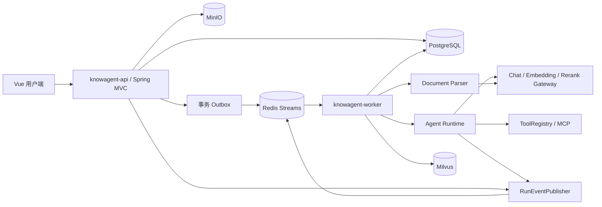
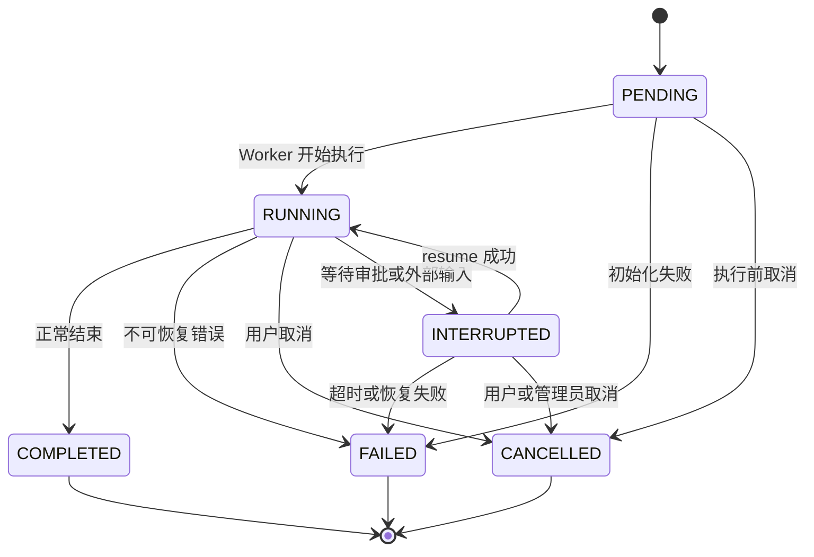
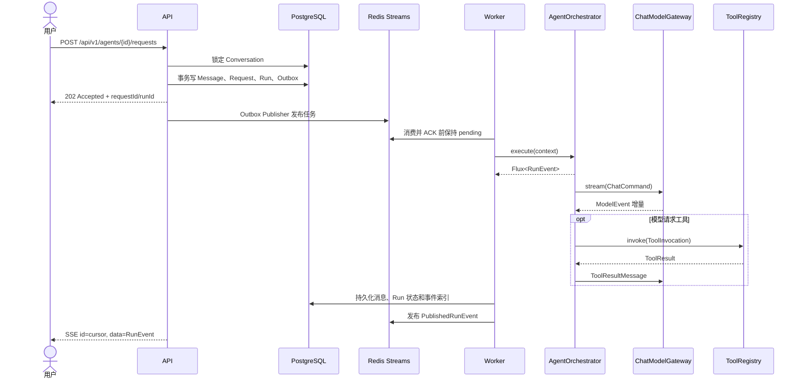
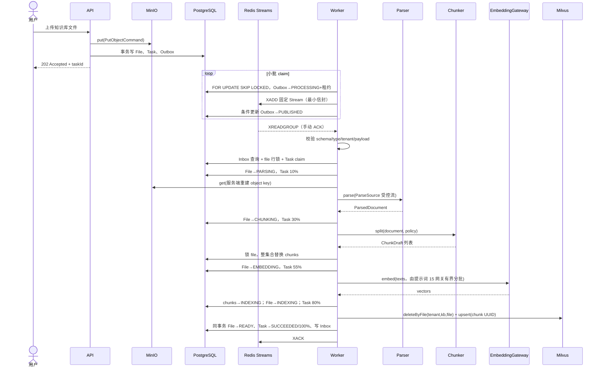
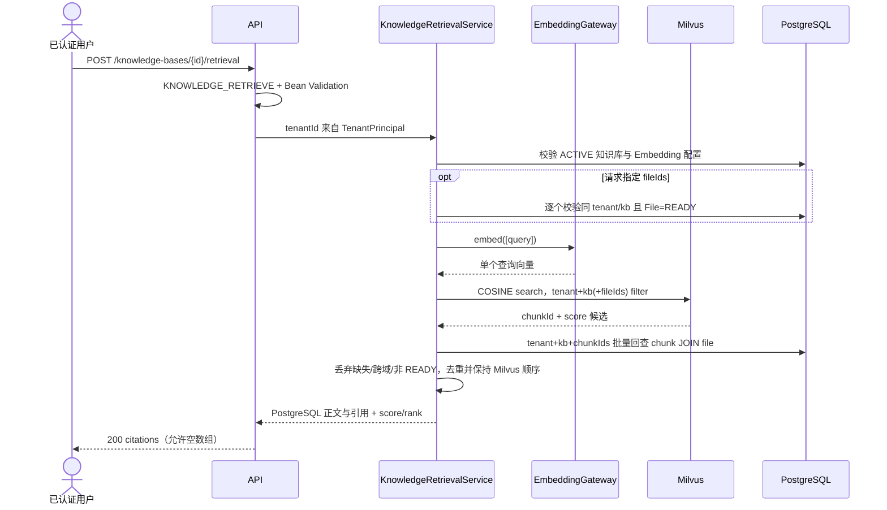
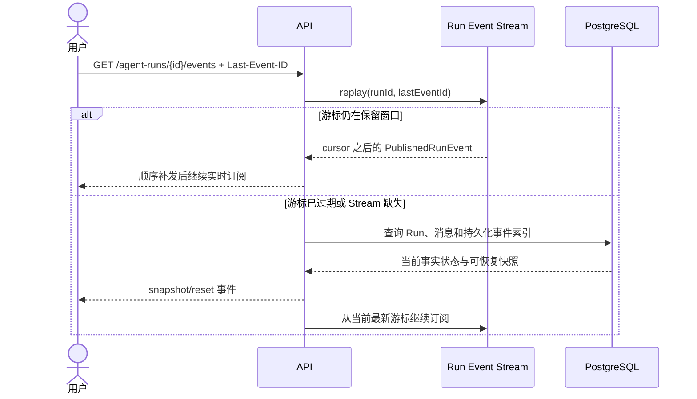

# KnowAgent 系统架构

本文是 KnowAgent 当前架构的唯一真相源，负责模块边界、运行链路、状态约束和基础设施职责。项目范围与里程碑见 [PLAN.md](../PLAN.md)，原 Yuxi 文件与接口迁移见 [YUXI_REFACTOR_GUIDE.md](../YUXI_REFACTOR_GUIDE.md)。

## 1. 系统组件

API 负责认证、参数校验、事务入口和 SSE 连接；Worker 负责耗时任务和 Agent Run；领域模块不依赖 API 或 Worker。

## 2. 模块依赖矩阵

| 模块 | 可以依赖 | 禁止依赖 | 主要职责 |
|---|---|---|---|
| `common` | 无 | 所有业务模块 | 通用错误、租户 ID、领域事件 |
| `security` | common | api、worker | Principal、认证授权边界 |
| `model` | common、security | knowledge、runtime | Chat、Embedding、Rerank 端口 |
| `knowledge` | common、security、model | runtime、api | 解析、分块、向量检索契约 |
| `agent-runtime` | common、security、model、knowledge | api、worker | Run 状态、编排、事件和检查点 |
| `extension` | common、security、agent-runtime | api、worker | Tools、Skills、MCP、SubAgent |
| `workspace` | common、security | api、worker | 对象存储、附件、虚拟路径 |
| `observability` | common、security | api、worker | 任务、审计、指标和评估 |
| `api` | 所有业务模块 | worker | HTTP、Spring Security、SSE、事务装配 |
| `worker` | 所有业务模块 | api | Outbox 发布、Stream 消费和后台执行 |

约束：禁止 Controller 直接调用 Mapper；禁止跨模块调用 Mapper；供应商 SDK 只能出现在基础设施适配器；自定义 SQL 必须显式校验 tenant。

## 3. 数据职责

| 组件 | 保存内容 | 不承担的职责 |
|---|---|---|
| PostgreSQL | 用户、知识库元数据、chunk、会话、消息、Request、Run、Task、Checkpoint、Outbox | 大文件和向量近邻索引 |
| Redis Streams | 任务投递、消费者组状态、短期 Run 事件和 SSE 游标 | Run 最终状态的唯一副本 |
| MinIO | 原始文档、附件、Agent 产物 | 权限事实和业务状态 |
| Milvus | embedding、chunk ID 和租户/知识库过滤字段 | chunk 正文的最终事实 |
| Neo4j | 后续阶段的图实体和关系 | 普通 RAG 可用状态 |

PostgreSQL 始终是最终事实来源。Redis、Milvus 和 Neo4j 的数据必须可以依据 PostgreSQL 重建或校验。表结构、复合租户外键、锁 SQL 和数据生命周期见 [数据库设计](database-schema.md)。

## 4. Agent 执行与事件

`AgentOrchestrator.execute` 返回 `Flux<RunEvent>`。每次执行必须产生一个开始事件、零到多个中间事件，以及一个且仅一个终态事件。

`RunEvent.eventId` 是 UUID，用于业务幂等和审计；`PublishedRunEvent.cursor` 是 Redis Stream/SSE 游标，用于排序和 `Last-Event-ID` 重连，二者不得混用。

`INTERRUPTED` 不是终态。终态不可回退；相同状态的重复写入按幂等处理；其他非法转换必须拒绝并记录审计事件。

## 5. 用户提问链路

## 6. 文档入库链路

该链路已完整实现。Publisher 的 XADD 与 PG PUBLISHED 不是一个事务：若进程在两者之间崩溃，租约过期后会重复投递；Inbox `(consumer_name,event_id)`、file 行锁、Task 租约和条件更新使业务最终只执行一次。Consumer 只在完成终态数据库事务后 ACK，死亡消费者的 pending 消息由 XPENDING + XCLAIM reclaim。

解析、Embedding、MinIO 和 Milvus 外部调用都位于短 PostgreSQL 事务之外。重试时先整集合覆盖 PG chunk，并在 upsert 前按 tenant+knowledge_base+file 幂等删除旧向量；PG chunk UUID 恒等于 Milvus entity ID。该设计是幂等操作加补偿的最终一致，不是全链路强事务。失败阶段同步写 File 和 Task：暂态错误有界退避，永久错误或预算耗尽进入 FAILED，PostgreSQL 始终是 UI 查询的事实来源。

### 6.1 语义检索链路

检索不建立跨 PostgreSQL、Embedding 和 Milvus 的事务。知识库/fileIds 的权限与状态检查是短只读数据库操作；Embedding 和 Milvus 是有超时的外部调用；最终批量回查 PostgreSQL 后才生成引用。Milvus 的 tenant/file 标量只用于缩小候选，不作为授权事实，即使候选 chunkId 的标量被污染、行已删除或状态落后，也会被 tenant+knowledge_base 联合查询与 chunk/file READY 检查丢弃。重复 Milvus id 保留第一次排名，threshold 与最终 topK 在应用层稳定执行。

该接口不调用 `ChatModelGateway`，不生成自然语言答案，也不创建 Conversation/Run/SSE。当前没有 RerankGateway 供应商适配器；若知识库 `rerankEnabled=true`，请求明确失败为配置错误，禁止把向量相似度冒充 rerank 分数。检索指标仅含 tenant/provider 非敏感 ID、候选数、结果数、结果状态与耗时；query、chunk 正文和向量不写日志或指标。

## 7. SSE 断线恢复链路

API 必须校验 runId 所属 tenant。客户端收到 reset 后用快照替换本地状态，不能把快照重复追加为增量。

## 8. 工具消息

`ChatMessage` 是密封接口：`TextChatMessage` 表示普通文本，`AssistantToolCallMessage` 保存有序工具调用，`ToolResultMessage` 通过 `toolCallId` 关联结果。供应商适配器负责与 Spring AI 消息互转，核心模型不依赖供应商私有类型。

## 9. 对象存储隔离

`ObjectStorageGateway` 的 put/stat/get/delete 只接受带 `TenantId` 的命令（`PutObjectCommand`/`GetObjectCommand`/`DeleteObjectCommand`）。调用方不能提供完整物理键：对象键由服务端经 `StorageKeys` 统一生成，知识库文件源的规范形状是 `tenants/{tenantId}/knowledge-bases/{knowledgeBaseId}/files/{fileId}/source`。`MinioObjectStorageAdapter`（MinIO Java SDK 8.5.17）在**每个**操作上首先重新校验对象键必须以 `tenants/{tenantId}/` 前缀开头——跨租户寻址（tenant-B 访问 tenant-A 的键、或任意不属该前缀的键）在发起任何 MinIO 调用前即被拒绝并映射为 `ObjectStorageException.Reason.INVALID_OPERATION`，物理对象不暴露给其他租户。

适配器约定：

- 固定由配置的 bucket（`minio.bucket`，缺省 `knowledge`）承载，启动时幂等 `bucketExists`/`makeBucket` 确保存在；misconfiguration 启动即失败，不把错误推迟到首次上传。
- `put` 流式 `putObject`，SHA-256 作为用户元数据（`x-amz-meta-sha256`）随对象一起写入；`stat` 从响应头还原 size/contentType/sha256；`get` 返回 closeable `InputStream`，所有输入流在消费方 `try-with-resources` 关闭。
- stat/get 对缺失对象映射 `OBJECT_NOT_FOUND`；`delete` 对不存在的对象是幂等成功（补偿语义：重复删除不报错）；网络/服务异常映射 `UNAVAILABLE`。
- 配置装配：`MinioObjectStorageConfiguration` 在 `minio.endpoint` 配置时启用（`MINIO_ENDPOINT` 环境变量），否则回退 `ObjectStorageFallbackConfiguration` 提供 `UnavailableObjectStorageGateway`（明确定义的不可用语义），API/Worker 在无 Docker/无 MinIO 的环境下也能正常启动。

数据库附件记录（`knowledge_files`）同时保存 tenant、object key、SHA-256 与大小；MinIO 本身不承担权限事实，任何对象只能经由带 tenant 的网关命令访问。

## 10. 认证请求上下文与租户隔离

`TenantContext`(knowagent-security)用普通 `ThreadLocal` 保存当前请求的 `TenantPrincipal`(`tenantId`、`userId`、`roles`、`permissions`,均为不可变集合)。故意不使用 `InheritableThreadLocal`,避免值跨线程池(Worker 执行器、SSE 异步派发)传播而把租户 A 的身份泄漏进租户 B 的工作。

上下文 **fail closed**:`TenantContext.requireTenantId()` 在没有认证上下文时抛 `BusinessException(AUTHENTICATION_REQUIRED)`,受保护业务查询因此被拒绝,而不是默认查询全部租户。

请求链:

1. `knowagent-api` 的 `TenantContextFilter`(`OncePerRequestFilter`)从 `SecurityContextHolder` 的认证 principal 解析 `TenantPrincipal`,并在 `try/finally` 中 `set`/`clear`。
2. 过滤器注册在认证过滤器之后、Spring Security `AuthorizationFilter` 之前，保证认证 principal 已就绪，并让租户感知的授权逻辑能够读取 `TenantContext`；即使授权被拒绝，也会执行过滤器的 `finally` 清理。
3. 租户来源只能是认证 principal。客户端请求头(如 `X-Tenant-Id`)永不作为租户来源;Controller 不得手工 `set`/`clear`。
4. `finally` 清理保证:Servlet 线程复用时下个请求观察不到上个请求的租户;请求中途抛异常上下文依然被清理。

数据访问:

- `SecurityPersistenceConfiguration` 装配 `TenantLineInnerInterceptor` 在乐观锁之前,普通 MyBatis-Plus 查询/写入自动追加 `tenant_id = <context>`。
- `TenantContextTenantLineHandler` 显式忽略没有 `tenant_id` 的表:`tenants`(唯一无 tenant_id 的业务表)与 `flyway_schema_history`。
- 只有极少数认证前 Mapper 方法允许 `@InterceptorIgnore(tenantLine = "1")` 绕过,且绕过 SQL 必须自身显式携带 `tenant_id`(或属于 tenant 根表、refresh token 全局唯一 hash 的文档化例外)。该白名单由 `SecurityMapperSqlContractTest` 精确锁定,新增绕过方法会使测试失败。
- 插入规则:PO 未设置 `tenantId` 时由拦截器从上下文填充;PO 显式声明 `tenantId` 时被信任。因此应用服务必须始终用 `TenantContext.requireTenantId()` 派生租户,不能接受客户端传入的租户。
- 代码审查规则:自定义 SQL、锁查询、统计与批量更新必须显式包含 `tenant_id`;锁查询与统计只能通过显式租户条件执行。

开发者管理员初始化:

- `AdminBootstrapRunner` 按 `bootstrap.enabled` 显式开关在启动时执行;缺参、弱密码或非法 slug 直接抛异常拒绝启动,不会自动生成并打印密码。
- 整个流程在一个事务内创建初始租户、`ADMIN` 系统角色、管理员用户和 `user_roles` 绑定,按 slug / tenant+code / tenant+login 幂等,任一步失败整体回滚。
- 密码经 `PasswordHasher`(Argon2id)编码后落库,原始密码不会出现在日志或异常中。初始化运行在认证前,不存在 `TenantContext`,因此所有存在性查询复用上文认证前显式租户查询白名单,写入的 PO 显式携带 `tenantId` 被拦截器信任。

Access Token 基础设施:

- `AccessTokenIssuer`(knowagent-api/security)负责签发 JWT;`AccessTokenAuthenticationConfiguration` 用 Spring Security 官方 OAuth2 Resource Server + Jose(`NimbusJwtEncoder`/`NimbusJwtDecoder`)签发与校验,不手写 JWT 编解码器。HS256 对称密钥只从环境变量读取(`JWT_SECRET`,base64,解码后至少 32 字节);`issuer`、`audience`、有效期与密钥通过 `@ConfigurationProperties(prefix = "jwt")` 类型安全绑定,`application.yml` 不含任何真实密钥,缺参时启动即失败。
- 令牌声明契约:签名使用 HS256;必需声明 `sub`(用户 UUID)、`tenant_id`(租户 UUID)、`roles`、`permissions`、`jti`、`iat`、`exp`;校验签名、issuer、audience、过期时间与必需声明。`permissions` 声明的唯一来源是 `TenantPrincipal.permissions()`(登录/刷新时从数据库聚合的有效角色权限),`AccessTokenIssuer.issue(principal)` 直接读取该字段,principal 是 JWT permissions claim 的唯一事实来源。
- 请求链:`BearerTokenAuthenticationFilter` 经 `JwtAuthenticationProvider` 校验 token → `JwtToTenantAuthenticationConverter` 把 JWT 转换为 `JwtTenantAuthenticationToken`,principal 为 `TenantPrincipal` → `TenantContextFilter` 从 principal 建立 `TenantContext`,`finally` 清理。必需声明缺失或畸形(如 `tenant_id` 不是 UUID)时转换器抛 `InvalidBearerTokenException`,统一得到稳定 JSON 401。
- 路由规则:`/actuator/health/**`、`/api/v1/system/info`、`/api/v1/auth/login`、`/api/v1/auth/refresh`、`/api/v1/auth/logout` 匿名;其余请求要求认证。资源服务器入口点与全局 `exceptionHandling` 共用 `JsonAuthenticationEntryPoint`/`JsonAccessDeniedHandler` 输出 JSON 401/403,不保留 Spring Boot 自动生成的 in-memory 用户与开发密码。
- 接口级授权使用 Spring Security Method Security:`SecurityBootstrapConfiguration` 类级 `@EnableMethodSecurity`,`@PreAuthorize("hasAuthority('USER_READ')")` 保护管理查询。JWT 的 `permissions` 声明经转换器原样映射为 authority(因此用 `hasAuthority` 而非 `hasRole`);方法级 `AccessDeniedException` 复用 `JsonAccessDeniedHandler` 输出稳定 JSON 403。权限常量集中在 `SecurityPermissions`:`USER_READ` 决定用户读取权限;`USER_ADMIN` 本阶段只定义常量、不授予任何人、不实现写接口。
- Access Token 基础设施与 Refresh Token 轮换/登出均已实现(见下文「登录、轮换与登出接口」)。

登录与当前用户接口:

- `POST /api/v1/auth/login`(`AuthController`,匿名)把请求映射为 `LoginCommand`(租户 slug、登录名、密码、来源 IP、User-Agent),调用 `Login` 端口;`GET /api/v1/users/me`(`UserController`,需认证)从 `@AuthenticationPrincipal TenantPrincipal` 读取当前身份。
- `POST /api/v1/auth/refresh` 与 `POST /api/v1/auth/logout`(`AuthController`,匿名)分别映射为 `RefreshCommand`(原始 token + 来源 IP + User-Agent)与 `LogoutCommand`(原始 token)。刷新由 API 层 `RefreshAuthenticationService` 事务门面协调 `RefreshTokens` 与 `AccessTokenIssuer`;轮换响应与登录同构(tokenType/accessToken/refreshToken/expiresIn),复用 `LoginResponse`;登出直接调用 `RefreshTokens` 并返回 204。两个 DTO 与命令的字符串输出均隐藏原始 token。
- 登录流程(`LoginService`,**不持有事务**):标准化 slug/login 小写 → 按 slug 解析 ACTIVE 且未删除租户 → 按 tenant_id+login_name 查询未删除用户 → 状态检查 → Argon2id 密码校验 → 聚合有效角色与权限 → 调用 `LoginSuccessHandler` 提交成功写入 → 签发高熵(32 字节 Base64url)Refresh Token,仅把 SHA-256 十六进制哈希落库。所有读为自动提交;写路径各自独立事务,单个登录**最多持有一个数据库连接**,并发失败登录不会耗尽连接池。
- 失败策略:未知租户、未知用户与错误密码统一抛 `INVALID_CREDENTIALS`(401),不泄露是哪一步失败,且未知租户/用户仍执行一次预计算的 dummy Argon2 校验,并对未知租户用固定 dummy tenant ID 执行一次用户查询,使三者工作量一致(租户查询 + 用户查询 + Argon2),响应耗时不能区分账号是否存在(防计时枚举);禁用/锁定账户在密码校验前抛稳定的 `ACCOUNT_DISABLED`/`ACCOUNT_LOCKED`(403);登录失败阈值与临时锁定窗口来自 `auth.login.*` 配置(`LoginPolicies`),不在代码写死。锁定按窗口判定:`LOCKED` + 过期窗口可重试,成功登录清除计数与锁定;`LOCKED` + 空窗口视为永久锁。
- 事务边界:成功路径由 `LoginSuccessHandler`(`@Transactional`)把「带版本守卫的登录状态更新 + Refresh Token 插入」在同一事务提交,冲突抛 `CONFLICT`(409);失败计数由 `LoginFailureRecorder`(`@Transactional` 普通独立事务,因 `LoginService` 无外层事务故不再嵌套 `REQUIRES_NEW`)写入,登录方法随后抛异常不影响其提交;计数在数据库内原子递增(`login_failed_count = login_failed_count + 1`),并发错误密码不丢失计数,达到阈值即置 `LOCKED`。
- 登录运行在认证前,没有 `TenantContext`,因此所有查询/写入复用认证前显式租户白名单:自定义 SQL 自带 `tenant_id` 条件,插入的 RefreshTokenPo 显式携带 `tenantId` 被拦截器信任。
- 响应契约:登录响应只含 tokenType/accessToken/refreshToken/expiresIn,Refresh Token 原始值仅出现一次;`/users/me` 返回 userId/tenantId/tenantSlug/loginName/displayName/roles/permissions。两者都不含密码哈希、token 哈希或锁定内部字段;DTO 校验失败统一返回 JSON 400 `VALIDATION_ERROR`。
- Refresh Token 轮换与登出(`RefreshTokenService`,`refresh` 与 `logout` 均为事务方法):只把 SHA-256 哈希作为查询键(禁止明文查库或落库)。所有 refresh、重放与 logout 先锁定家族根 token(`findFamilyRootForUpdate` 按 `id = family_id` FOR UPDATE,单一串行化点),锁下按 id 重读提交的 token 并校验状态、`expires_at`、用户与租户状态。账户规则集中在 `AccountAuthenticationPolicy`:用户必须 `status == ACTIVE`,且未来的 `login_locked_until` 无论当前 status 是否仍为 ACTIVE 都视为有效临时锁;租户必须 ACTIVE 未删除。随后把 ACTIVE token 置为 CONSUMED 并插入同一 `family_id` 的子 token(`parent_token_id` 指向旧 token,root 满足 `family_id = id`,唯一部分索引 `uq_refresh_tokens_one_child` 约束单子),再按当前角色权限返回签发上下文。API 层 `RefreshAuthenticationService` 以 `@Transactional(noRollbackFor = RefreshTokenInvalidException.class)` 包住轮换、Access Token 签名和响应构造:签名或其他基础设施异常会让旧 token 消费与子 token 插入整体回滚,避免生成但未返回的凭据;CONSUMED token 重放、CAS 失败或唯一子 token 冲突则撤销家族并抛 `RefreshTokenInvalidException`,noRollbackFor 使安全撤销仍提交。子 token 插入运行在保存点(`insertChild` 的 `Propagation.NESTED`)内,PostgreSQL 唯一约束错误只回滚插入、事务仍可用于家族撤销,且仅 `uq_refresh_tokens_one_child` 映射为重放,其他唯一约束错误原样抛出。因为轮换/重放/登出共享同一家族根锁,子 token 刷新与根 token 重放/登出的并发最终收敛为家族无 ACTIVE。登出按 hash 定位 token 后锁定家族根并撤销家族内仍有效 token,重复登出幂等。轮换/登出运行在认证前,无 `TenantContext`,因此写入 SQL(消费、家族撤销)显式携带 `tenant_id` 并纳入 tenant-line 白名单。

租户内用户管理查询接口:

- `GET /api/v1/users`(分页查询)与 `GET /api/v1/users/{userId}`(详情)位于 `UserController`,均需 `USER_READ`(`@PreAuthorize`)。两者由 `UserQueryService` 支撑,租户来源只能是认证 principal:`@AuthenticationPrincipal TenantPrincipal` 取 `principal.tenantId()`,服务层不解析任何请求参数、不读取请求头。
- 分页/统计不走 MyBatis-Plus `PaginationInnerInterceptor`(代码库无此拦截器,且审查规则要求「统计只能通过显式租户条件执行」):手写 `SELECT COUNT(*)` + `LIMIT/OFFSET` 自定义 SQL,两者都显式携带 `tenant_id = #{tenantId}` 与 `deleted_at IS NULL`。这两个方法**不在**认证前绕过白名单,运行在租户插件下,插件额外注入相同的 `tenant_id` 作为 fail-closed 兜底。关键词模糊匹配用 `LOWER(login_name/display_name) LIKE LOWER(?) ESCAPE '\'`,`\`/`%`/`_` 由服务层转义;可选 status/keyword 用静态 `COALESCE(#{x},'')=''` 条件,避免动态 `<script>` 增加 JSqlParser 改写风险。
- 分页参数校验:page<1、size∉[1,100] 或 `(page-1)*size` 超出持久化层支持的 OFFSET 范围时返回 400 `VALIDATION_ERROR`;非法 status 枚举或 userId UUID 由 `ApiExceptionHandler` 的 `MethodArgumentTypeMismatchException` 处理器统一返回 400 `VALIDATION_ERROR`(此前误报 500)。
- 隔离与泄露:跨租户 `userId` 与不存在用户同样返回 404 `RESOURCE_NOT_FOUND`(不泄露资源存在性);过期 `user_roles`(expires_at 已过)在登录时聚合出空有效角色、不产生任何权限,访问受保护端点返回 403。响应 DTO(`UserItemResponse`/`UserPageResponse`)只含 userId/departmentId/loginName/displayName/email/phoneNumber/status/createdAt,结构上不可能泄露 passwordHash/loginFailedCount/loginLockedUntil 等内部字段。

## 11. 模型供应商配置与密钥加密

`knowagent-model` 承载模型供应商（`model_providers`，V5）的领域、应用服务、持久化和共享密钥装配；`knowagent-api` 只暴露 HTTP 接口，`knowagent-api` 与 `knowagent-worker` 从同一模型模块配置创建 `SecretCipher`。

- 领域：`ModelProvider` 聚合只携带加密后的 `EncryptedSecret` 信封（明文从不进入领域），`provider_key` 强制小写并遵守 `^[a-z0-9][a-z0-9_-]{0,98}$`；`AdapterType` 本阶段仅 OPENAI_COMPATIBLE，`capabilities`/`enabled_models`/`public_config` 为结构化 JSONB。
- 加密：端口 `SecretCipher` 隔离实现；`AesGcmSecretCipher`（JDK AES-256-GCM）每次加密用随机 12 字节 nonce + 128 位 tag，密文信封 `aesgcm.v{n}.{base64url(nonce)}.{base64url(ciphertext)}` 自描述 keyVersion，支持未来轮换。`ModelProviderCryptoConfiguration` 统一校验主密钥必须为合法 base64 且解码后恰好 32 字节，属性对象的 `toString()` 固定输出 `[REDACTED]`；主密钥只从 `MODEL_PROVIDER_SECRET_KEY` 读取，API 与 Worker 必须使用相同值。未配置时 `SecretCipher.isConfigured()==false`，写秘密的操作被拒（500），绝不退化明文。更新未提交 secret 保留旧值，`clearSecret`/`clearHeaders` 独立布尔命令显式清除（空字符串不作哨兵）。
- 持久化：`ModelProviderMapper` 的自定义分页/统计/锁查询/更新/软删 SQL 全部显式携带 `tenant_id` 且不加 `@InterceptorIgnore`（认证请求中租户插件再注入相同 tenant_id 作 fail-closed 兜底，与用户管理查询一致）；更新以显式 `version = #{version}` 守卫实现乐观锁，创建和更新的活动 key 唯一约束竞争统一映射为 409；部分唯一索引 `uq_model_providers_key_active`（tenant_id + provider_key，WHERE deleted_at IS NULL）保证软删后 key 可复用。JSONB 用专用 TypeHandler 结构化映射（public_config 复用 security 的 `JsonNodeJsonbTypeHandler`）。
- 删除：`ModelProviderService.delete()` 在同一事务内先以 `SELECT ... FOR UPDATE` 锁定活动供应商，再调用由 `knowagent-knowledge` 实现的 `ModelProviderReferenceChecker` 检查活动知识库引用，存在引用返回 409，最后执行带版本守卫的软删除。知识库创建或更换模型供应商时必须先以 `(tenant_id, id, deleted_at IS NULL) ... FOR KEY SHARE` 锁定活动供应商，再写入 `knowledge_bases`；该锁协议阻止“删除检查后并发新增引用”的 TOCTOU，不依赖数据库异常作正常控制流。
- 接口：读需 `MODEL_PROVIDER_READ`、写需 `MODEL_PROVIDER_WRITE`（均已授予 ADMIN 角色）；列表/详情只返回 hasSecret/capabilities/enabledModels/publicConfig，不含 ciphertext/解密值/keyVersion/内部 header；跨租户 ID 统一 404。`POST /api/v1/model-providers/{id}/health-check` 只做配置校验并返回未接入，不伪造 HEALTHY。

### Embedding 调用网关（提示词 15 已落地）

`knowagent-model` 新增 `embedding` 包（端口与值对象）与 `infrastructure.embedding` 包（OpenAI-compatible 适配器）实现文本向量化。提示词 15 本身只完成「输入 → 分批 → 供应商调用 → 校验 → 有序向量」；提示词 17 已把 `EmbeddingGateway.embed(EmbeddingRequest)` 接进 Worker 驱动链路并与 Milvus 对接。

- 端口与值对象：`EmbeddingGateway` 是纯应用端口（普通 Bean，无事务）；`EmbeddingRequest`/`EmbeddingResult` 为不可变值对象，`toString()` 不含文本与向量。调用方构造请求时携带已认证租户的 tenantId（租户只能来自 `TenantPrincipal`/`TenantContext`），不暴露任何供应商 DTO。
- 供应商解析与校验：`resolveProvider` 按 `(tenantId, providerId)` 从当前租户读取 `ModelProvider`——跨租户或缺失返回 `RESOURCE_NOT_FOUND`（不泄露存在性）；适配器非 OPENAI_COMPATIBLE、禁用、未声明 `EMBEDDING` 能力、或 `enabled_models` 非空但请求模型不在其中（按「模型名 + EMBEDDING 能力」完全匹配，空目录=不限）都返回 `MODEL_CONFIGURATION_ERROR`，且校验失败不发任何请求。
- 分批：`BatchPlanner.plan` 同时遵守 `maxTextsPerBatch`（最大文本条数）、`maxTokensPerBatch`（`CharRunTokenEstimator` 的 char-run-v1 确定性估算）与 `maxRequestBodyBytes` 三条限制；请求体大小按文本 JSON 转义后的 UTF-8 字节计算保守上界，并计入固定结构及模型名等可变开销，避免控制字符 `\\u00xx` 转义造成低估；空/空白输入直接拒绝（`VALIDATION_ERROR`），单个文本超限无法独自成批也拒绝；批次严格保持输入顺序。
- 协议与缓存：用 Spring AI 1.1.8 `OpenAiApi` + `OpenAiEmbeddingModel` 只做协议（不手写重复客户端；`baseUrl` 优先取 `embedding_base_url`）；`EmbeddingModelClientCache` 以 `(tenantId, providerId, configVersion)` 为键做 LRU 缓存，`configVersion` 更新后旧客户端不再被复用，`maxClientCacheSize` 有界。API Key（`SimpleApiKey`）与自定义 Header 只在客户端构建边界解密并进入请求头，解密值不进入日志、异常、缓存键或业务对象。
- 超时与重试：配置连接超时/读取超时（`SimpleClientHttpRequestFactory`）+ 总超时 deadline（所有批次共享）；每次模型调用都以剩余 deadline 限时，连接/读取超时也收紧到不超过 totalTimeout，因此单次慢成功、多批累计与退避共同受同一总预算约束。有界重试（`maxAttempts`、指数退避 `backoffInitial/multiplier/max`）只对 429、明确 5xx 与显式网络暂态错误重试，4xx 配置错误（401/403/400）及 SSL 握手等永久传输错误不重试；总预算耗尽映射为 `MODEL_TIMEOUT`。自定义 `OpenAiResponseErrorHandler` 与默认 Spring AI 重试模板都被替换（默认模板无 429 处理、错误处理器会把供应商正文带进异常消息）。
- 错误映射：错误沿 cause 链分类为稳定 `ErrorCode`——401/403 → `MODEL_AUTH_FAILED`、429 → `MODEL_RATE_LIMITED`、网络暂态/超时 → `MODEL_TIMEOUT`（含 body 转换失败包装的 `SocketTimeoutException`）、响应不可读 → `MODEL_BAD_RESPONSE`、其余 → `MODEL_SERVICE_ERROR`；供应商原始正文从不进入日志或异常消息。
- 向量校验：逐批校验返回数量等于输入条数、`index` 与位置一致、向量非空、所有值有限（NaN/Infinity 拒绝）、维度与 `expectedDimensions`（未请求时以首个向量定维）一致；跨批维度不一致、总数量不符都在索引前失败为 `MODEL_BAD_RESPONSE`。维度与 Milvus collection 配置不一致的失败由调用方在索引前比对。
- 指标：`EmbeddingMetrics` 记录 providerId/model/outcome/耗时/批次数/估算 token 总数等非敏感字段，绝不记录 chunk 原文或向量数组；无 MeterRegistry 时为 no-op。
- 配置：`knowagent.model.embedding.*`（连接/读取/总超时、maxAttempts、退避、maxTextsPerBatch、maxTokensPerBatch、maxRequestBodyBytes、maxClientCacheSize），API 与 Worker 共用同一 `EmbeddingGatewayConfiguration` 装配。

## 12. 知识库领域与 CRUD

`knowagent-knowledge` 承载知识库（`knowledge_bases`，V6）与知识库文件（`knowledge_files`，V6）的领域、应用服务与持久化；`knowagent-api` 只暴露 HTTP 接口。本阶段已实现知识库 CRUD、文件上传（提示词 12）、本地文档解析（提示词 13）与确定性文本分块持久化（提示词 14）；Embedding、向量检索与 Worker 驱动的解析/分块执行留待后续提示词。解析器只处理「受控对象流 → ParsedDocument」，不写 chunk、不调模型、不启动 Redis consumer。

- 领域：`KnowledgeBase` 聚合携带 slug、名称、描述、类型（`KnowledgeType`）、状态（`KnowledgeBaseStatus`）、embedding/rerank 供应商 ID + 模型（provider/model 必须成对或同时为空）、`ChunkPolicy` 与 `RetrievalConfig` 值对象、JSON 元数据和乐观锁版本。slug 强制小写并遵守 `^[a-z0-9][a-z0-9_-]{0,98}$`（与 V6 约束一致）。`ChunkPolicy` 为密封值对象：`RECURSIVE`/`MARKDOWN_HEADING`/`TOKEN_WINDOW` 三种策略 + `maxTokens`/`overlapTokens`（**单位恒为 token**），compact 构造器校验 `maxTokens>0`、`overlapTokens>=0`、`overlapTokens<maxTokens`，`defaults()` 为 RECURSIVE 800/100；`RetrievalConfig` 校验 `topK∈[1,100]`、`scoreThreshold∈[0,1]`，并携带 `rerankEnabled`。`toString()` 不含配置与审计字段。
- 状态机：`KnowledgeBaseStatus.canTransitionTo` 集中定义合法转换——仅 `ACTIVE↔DISABLED` 可正向切换，`DELETING`/`DELETED` 是软删内部状态（DELETE 接口直接软删到 `DELETED`，删除任务进程使用 `DELETING`）。非法转换返回 400。
- 应用服务：`KnowledgeBaseService` 校验 slug 租户内活动唯一（预检查 + 部分唯一索引 `uq_knowledge_bases_slug_active` 竞争兜底映射 409，创建与更新的唯一约束竞争都转 CONFLICT）、名称/描述/元数据边界（描述超长、非对象元数据在服务层转稳定 400，避免领域构造器 IAE 变 500）。供应商解析 `resolvePair`：提交的 provider/model 必须成对；供应商必须存在于当前租户（`providers.findByIdForKeyShare`——跨租户或已软删供应商同 404，不泄露存在性）、`enabled` 且声明对应能力（EMBEDDING/RERANK），否则 400。模型校验契约：`enabled_models` 目录**非空**时，必须存在一条「模型名 + 能力」完全匹配的记录（模型不在目录或登记为其他能力都返回 400）；**为空**表示租户未限定模型列表，允许任意模型名（只要能力已声明）。PATCH 语义为 null=保留，本阶段不支持解绑。
- 锁定协议：知识库创建与更新（两者都在事务内）经 model 模块 `ModelProviderRepository.findByIdForKeyShare` 以 `(tenant_id, id, deleted_at IS NULL) ... FOR KEY SHARE` 锁定活动供应商，再写入 `knowledge_bases`，与供应商删除侧的 `FOR UPDATE` 锁配对。该锁串行化「验证供应商 → 插入知识库」与「检查无引用 → 软删供应商」的 TOCTOU：删除已持有 `FOR UPDATE` 时，创建方的 `FOR KEY SHARE` 读**阻塞**，待删除提交后用 `deleted_at IS NULL` 重新判定 → 返回 404 且不落库；创建先提交时，删除方的引用检查看到新引用 → 返回 409。文件上传落库事务同样通过 `KnowledgeBaseRepository.findByIdForKeyShare` 锁定活动知识库，与知识库删除侧的 `FOR UPDATE` 配对，防止对象上传后并发软删仍写入文件引用。`FOR KEY SHARE` 与 `FOR UPDATE` 不同，同一父资源仍可承载多个并发引用写入。
- 持久化：`KnowledgeBaseMapper` 的自定义读/分页/统计/行锁/更新/软删 SQL 全部显式携带 `tenant_id = #{tenantId}` 与 `deleted_at IS NULL`，不加 `@InterceptorIgnore`（认证请求中租户插件再注入相同 tenant_id 作 fail-closed 兜底）。更新与软删都以 `version = #{version}` 守卫（受影响行数 0 → 409 乐观锁冲突），软删 SQL 同时置 `status='DELETED'` + `deleted_at`，slug 复用依赖部分唯一索引。`chunk_policy`/`retrieval_config` 用专用 TypeHandler 结构化映射 JSONB，非法存储值在读取时转 SQLException。
- 列表与过滤：`GET /api/v1/knowledge-bases` 支持 page/size（size∈[1,100]、OFFSET 溢出 400）、`name`/`slug` 不区分大小写模糊（`LOWER(...) LIKE LOWER(?) ESCAPE '\'`，`\`/`%`/`_` 由服务层转义）、`status` 精确过滤；数据与统计 SQL 使用同一套显式租户条件，`ORDER BY created_at DESC`。
- 删除：`DELETE` 仅允许无未删除文件的知识库——先 `findByIdForUpdate` 锁定行，再经 `KnowledgeFileReferenceChecker` 统计未删除文件（`countActiveFiles` 按 tenant_id + knowledge_base_id），有文件返回 409，无文件执行版本守卫软删；全量级联删除与文件/向量清理留待文件入库阶段（提示词十九）。
- 接口与权限：`POST/GET/GET/{id}/PATCH/{id}/DELETE/{id}` 于 `/api/v1/knowledge-bases`。读需 `KNOWLEDGE_BASE_READ`、写需 `KNOWLEDGE_BASE_WRITE`（`SecurityPermissions` 集中定义并加入 `ADMIN_ROLE_PERMISSIONS`），`@PreAuthorize` 方法级鉴权；租户只来自 `@AuthenticationPrincipal`。响应 DTO 只含业务字段，不含 version/tenantId/createdBy/updatedBy/deletedAt；跨租户知识库 ID 统一 404。

### 知识库文件上传与对象存储（提示词 12）

`knowagent-knowledge` 的 `KnowledgeFileService` + `KnowledgeFileSubmissionService` 承载文件上传，`knowagent-workspace` 的 `MinioObjectStorageAdapter` 承载对象存储，`knowagent-api` 的 `KnowledgeFileController` 只做 HTTP 装配。上传线程**不解析文件、不调用 Embedding 或 Milvus**，成功只把文件置为 `QUEUED`（任务 `PENDING`）；随后由已落地的 Worker 异步入库链承接。

- 接口：`POST /api/v1/knowledge-bases/{knowledgeBaseId}/files`（multipart/form-data，成功返回 **202** + fileId/taskId/replayed）；`GET .../files`（分页 + status 过滤）；`GET .../files/{fileId}`（详情）；`GET .../files/{fileId}/content`（认证 + 流式下载，`Content-Disposition: attachment`）。写需 `KNOWLEDGE_FILE_WRITE`、读需 `KNOWLEDGE_FILE_READ`（均在 `SecurityPermissions` 集中定义并加入 `ADMIN_ROLE_PERMISSIONS`），租户只来自 `@AuthenticationPrincipal`。
- 上传流程：① 校验知识库属于当前租户且 `ACTIVE`（缺失/跨租户/禁用分别映射 404/404/409）；② fileId/taskId/outboxEventId 全部在 Java 预生成；③ 流式计算 SHA-256 与字节数，执行非空、请求大小（servlet 413 第一道防线 + 服务层 50MB spool 上限第二道防线）与类型校验；④ 类型检测用 Apache Tika 嗅探 + 可信内容回退（Markdown 标题/围栏启发式、OOXML `word/document.xml` 检查），TXT/PDF/DOCX/TEXT_MARKDOWN 可上传，空文件、伪造 MIME（如 PNG 字节声明 text/plain）、未知类型稳定 400 `VALIDATION_ERROR`；文件名只作为展示/原始元数据，不作为类型事实；⑤ `ObjectStorageGateway.put` 流式写 MinIO，SHA-256 存用户元数据；⑥ 落库事务先以 `FOR KEY SHARE` 重新锁定并确认知识库仍为 `ACTIVE`，再在**同一事务**写 `knowledge_files`（`QUEUED`）+ `tasks`（`PENDING`）+ `outbox_events`，四项校验/写入同生同灭；⑦ 数据库失败或并发删除获胜时立即补偿删除已上传对象（补偿失败记录可告警的稳定错误，绝不误报成功）。
- Idempotency：请求头 `Idempotency-Key` → `upload_idempotency_key`（tenant + knowledge_base 作用域）。同 key + 同文件 SHA-256 → 返回原 fileId/taskId（`replayed=true`），不产生第二个文件/Task/Outbox；同 key + 不同内容 → 409 `CONFLICT`。数据库 `DuplicateKeyException` 竞争同样按此重放/冲突语义映射。
- 文件状态机：`KnowledgeFileStatus` 的 `UPLOADED → QUEUED` 由 `KnowledgeFileSubmissionService` 集中定义，`Task` 走 observability 的 PENDING/RUNNING/… 状态机；任务幂等键在此阶段刻意为空（上传幂等由 KB 作用域的 upload_idempotency_key 承载，任务索引是 tenant+taskType 作用域）。
- 读取与泄露控制：list 先按 tenant + knowledgeBaseId 校验活动知识库，detail/content 再按 tenant + knowledgeBaseId + fileId 读取；跨租户知识库、跨租户/跨知识库 fileId 与不存在统一 404（不泄露存在性）。`UploadFileResponse`/`KnowledgeFileResponse` 结构上不含 object_key/bucket/processing_params/内部错误栈/MinIO 凭据；content 流式下载不把整个对象读入内存。
- 测试：单元 `KnowledgeFileServiceTest`（上传/幂等/补偿/读取全路径）与 `KnowledgeFileMapperSqlContractTest`（自定义 SQL 显式 tenant_id、幂等历史查询不过滤 deleted_at）；docker-it 真实容器 `MinioStorageIT` 5 例（对象存储边界契约）与 `KnowledgeFileUploadIT` 14 例（真实 PG + MinIO + 安全链的端到端上传/幂等/补偿/权限/泄露控制，含并发删除先锁行时上传等待、删除提交后 404 且对象补偿）。

### 本地文档解析与外部 OCR 边界（提示词 13）

`knowagent-knowledge` 的 `document` 包承载本地解析：`ParserRegistry` 按已检测规范 MIME 选择唯一解析器，产出标准 `ParsedDocument`（title/text/pageCount + 精确分区的 `ParsedSection`，每节带 sectionPath/heading/pageNumber/字符偏移/metadata），这是分块唯一消费的契约。**解析器只接受服务端 `ObjectStorageGateway` 提供的受控流与元数据**（`ParseSource`），永不自行从任意 URL 下载文件；解析器自身不写 chunk、不调 Embedding/Milvus，阶段推进由 Worker 入库应用服务负责。

- 解析器与依赖：`TxtMarkdownParser`（`text/plain`/`text/markdown`，UTF-8/UTF-16 BOM 与宽松回退解码，Markdown `#` 标题切节）、`PdfParser`（`application/pdf`，PDFBox 3，每页一节带 1-based pageNumber，按阅读顺序提取）、`DocxParser`（`application/vnd.openxmlformats-officedocument.wordprocessingml.document`，Apache POI XWPF，Heading id 或样式显示名（含本地化“标题 n”）识别开节，表格按读取顺序加入）。依赖最小化：只引入 `pdfbox:3.0.5` 与 `poi-ooxml:5.4.1`（Spring Boot BOM 均不托管、显式固定版本），tika-core 仍只做上传期类型嗅探，不参与解析。`ParsedSection` 沿用统一领域模型，不为各供应商复制一套类型。
- 限制与安全：`knowagent.parse.*` 类型安全配置（`ParseProperties`，未配置回退安全默认）——maxBytes（源流 spool 上限，`SourceSpool` + `LimitedInputStream` 双防线）、maxPages（PDF）、maxUncompressedBytes（DOCX zip-bomb 防线：`ZipSecureFile.setMaxEntrySize` + 中央目录逐入口和累计解压大小预检，超限稳定 `DOCUMENT_TOO_LARGE`）、maxCharacters（文本预算）、timeout（`ParseBudget` 协作式超时）。空文件/空文本 → `EMPTY_DOCUMENT`，损坏 PDF/DOCX → `CORRUPT_DOCUMENT`，未知 MIME → `UNSUPPORTED_DOCUMENT_TYPE`，超限 → `DOCUMENT_TOO_LARGE`，超时 → `DOCUMENT_TIMEOUT`。源流在所有成功、解析异常和未知 MIME 路径都被关闭，临时 spool 文件全路径删除；`OPCPackage` 作为独立 try-with-resources 资源，`XWPFDocument` 构造失败也不会遗留文件句柄。Compose 将同一组 `PARSE_*` 环境变量同时传给 API 与 Worker。
- 错误与泄露控制：所有异常转稳定 `ErrorCode`，错误消息为固定文案，**不含原文、对象键、文件系统路径或第三方堆栈**；`ParseSource`/`ParsedSection`/`ParsedDocument` 覆盖 `toString()`，不输出对象键、文件名、标题、正文、章节标题或 metadata。`ParsedSection` 自身校验 offset 长度与 1-based 页码，`ParsedDocument` 再校验每个 section.content 与对应 text slice 逐字相等、连续且完整覆盖。`ParserRegistry` 构造期拒绝两个解析器声明同一 MIME（歧义即不可部署），MIME→解析器映射不可变，选择确定且并发安全。
- 外部 OCR 边界：MinerU/PaddleX OCR 属 `EXTERNAL_SERVICE`/后续范围。扫描 PDF 等**可加载但无文本**的文档稳定返回 `OCR_REQUIRED`（不伪造文本），由后续外部 OCR 提示词接入；可重试与「需要 OCR」的明确信号在此已定型，`ApiExceptionHandler` 映射 422。本地解析与外部 OCR 共享同一 `ParsedDocument` 契约，消费方无感知。
- 测试：`TxtMarkdownParserTest`/`PdfParserTest`/`DocxParserTest`/`ParserRegistryTest`/`ParsedDocumentContractTest` 共 39 例——真实 PDF/DOCX 夹具验证页码、标题路径、本地化样式名、文本顺序与字符范围，空/损坏/超限页数/单入口及累计超限解压/未知 MIME 稳定错误码，InputStream 成功与异常路径均关闭，值对象日志脱敏，注册表多线程确定性。

### 确定性文本分块与 knowledge_chunks 持久化（提示词 14）

`knowagent-knowledge` 的 `chunk` 包承载确定性分块，`application.service.ChunkWriteService` 承载替换式持久化。范围到「ParsedDocument → 有序 ChunkDraft → `knowledge_chunks` 落库」为止：**不生成向量、不调 EmbeddingGateway/Milvus、不推进文件状态**——Embedding 与 Worker 驱动留待后续提示词。

- Token 估算：未接入供应商 tokenizer 前统一走 `TokenCounter` 端口 + `DeterministicTokenCounter`「char-run-v1」确定性估算（CJK 表意/全角=1、其余非空白连续码点每 4 个=1、空白=0；`tokenCount = tokenCountAt(end) - tokenCountAt(start)` 前缀差分定义）。`TokenStream` 把文本切成位置原子 token（`record Token(int startChar,int endChar)`，`tokenCountAt` 二分计数），token 边界恒落在码点之间，**绝不切开 Unicode 代理对**；公开的 `fromTokens` 工厂校验顺序、范围、不重叠与代理对边界，使后续供应商 tokenizer 能构造同一 positioned-token 契约。每个 chunk 的 metadata 携带 `token_estimator=char-run-v1` 与 `chunk_strategy`，明确标记算法版本——不把字符数冒充精确 token 数。
- 三种策略（`DeterministicChunker`，同输入 + 策略恒产生同顺序同内容同哈希，无空 chunk、无无限循环）：`RECURSIVE` 全文本按段落/句子/换行偏好边界切分；`MARKDOWN_HEADING` 以 `ParsedSection` 为硬边界（chunk 不跨节），并在每节内独立 token 化后累计文档级 token offset，避免无空白章节边界切入英文 token 时少算，页码 `pageNumber` 与标题路径（`sectionPath`，如 `"1.1"` → `["1","1.1"]`）从覆盖 chunk 起点的 ParsedSection 透传到每个相关 chunk；`TOKEN_WINDOW` 定长 token 窗口、步长 `maxTokens - overlapTokens`，overlap 精确到 token，窗口间分隔空白归入前一块并保留文档首尾空白，零重叠时可无损拼回全文。预算内取最远偏好边界，超长无分隔文本 `safeSplit` 安全退化（窗口精确 maxTokens token，含 `tokenEndChar(target-1)` off-by-one 修正）；`overlapStart` 钳制 `overlap < chunkSize` 且至少一个 token 前进。
- 领域与持久化：`ChunkDraft` 构造时校验 SHA-256 确实匹配 content、tokenCount 确实等于 token offset 差；`KnowledgeChunk`（确定性 UUID、tenant/kb/file、chunkIndex、content/SHA-256 contentHash、字符与 Token offset、pageNumber、sectionPath、metadata、index_status、version），`KnowledgeChunkPo` + `KnowledgeChunkMapper` + `KnowledgeChunkPersistenceConverter` + `MyBatisKnowledgeChunkRepository`。`section_path`/`metadata` 用 `StringListJsonbTypeHandler`/`StringMapJsonbTypeHandler` 结构化映射 JSONB（损坏 JSON → SQLException）。chunk 初始 `index_status='PENDING'`。
- 替换式写入事务（`ChunkWriteService.replaceChunks`，单一 `@Transactional`）：① `FOR UPDATE` 锁定 `knowledge_files` 行（不存在/跨租户 → 404，不泄露存在性）；② drafts 转 PENDING KnowledgeChunk，UUID 由 tenant/kb/file/chunkIndex/contentHash 确定性生成——相同重试保留未来 Milvus entity id，内容变化则换 id；随后整集合替换（删除旧 chunk 后逐条插入），`UNIQUE(tenant_id, file_id, chunk_index)` 兜底杜绝重复索引；③ `updateChunkStatistics` 以 `version = #{version}` 条件更新 chunk_count/token_count/version（受影响行数 0 → 409 乐观锁冲突）。任一失败整体回滚，**旧数据/新数据不半替换**。所有 chunk SQL 显式携带 tenant_id + knowledge_base_id + file_id，不加 `@InterceptorIgnore`（租户插件留作 fail-closed 兜底）。
- 测试：分块与持久化相关 61 例（`DeterministicTokenCounterTest` 9 + `ChunkDraftTest` 10 + `DeterministicChunkerTest` 20 + `KnowledgeChunkTest` 8 + `KnowledgeChunkTypeHandlerTest` 5 + `KnowledgeChunkMapperSqlContractTest` 2 + `ChunkWriteServiceTest` 4 + `KnowledgeFileMapperSqlContractTest` 补 3），覆盖三策略边界/重叠/空白/中文/英文/Emoji 代理对/超长单词、TOKEN_WINDOW 分隔符完整覆盖、章节边界重新 token 化、草稿完整性、稳定 UUID、页码与标题路径透传、确定性。docker-it `KnowledgeChunkIT` 5 例在真实 PostgreSQL 上验证：统计与实际行数一致、同替换重试不重复 chunkIndex 且 UUID 不变、重复 chunkIndex 回滚后旧集合完整、tenant-B 不能查询/替换/删除 tenant-A chunk。

### Milvus 向量存储适配器（提示词 16 已落地）

`knowagent-knowledge` 的 `infrastructure.vector` 包实现 `VectorStoreGateway`（`VectorChunk`/`VectorQuery`/`VectorHit` 端口不暴露 Milvus SDK 类型），使用 Milvus Java SDK V2 API（`io.milvus:milvus-sdk-java:2.5.6`，与 Compose 的 Milvus 2.5.6 服务端匹配）。契约与安全边界见 [ADR-0005](adr/0005-milvus.md)；此处记录装配与运行要点：

- **装配**：`VectorStoreConfiguration` 在 `knowagent.vector.milvus.uri`（`MILVUS_ENDPOINT`）配置时启用（client/executor/initializer/gateway 四个 Bean，client 与 executor 带 destroy 清理）；缺省由 `VectorStoreFallbackConfiguration` 提供 `UnavailableVectorStoreGateway`（任何操作稳定 `VECTOR_UNAVAILABLE`）。API（扫描 `com.knowagent`）与 Worker（扫描 `com.knowagent.knowledge`）都会装配同一适配器；`MILVUS_DIMENSION` 必须与 embedding 模型输出一致，未设置时启用即拒绝启动。
- **启动**：`MilvusCollectionInitializer`（SmartLifecycle，`isAutoStartup=true`）幂等检查/创建 collection + COSINE 索引（`index-type` HNSW/FLAT/AUTOINDEX 与 HNSW 参数 `m`/`ef-construction`/`search-ef` 由配置固定）并 load；已存在 collection 只做 schema/维度/主键/autoID/metric 校验，不匹配抛 `VECTOR_SCHEMA_MISMATCH` 拒绝启动，**绝不 drop 生产集合**。
- **数据职责**：Milvus 只存 `id`（chunk UUID，VARCHAR 主键 autoID=false）、`embedding`（FLOAT_VECTOR）与 `tenant_id`/`knowledge_base_id`/`file_id`/`chunk_id`/`embedding_model_spec` 标量；chunk 正文与元数据以 PostgreSQL 为唯一事实来源，检索结果（id/fileId/score）由应用层按 tenant + chunk ids 回查 PostgreSQL 再拼正文。
- **隔离**：upsert/search/deleteByFile 全部经 `MilvusFilterBuilder` 受控 filter（恒含 tenant_id + knowledge_base_id，可选 file_id in 列表逐 UUID 校验并转义，Milvus 2.5 的 `in` 右侧为方括号列表）；跨租户 chunkId/fileId 伪造无结果；deleteByFile 无匹配视为幂等成功。
- **可靠性**：索引**同步**创建（避免 describeIndex/检索与索引构建竞态）；检索使用 **STRONG 一致性**（写入立即可见，满足「写入即检索」）；连接/搜索/写入/删除/初始化超时独立配置，所有 SDK 调用经 `MilvusCallExecutor` 限时执行；错误映射稳定 `VECTOR_UNAVAILABLE`/`VECTOR_SCHEMA_MISMATCH`/`VECTOR_BAD_RESPONSE`（已加入 `ErrorCode` 与 `ApiExceptionHandler` 映射：503/500/502），消息恒为固定文案；`VectorMetrics` 只记 collection/operation/outcome/数量/耗时，无 MeterRegistry 时 no-op。
- **测试**：知识模块单元测试 49 例（filter 转义/维度校验/UUID 映射/错误转换/指标/初始化校验）；docker-it `MilvusVectorStoreIT` 6 例在真实 Milvus 2.5.6 容器验证建集合/load/upsert/COSINE 搜索/tenant+kb+file 过滤/幂等 upsert 与 delete/PostgreSQL UUID 与 Milvus 主键一致/维度不匹配拒绝启动且不删数据。

## 13. 异步任务、Outbox 与 Inbox 持久化基础

`knowagent-observability` 承载知识库异步入库等异步工作的**持久化基础**：`tasks`（Task 生命周期）、`outbox_events`（事务性 Outbox）、`inbox_events`（消费者幂等回执），均落在 V9 的 PostgreSQL 表。`knowagent-worker` 已接通固定 Redis Stream 的发布、consumer group 消费、手动 ACK 与 pending reclaim；PostgreSQL 仍是任务与文件状态的唯一事实来源，Redis 仅承担至少一次投递。

- 领域模型（`task`/`outbox`/`inbox` 包，均为不可变 record）：`Task` 携带任务类型、聚合信息、进度、JSONB payload/result、attemptCount/maxAttempts、`next_retry_at`、锁租约、错误与版本号；`OutboxEvent` 携带聚合信息、事件类型、JSONB payload/headers、retryCount/maxRetries、`next_retry_at`、锁租约、`last_error`、`published_at` 与版本号；`InboxEvent` 只记录消费者回执（consumerName、eventId、eventType、64 位小写 payload_hash、processedAt）。`claimed()/published()/failure()` 等转换方法返回 version+1 的新实例，使每次写入都能用上一版本 + 上一状态守卫。
- 状态机：`TaskStatus` 严格 PENDING/RUNNING/SUCCEEDED/FAILED/CANCELLED（终态标志 + `canTransitionTo` 集中定义合法转换；可重试失败经 RUNNING→PENDING 排入退避、最终失败经 RUNNING→FAILED，FAILED/SUCCEEDED/CANCELLED 终态不可逆）；`OutboxStatus` 严格 PENDING/PROCESSING/PUBLISHED/DEAD_LETTER。状态名与 V9 CHECK 一致，非法转换先被领域层拒绝、再被数据库 status+version 条件更新兜底。
- 同一事务写入边界：`TaskSubmissionService.submit`（`REQUIRED` 加入调用方事务）先校验（taskType 边界、JSONB 必须为对象、maxAttempts/eventMaxRetries ∈[1,100]），再在**同一事务**内 `tasks.save` + `outboxEvents.append` 返回双 id。业务记录 + Task + Outbox 三者同生同灭：任何一步失败（含抛异常回滚）全部回滚，永不出现只有任务或只有事件的半写状态（`TaskOutboxInboxIT.businessRecordTaskAndOutboxEventRollBackTogether`）。UUID 全部在 Java 预生成。
- 模块边界：`TaskSubmission`/`TaskQueryService` 等应用端口是 knowledge 等模块发起异步工作的唯一入口，禁止直接调用 observability 的 Mapper。`SubmitTaskCommand` 的 `tenant_id` 只由调用方（源自认证 principal）传入，服务层不解析任何客户端参数。
- Outbox 竞争发布：`OutboxEventStore.claimReady` 用 `FOR UPDATE SKIP LOCKED` 按 `next_retry_at, created_at` 抓取就绪事件（PENDING，或租约过期的 PROCESSING），逐行 `markProcessing` 置 PROCESSING + `locked_by`/`locked_until` + version+1，返回带 post-claim version 的领域对象；并发发布者拿到的集合绝不重叠且并集完整（`twoConcurrentPublishersNeverClaimTheSameEvent`）。claim 是**跨租户**的文档化全局例外（`ix_outbox_events_publishable` 为全局索引），每行携带 `tenant_id`，下游 worker 操作自行再应用租户条件。
- 两阶段 claim：claim 事务提交即释放行锁；随后的 `markPublished`（置 PUBLISHED + `published_at`、清锁）与 `markFailed`（递增 retry_count、按 `RetryPolicy` 指数退避回 PENDING，达 `max_retries` 置 DEAD_LETTER）都以 **status + version 条件更新**守卫，第二个发布者无法在崩溃者的租约内完成其 PROCESSING 事件，丢失竞争返回 0 → 应用层抛 409（`statusAndVersionGuardsPreventCompletingAStaleEvent`）。`RetryPolicy` 为 1s 基数、指数倍增、5min 封顶的无抖动纯函数，`next_retry_at` 精确可断言；租约未过期不可抢占、过期可重新认领（`anUnexpiredLeaseIsNotPreemptableButAnExpiredOneIsReclaimed`）。
- Task claim/更新：`TaskStore.claim` 显式 `tenant_id` + `selectByIdAndTenantForUpdate`（FOR UPDATE 行锁）→ `claimForExecution` 条件更新置 RUNNING + 新租约 + `attempt_count+1`；claim SQL 以 `attempt_count < max_attempts` 守卫、领域 `claimed()` 同样拒绝耗尽任务，且 `TaskStore.transition` 拒绝耗尽任务再入 PENDING（最后一次失败必须转 FAILED），避免触发 V9 `ck_tasks_attempts` CHECK（`TaskOutboxInboxIT.exhaustedTaskCannotBeReclaimedOrRetriedButResolvesToFailed`）；`TaskStore.transition` 以 version + expectedStatus 守卫应用 `TaskTransition`，终态置 `completed_at`、清锁。跨租户 id 与不存在任务同样查不到（不可区分）。
- Inbox 幂等：`InboxEventStore.recordProcessed` 依赖 `uq_inbox_events_consumer_event (consumer_name, event_id)` 唯一约束 + `ON CONFLICT DO NOTHING`——重复回执插入 0 行返回「已处理」，永不报错，重复消息不会执行两次业务副作用；`wasProcessed` 按 tenant+consumer+event 查询（`duplicateInboxEventIsProcessedOnceAndReportedAsAlreadyProcessed`）。
- Worker 完成点：事件信封通过白名单校验后才建立可信 TenantContext；file 行锁与 Task 租约串行化同一文件的执行。READY + Task SUCCEEDED + Inbox 在一个 PostgreSQL 事务内提交后才 XACK；重试等待不 ACK，消费者死亡的 PEL 消息经 XPENDING + XCLAIM 恢复。外部 Parser/Embedding/MinIO/Milvus 调用不包含在数据库事务内，依靠文件级 delete/replace/upsert 补偿收敛。
- JSONB 结构化：Task `payload`/`result` 与 Outbox `payload`/`headers` 经 security 模块的 `JsonNodeJsonbTypeHandler` 结构化映射（NOT NULL 列缺失时落空对象）；错误消息统一经 `ErrorMessageSanitizer` 同一净化边界（`TaskTransition`/`OutboxEvent` 构造即净化，原始消息不可能到达持久化层）稳定脱敏常见凭证（api_key/Authorization Bearer/client_secret/password/JWT/裸 `sk-` → `<redacted>`）、去除控制字符、截断至 2000 字符后落 `error_message`/`last_error`；`Task`/`OutboxEvent`/`SubmitTaskCommand` 覆盖 `toString()`，默认输出不携带 JSON payload/result/headers。
- 租户隔离单一机制：observability 的 Mapper 同时服务认证请求与无 `TenantContext` 的 Worker，因此**所有自定义 SQL 都绕过 tenant-line 插件**（`@InterceptorIgnore(tenantLine = "1")`）并以显式 `tenant_id` 作为唯一隔离机制；`ObservabilityMapperSqlContractTest` 用反射精确锁定 11 个绕过方法白名单与唯一全局例外（`OutboxEventMapper.selectClaimable`），并断言 claim 的 `FOR UPDATE SKIP LOCKED`、排序、`markProcessing`/`markPublished`/`markFailed`/`claimForExecution`/`transitionTask` 的 status+version+tenant 守卫、Inbox INSERT 的唯一约束幂等与 `selectProcessed` 的租户条件。新增绕过方法即构建失败。PO 插入时显式携带 `tenantId` 被拦截器信任。
- HTTP 接口：`GET /api/v1/tasks/{id}`（`TaskController`）需 `TASK_READ`（`SecurityPermissions.ADMIN_ROLE_PERMISSIONS` 已含），租户只来自 `@AuthenticationPrincipal TenantPrincipal`；`TaskResponse` 刻意不含 payload/result（可能携带存储键或解析内容）与 tenantId/lockedBy/lockedUntil/version 等内部字段。匿名 401 `AUTHENTICATION_REQUIRED`、无权限 403 `ACCESS_DENIED`、跨租户与不存在任务统一 404 `RESOURCE_NOT_FOUND`（`TaskOutboxInboxIT` 匿名/查看者/管理员/跨租户 4 条 HTTP 用例）。

## 14. 架构决策

- [ADR 0001：Maven 多模块单体](adr/0001-modular-monolith.md)
- [ADR 0002：PostgreSQL Outbox 与 Redis Streams](adr/0002-outbox-redis-streams.md)
- [ADR 0003：MyBatis-Plus](adr/0003-mybatis-plus.md)
- [ADR 0004：Spring MVC 与 Reactor Flux](adr/0004-spring-mvc.md)
- [ADR 0005：Milvus](adr/0005-milvus.md)
