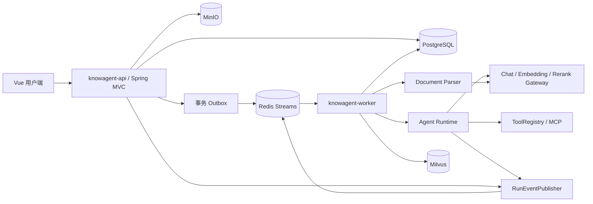
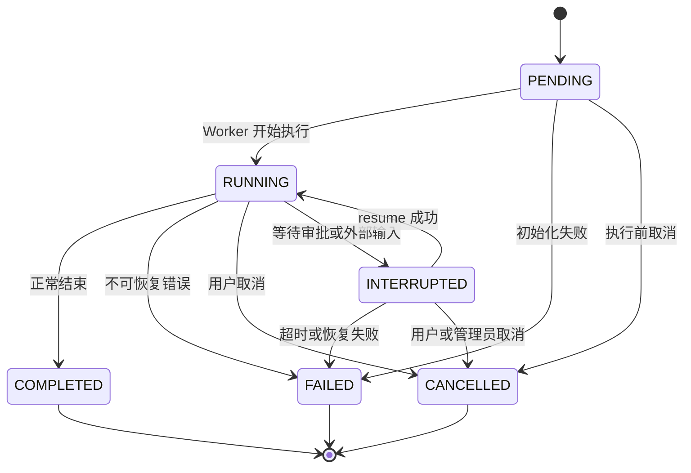
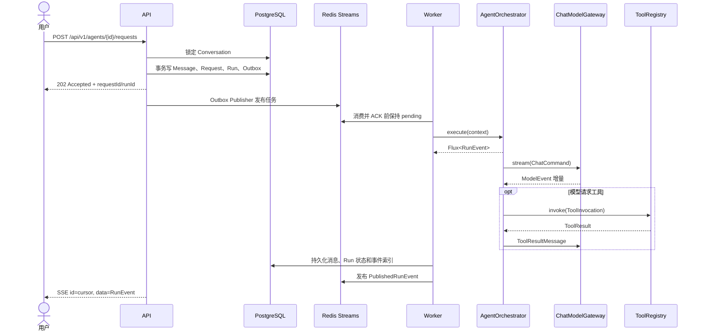
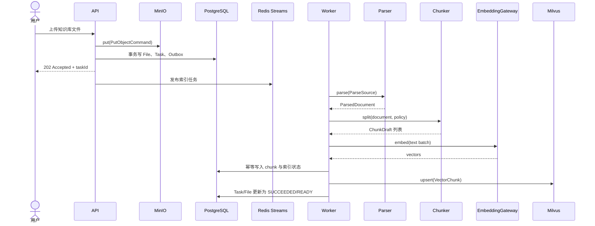
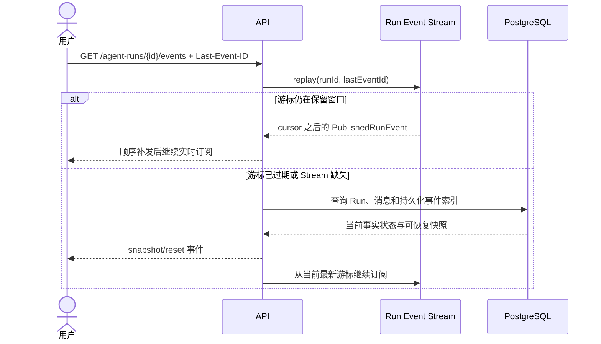

# KnowAgent 系统架构

本文是 KnowAgent 当前架构的唯一真相源，负责模块边界、运行链路、状态约束和基础设施职责。项目范围与里程碑见 [PLAN.md](../PLAN.md)，原 Yuxi 文件与接口迁移见 [YUXI_REFACTOR_GUIDE.md](../YUXI_REFACTOR_GUIDE.md)。

## 1. 系统组件

API 负责认证、参数校验、事务入口和 SSE 连接；Worker 负责耗时任务和 Agent Run；领域模块不依赖 API 或 Worker。

## 2. 模块依赖矩阵

| 模块 | 可以依赖 | 禁止依赖 | 主要职责 |
|---|---|---|---|
| `common` | 无 | 所有业务模块 | 通用错误、租户 ID、领域事件 |
| `security` | common | api、worker | Principal、认证授权边界 |
| `model` | common、security | knowledge、runtime | Chat、Embedding、Rerank 端口 |
| `knowledge` | common、security、model | runtime、api | 解析、分块、向量检索契约 |
| `agent-runtime` | common、security、model、knowledge | api、worker | Run 状态、编排、事件和检查点 |
| `extension` | common、security、agent-runtime | api、worker | Tools、Skills、MCP、SubAgent |
| `workspace` | common、security | api、worker | 对象存储、附件、虚拟路径 |
| `observability` | common、security | api、worker | 任务、审计、指标和评估 |
| `api` | 所有业务模块 | worker | HTTP、Spring Security、SSE、事务装配 |
| `worker` | 所有业务模块 | api | Outbox 发布、Stream 消费和后台执行 |

约束：禁止 Controller 直接调用 Mapper；禁止跨模块调用 Mapper；供应商 SDK 只能出现在基础设施适配器；自定义 SQL 必须显式校验 tenant。

## 3. 数据职责

| 组件 | 保存内容 | 不承担的职责 |
|---|---|---|
| PostgreSQL | 用户、知识库元数据、chunk、会话、消息、Request、Run、Task、Checkpoint、Outbox | 大文件和向量近邻索引 |
| Redis Streams | 任务投递、消费者组状态、短期 Run 事件和 SSE 游标 | Run 最终状态的唯一副本 |
| MinIO | 原始文档、附件、Agent 产物 | 权限事实和业务状态 |
| Milvus | embedding、chunk ID 和租户/知识库过滤字段 | chunk 正文的最终事实 |
| Neo4j | 后续阶段的图实体和关系 | 普通 RAG 可用状态 |

PostgreSQL 始终是最终事实来源。Redis、Milvus 和 Neo4j 的数据必须可以依据 PostgreSQL 重建或校验。表结构、复合租户外键、锁 SQL 和数据生命周期见 [数据库设计](database-schema.md)。

## 4. Agent 执行与事件

`AgentOrchestrator.execute` 返回 `Flux<RunEvent>`。每次执行必须产生一个开始事件、零到多个中间事件，以及一个且仅一个终态事件。

`RunEvent.eventId` 是 UUID，用于业务幂等和审计；`PublishedRunEvent.cursor` 是 Redis Stream/SSE 游标，用于排序和 `Last-Event-ID` 重连，二者不得混用。

`INTERRUPTED` 不是终态。终态不可回退；相同状态的重复写入按幂等处理；其他非法转换必须拒绝并记录审计事件。

## 5. 用户提问链路

## 6. 文档入库链路

失败必须记录当前阶段、错误码和可重试性；重复任务使用 file/chunk 幂等键，不得产生重复向量。

## 7. SSE 断线恢复链路

API 必须校验 runId 所属 tenant。客户端收到 reset 后用快照替换本地状态，不能把快照重复追加为增量。

## 8. 工具消息

`ChatMessage` 是密封接口：`TextChatMessage` 表示普通文本，`AssistantToolCallMessage` 保存有序工具调用，`ToolResultMessage` 通过 `toolCallId` 关联结果。供应商适配器负责与 Spring AI 消息互转，核心模型不依赖供应商私有类型。

## 9. 对象存储隔离

`ObjectStorageGateway` 的 put/get/delete 只接受带 `TenantId` 的命令。MinIO 适配器统一生成 `<tenantId>/<objectKey>`，调用方不能提供完整物理键；数据库附件记录同时保存 tenant、object key、散列和大小。

## 10. 认证请求上下文与租户隔离

`TenantContext`(knowagent-security)用普通 `ThreadLocal` 保存当前请求的 `TenantPrincipal`(`tenantId`、`userId`、`roles`)。故意不使用 `InheritableThreadLocal`,避免值跨线程池(Worker 执行器、SSE 异步派发)传播而把租户 A 的身份泄漏进租户 B 的工作。

上下文 **fail closed**:`TenantContext.requireTenantId()` 在没有认证上下文时抛 `BusinessException(AUTHENTICATION_REQUIRED)`,受保护业务查询因此被拒绝,而不是默认查询全部租户。

请求链:

1. `knowagent-api` 的 `TenantContextFilter`(`OncePerRequestFilter`)从 `SecurityContextHolder` 的认证 principal 解析 `TenantPrincipal`,并在 `try/finally` 中 `set`/`clear`。
2. 过滤器注册在认证过滤器之后、Spring Security `AuthorizationFilter` 之前，保证认证 principal 已就绪，并让租户感知的授权逻辑能够读取 `TenantContext`；即使授权被拒绝，也会执行过滤器的 `finally` 清理。
3. 租户来源只能是认证 principal。客户端请求头(如 `X-Tenant-Id`)永不作为租户来源;Controller 不得手工 `set`/`clear`。
4. `finally` 清理保证:Servlet 线程复用时下个请求观察不到上个请求的租户;请求中途抛异常上下文依然被清理。

数据访问:

- `SecurityPersistenceConfiguration` 装配 `TenantLineInnerInterceptor` 在乐观锁之前,普通 MyBatis-Plus 查询/写入自动追加 `tenant_id = <context>`。
- `TenantContextTenantLineHandler` 显式忽略没有 `tenant_id` 的表:`tenants`(唯一无 tenant_id 的业务表)与 `flyway_schema_history`。
- 只有极少数认证前 Mapper 方法允许 `@InterceptorIgnore(tenantLine = "1")` 绕过,且绕过 SQL 必须自身显式携带 `tenant_id`(或属于 tenant 根表、refresh token 全局唯一 hash 的文档化例外)。该白名单由 `SecurityMapperSqlContractTest` 精确锁定,新增绕过方法会使测试失败。
- 插入规则:PO 未设置 `tenantId` 时由拦截器从上下文填充;PO 显式声明 `tenantId` 时被信任。因此应用服务必须始终用 `TenantContext.requireTenantId()` 派生租户,不能接受客户端传入的租户。
- 代码审查规则:自定义 SQL、锁查询、统计与批量更新必须显式包含 `tenant_id`;锁查询与统计只能通过显式租户条件执行。

开发者管理员初始化:

- `AdminBootstrapRunner` 按 `bootstrap.enabled` 显式开关在启动时执行;缺参、弱密码或非法 slug 直接抛异常拒绝启动,不会自动生成并打印密码。
- 整个流程在一个事务内创建初始租户、`ADMIN` 系统角色、管理员用户和 `user_roles` 绑定,按 slug / tenant+code / tenant+login 幂等,任一步失败整体回滚。
- 密码经 `PasswordHasher`(Argon2id)编码后落库,原始密码不会出现在日志或异常中。初始化运行在认证前,不存在 `TenantContext`,因此所有存在性查询复用上文认证前显式租户查询白名单,写入的 PO 显式携带 `tenantId` 被拦截器信任。

Access Token 基础设施:

- `AccessTokenIssuer`(knowagent-api/security)负责签发 JWT;`AccessTokenAuthenticationConfiguration` 用 Spring Security 官方 OAuth2 Resource Server + Jose(`NimbusJwtEncoder`/`NimbusJwtDecoder`)签发与校验,不手写 JWT 编解码器。HS256 对称密钥只从环境变量读取(`JWT_SECRET`,base64,解码后至少 32 字节);`issuer`、`audience`、有效期与密钥通过 `@ConfigurationProperties(prefix = "jwt")` 类型安全绑定,`application.yml` 不含任何真实密钥,缺参时启动即失败。
- 令牌声明契约:签名使用 HS256;必需声明 `sub`(用户 UUID)、`tenant_id`(租户 UUID)、`roles`、`permissions`、`jti`、`iat`、`exp`;校验签名、issuer、audience、过期时间与必需声明。
- 请求链:`BearerTokenAuthenticationFilter` 经 `JwtAuthenticationProvider` 校验 token → `JwtToTenantAuthenticationConverter` 把 JWT 转换为 `JwtTenantAuthenticationToken`,principal 为 `TenantPrincipal` → `TenantContextFilter` 从 principal 建立 `TenantContext`,`finally` 清理。必需声明缺失或畸形(如 `tenant_id` 不是 UUID)时转换器抛 `InvalidBearerTokenException`,统一得到稳定 JSON 401。
- 路由规则:`/actuator/health/**`、`/api/v1/system/info`、`/api/v1/auth/login`、`/api/v1/auth/refresh` 匿名;其余请求要求认证。资源服务器入口点与全局 `exceptionHandling` 共用 `JsonAuthenticationEntryPoint`/`JsonAccessDeniedHandler` 输出 JSON 401/403,不保留 Spring Boot 自动生成的 in-memory 用户与开发密码。
- 本阶段只实现 Access Token 基础设施,不实现 Refresh Token 轮换。

## 11. 架构决策

- [ADR 0001：Maven 多模块单体](adr/0001-modular-monolith.md)
- [ADR 0002：PostgreSQL Outbox 与 Redis Streams](adr/0002-outbox-redis-streams.md)
- [ADR 0003：MyBatis-Plus](adr/0003-mybatis-plus.md)
- [ADR 0004：Spring MVC 与 Reactor Flux](adr/0004-spring-mvc.md)
- [ADR 0005：Milvus](adr/0005-milvus.md)
