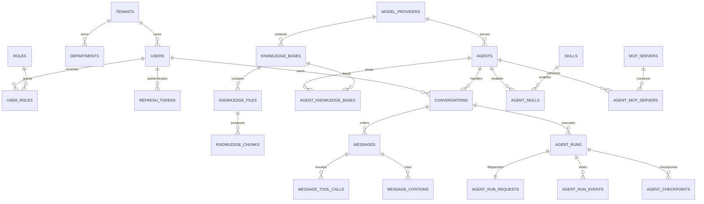

# KnowAgent 数据库设计

本文是 PostgreSQL 关系模型、约束和事务写法的唯一说明。系统边界与运行时链路见 [architecture.md](architecture.md)，实施范围见 [PLAN.md](../PLAN.md)。

## 1. 基线与迁移

- 数据库版本：PostgreSQL 16。
- Schema：默认 `public`。
- Flyway 是唯一结构变更入口，`V1__baseline.sql` 保持不变。
- `V2` 至 `V11` 创建 31 张 MVP 表；迁移只允许向前追加，禁止修改已经执行的版本。
- Flyway Community 不提供 Undo。生产修复通过新的版本化迁移完成，不删除或重写历史脚本。

| 迁移 | 能力 | 表 |
|---|---|---|
| V2 | 身份核心 | `tenants`、`departments`、`users` |
| V3 | RBAC | `roles`、`user_roles` |
| V4 | 凭据 | `refresh_tokens`、`api_keys` |
| V5 | 模型供应商 | `model_providers` |
| V6 | 知识库 | `knowledge_bases`、`knowledge_files`、`knowledge_chunks` |
| V7 | Agent 与聊天 | `agents`、`agent_knowledge_bases`、`conversations`、`messages`、`message_tool_calls`、`message_citations`、`message_feedback` |
| V8 | Agent 运行时 | `agent_runs`、`agent_run_requests`、`agent_run_events`、`agent_checkpoints` |
| V9 | 异步与审计 | `tasks`、`outbox_events`、`inbox_events`、`audit_logs` |
| V10 | Skills 与工具 | `skills`、`agent_skills`、`agent_tool_grants` |
| V11 | MCP | `mcp_servers`、`agent_mcp_servers` |

## 2. 关系概览



## 3. 通用约束

- 主键使用 `uuid DEFAULT gen_random_uuid()`；Request FIFO 使用独立 identity 序号。
- 除 `tenants` 外，业务表必须有非空 `tenant_id`。
- 被引用表提供 `UNIQUE (tenant_id, id)`，业务外键同时携带 `tenant_id`，数据库直接拒绝跨租户关联。
- 状态使用大写 `varchar + CHECK`，与 Java 枚举名称一致；可变元数据使用 `jsonb`。
- 时间使用 `timestamptz`；可更新状态实体使用 `version` 乐观锁字段。
- 软删除资源通过部分唯一索引保留租户内名称复用能力。
- 凭据表保存 Argon2 密码串或不可逆 Token/API Key 散列；模型和 MCP 密钥保存应用层密文及密钥版本。迁移脚本不包含任何凭据值。
- MyBatis-Plus 负责普通查询的租户条件。锁查询、统计和批量更新必须显式包含 `tenant_id`。

## 4. 消息与 Request 事务

API 在同一个数据库事务、同一个连接内完成以下步骤：

1. 预生成 Message、Request、Run、Outbox UUID。
2. 用单条 `UPDATE ... RETURNING` 分配消息序号并取得 Conversation 行锁。
3. 插入 Message、`PENDING` Run、`QUEUED` Request 和 Outbox。
4. 提交时校验 `messages.run_id/request_id` 的延迟外键。

```sql
UPDATE conversations
SET next_message_sequence = next_message_sequence + 1,
    updated_at = CURRENT_TIMESTAMP
WHERE tenant_id = :tenantId
  AND id = :conversationId
  AND deleted_at IS NULL
RETURNING next_message_sequence - 1 AS message_sequence;
```

行锁保持到事务提交。后续任意插入失败时，序号递增也会回滚，不会产生并发重复序号。

Dispatcher 按 `queue_sequence` 选择最早的排队请求，并用 `FOR UPDATE SKIP LOCKED` 防止多个 Worker 抢到同一行。只有取得请求锁后才把对应 Run 从 `PENDING` 条件更新为 `RUNNING`。部分唯一索引 `uq_run_active_per_conversation` 最终保证一个会话最多存在一个 `RUNNING/INTERRUPTED` Run；多个 `PENDING` Run 可以正常排队。

## 5. Token 家族

- 根 Token 满足 `family_id = id`，子 Token 通过 `(tenant_id, parent_token_id, family_id)` 复合外键继承同一家族。
- 一个父 Token 最多只能签发一个子 Token。
- 正常刷新先锁定 Token，在同一事务中把旧 Token 标记为 `CONSUMED`、插入子 Token 并签发 Access Token；签名失败时数据库写入整体回滚，避免子 Token 已落库但原始值未返回。
- 已消费 Token 再次出现表示重放攻击；服务锁定该记录并把同一 `family_id` 下仍有效的 Token 全部更新为 `REVOKED`。
- 数据库只保存 `token_hash`，原始 Refresh Token 只在签发响应中出现一次。

## 6. Checkpoint 与事件

`agent_run_events` 是追加写的 PostgreSQL 事件索引，`id` 对应 `RunEvent.eventId`，`stream_cursor` 只保存 Redis/SSE 游标。Redis 回放过期时，API 依据该表、消息和 Run 状态构造 reset 快照。

`agent_checkpoints` 使用结构化信封：`sequence_no`、`stage`、`checkpoint_type`、`schema_version`、`caused_by_event_id` 可直接查询，恢复上下文放在 `payload jsonb`。当前 Java `String payload` 由后续 MyBatis TypeHandler 转换为 JSONB。

## 7. 文件与 Chunk 删除

`knowledge_chunks` 不软删除，它是可以从源文件重新生成的数据。删除文件采用两阶段流程：

1. 事务内把文件更新为 `DELETING`，设置 `deleted_at`，写入清理 Task 与 Outbox；检索立即排除该文件。
2. Worker 幂等删除 Milvus 向量和 MinIO 对象。
3. 外部删除成功后，事务内物理删除 chunk，并把文件状态更新为 `DELETED`。

外部删除接口必须把“对象不存在”视为成功。若外部删除成功而 PostgreSQL 提交失败，重试会再次执行无害删除并最终完成数据库状态更新。

`message_citations` 保存来源 UUID、名称、页码和引用文本快照，不对 chunk 建立实时外键。这样文件重建或 chunk 物理删除后，历史回答仍能展示当时的引用信息。

## 8. Outbox 与 Inbox

业务状态和 `outbox_events` 必须在同一事务写入。Publisher 按租户批量查询到期的 `PENDING` 事件或锁已过期的 `PROCESSING` 事件，使用 `FOR UPDATE SKIP LOCKED` 抢占后设置 `locked_by/locked_until`。Redis 发布成功后更新为 `PUBLISHED`；超过最大重试次数转为 `DEAD_LETTER`。

Worker 只在业务处理成功的同一事务中写入 `inbox_events`。`UNIQUE (consumer_name, event_id)` 让 Redis 重复投递转化为幂等成功，不重复修改业务数据。

## 9. 验证

默认 `mvn verify` 不启动 Docker。启动 Docker Desktop 后执行：

```powershell
mvn -Pdocker-it verify
```

`FlywaySchemaIT` 会在全新 PostgreSQL 16 容器中运行迁移，并验证租户隔离、状态约束、软删除唯一性、Token 家族、Run 并发约束、Outbox 抢占和事务回滚。
